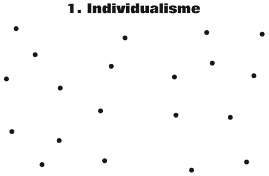
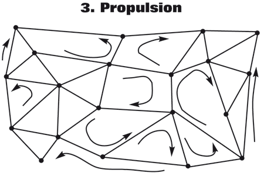

# L’alternative nomade revisitée

Je ne l’ai pas caché, *[L’alternative nomade](../../books/alternative-nomade.md)* dans sa forme actuelle, plus que dans les idées que j’y exprime, ne me convient pas. Il me semble que le début devrait aller au milieu, que certaines choses n’ont rien à faire dans le texte, l’encombrent, détournent des arguments centraux.

Dans la version actuelle de l’alternative, le flux apparaît presque a priori, comme une entité mystique. Il me semble plus judicieux de montrer comment il apparaît, comment il se lie à notre tradition culturelle, comment effectivement il pourrait inaugurer une nouvelle époque de l’humanité… Je dois réordonner le livre dans une perspective évolutive qui se déroule en trois étapes.

Au commencement, nous avons des gens plutôt seuls, surtout devant leur télévision, qui travaillent dans des structures pyramidales, qui parfois militent dans des partis pyramidaux pour élire des représentants perchés au sommet de la pyramide. Ils sont sédentaires et souffrent de [l’antipathie](http://www.journaldumauss.net/spip.php?article553). Leur échappatoire : la consommation.

Ce modèle ne peut perdurer tant pour des raisons écologiques que psychologiques. Pour que nous sortions de ce piège, nous devons aller vers une autre société plus sexy que celle d’aujourd’hui. Aucun plan de rigueur ne nous poussera à nous bouger le cul, sinon à nous révolter… et nous savons que la révolution ne mène à rien.

Grâce à de nombreuses technologies de fluidification (Internet, mobile, transports…), il devient plus facile pour nous d’établir [des liens de qualité](qualite-des-liens.md) avec nos semblables. Nous complexifions la structure sociale, brisant les hiérarchies par des liaisons transversales. Nous avons enclenché un [processus qui augmente nos libertés](la-liberte-le-lien.md), mais Nous sommes encore dans une situation statique. Nous passons du cristal, le réseau ordonné, à un réseau plus chaotique qui pourrait évoquer un corail.

Sur les liens que nous avons créés, nous poussons des informations, des idées, des émotions, nous engendrons un flux. Et alors ? Ressentir ce flux nous procure du bonheur, de l’empathie par opposition à l’antipathie, et nous incite à y participer d’avantage… ainsi nous créons de nouveaux liens, propulsons de nouvelles informations, idées, émotions. Avec le flux que nous animons, entrainé par lui, nous nous mettons en mouvement. Nous quittons notre état de sédentaire pour devenir des nomades dans le flux même. Plus nous allons dans ce sens, plus nous complexifions le monde, plus nous nous libérons tout en nous liant toujours plus avec les autres (processus qui s’amplifie lui-même et pousse de plus en plus au nomadisme). Plus nous sommes libres, plus nous sommes nomades. Récompense : nous nous individuons, éprouvons la vie avec plus de puissance.

Au passage, notre activité de propulseur nous éloigne du consumérisme, puisqu’elle se joue dans le domaine des informations, des idées, des émotions… le domaine culturel si vous voulez… et nous provoquons en nous une véritable révolution psychologique… qui, si nous sommes de plus en plus nombreux, se transformera en révolution sociale. Et nous devrions effectivement être de plus en plus nombreux pour la simple raison que nous apparaitrons aux autres plus heureux, en même temps que plus respectueux de notre environnement.

Les soucis écologiques ne sont pas à l’origine de cette démarche. Ils apparaissent comme corolaire.

Les technologies autorisent la démarche mais ne suffisent pas à la provoquer, d’où la nécessité d’en parler, de s’y initier pour que d’autres à leur tour puissent la pratiquer.

Mon projet me paraît plus clair. Je pars d’une situation pour aller vers une autre. Je raconte d’une certaine façon mon propre parcours. Sachant qu’il s’agit bien sûr d’une possibilité historique, amorcée à mon avis, mais qui n’ira pas nécessairement à son terme (elle n’arrange pas tout le monde). Si elle mène à un plus grand niveau d’individuation, elle nous protègera en partie de notre désir mimétique, notamment cette propension à nous abandonner au consumérisme matérialiste. Ainsi nous créerons alors une société durable et plus agréable à vivre.

#netculture #dialogue #y2010 #2010-5-20-15h38
