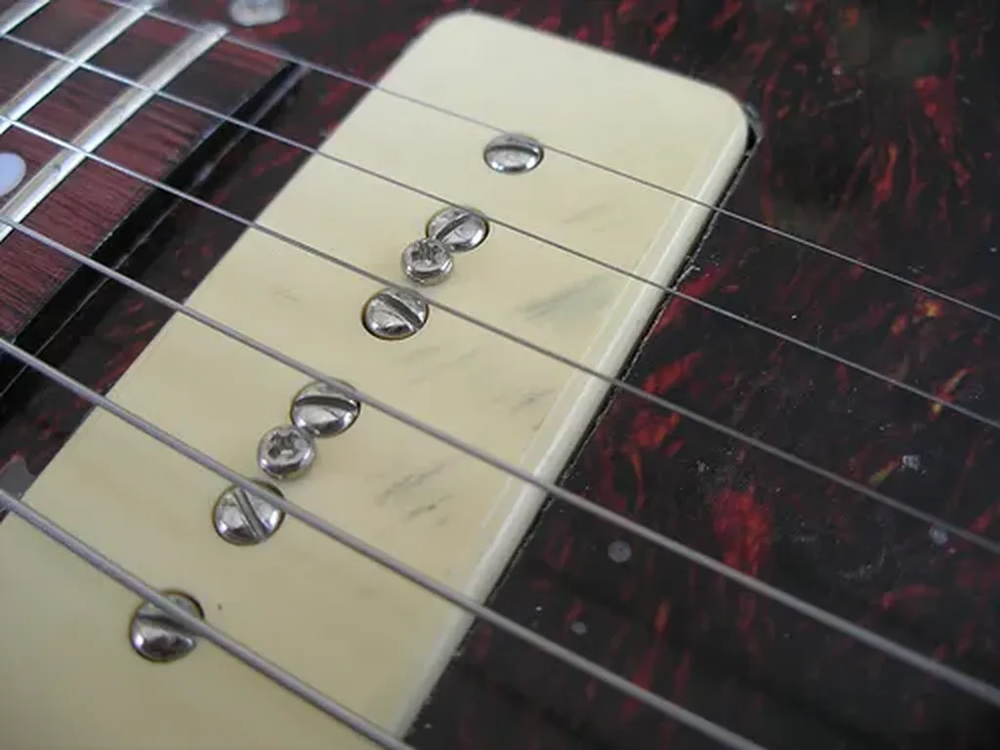

# Le manifeste cyborg

Aujourd’hui encore, la machine seule n’est pas plus intelligente que l’homme. L’homme n’est pas plus intelligent que la machine, il perd souvent contre elle aux échecs et dans de nombreuses situations. En revanche, [l’homme aidé par la machine est imbattable](edition-au-temps-des-cyborgs.md). L’humanité l’a compris depuis longtemps en se lançant dans la course à la technologie.

Dans le domaine artistique, les plasticiens adoptent cette voie. Utilisation de pigments de plus en plus perfectionnés. Photographie. Cinéma. Photoshop. Les musiciens n’ont cessé d’inventer de nouveaux instruments. Violon. Guitare électrique. Synthétiseur. Sampleur.

Qu’ont fait les écrivains ? Ils ont changé de plume mais pour quels changements visibles dans leurs œuvres ? Entre un texte écrit au stylo ou au clavier, il existe sans doute des différences, qu’il sera intéressant d’étudier, mais à mon sens rien d’aussi flagrant qu’entre la peinture sur toile et la photographie ou entre la musique classique et la pop ! L’évolution des outils d’écriture ne se révèle pas au grand jour dans l’écriture elle-même (qui semble avant tout soumise à la mode sans que les techniques ne produisent de brusques ruptures).

Je suis sévère. Je pourrais trouver quelques expérimentations intéressantes, remonter à [Mallarmé](../../2009/8/le-livre-echappera-pas-aux-flux.md) et ses jeux typographiques dans la page, évoquer l’écriture dynamique de [Daniel Bourrion](../4/le-mystere-picasso.md), la liste pourrait s’allonger, vous conviendrez que ces expérimentations restent marginales.

Alors l’écrivain doit-il considérer la technologie comme accessoire, tout comme est accessoire le siège sur lequel il s’assoit quand il écrit ? Ce siège d’ailleurs n’est pas si anodin qu’il y paraît. Je connais la différence entre écrire chez moi, assis dans un parc, perché au sommet d’une montagne ou tout simplement rêvant en terrasse de café.

Rien n’est anodin. Mais le texte est peut-être une trop vieille invention pour que la technologie l’affecte en profondeur. C’est alors dans le travail même de l’écrivain que la technologie peut renouveler, et, au-delà du travail de l’écrivain, le travail tous les créateurs, même les journalistes, les scientifiques ou les philosophes. La révolution cyborg peut affecter tous les hommes.

Il ne s’agit plus de travailler seul mais de travailler avec les autres. Je ne parle pas du chimérique travail collaboratif, sorte de [fusion surperorganismique](#starglider), mais d’un travail où un créateur se dope à travers le réseau. Il étend son cortex cérébral aux réseaux neuronaux temporairement mis à sa disposition par des stimulateurs.

Le blog est un fantastique instrument pour nous transformer en cyborg. Je l’ai expérimenté au moins à deux reprises, en écrivant *[Le cinquième pouvoir](../../page/le-cinquieme-pouvoir)* puis *[La quatrième théorie](../../page/la-quatrieme-theorie)*. Les billets publiés sur le blog n’ont pas pour vocation de faire date, de faire œuvre, mais de démultiplier l’activité intellectuelle capable d’engendrer une œuvre qui, éventuellement, ultérieurement, pourra elle-même être publiée sur le blog ou sur tout autre support.

Le blog conçu de cette façon ne vise pas l’audience, mais la constitution d’une TAZ créative. Et ce n’est que suivant cette perspective que le blog se différencie des vieux journaux et magazines ou feuilles de choux ronéotypées.

On peut même imaginer que tout créateur dispose de deux espaces. 1/ Son extension mentale de cyborg, d’une confidentialité étendue. 2/ Un espace de diffusion des œuvres, un espace où il publie beaucoup plus rarement, dans l’espoir de livrer l’aboutissement d’un travail plutôt qu’un work in progress perpétuel.

Vous comprendrez peut-être mieux pourquoi j’attache de l’importance au [format epub](http://txt.tcrouzet.com/) ou à [l’impression à la demande](autopublication-arnaque.md) ou même à l’édition traditionnelle, trois méthodes pour moi de séparer l’atelier du cyborg, ce qu’est mon blog, des productions de cet atelier. D’autres praticiens pourraient invoquer d’autres méthodes où délivrer leurs travaux de cyborg : presse, TV, cinéma, galerie, théâtre… et pourquoi pas un blog, un autre blog, ou un autre espace de son blog.

Nous sommes entrés dans l’âge des cyborgs. Le travail solitaire devient anachronique. Pour autant, l’auteur ne disparaît pas. Au contraire, il allonge ses synapses de plus qu’humain à travers le réseau.

#cyborg #netculture #netlitterature #dialogue #y2010 #2010-5-30-20h11
