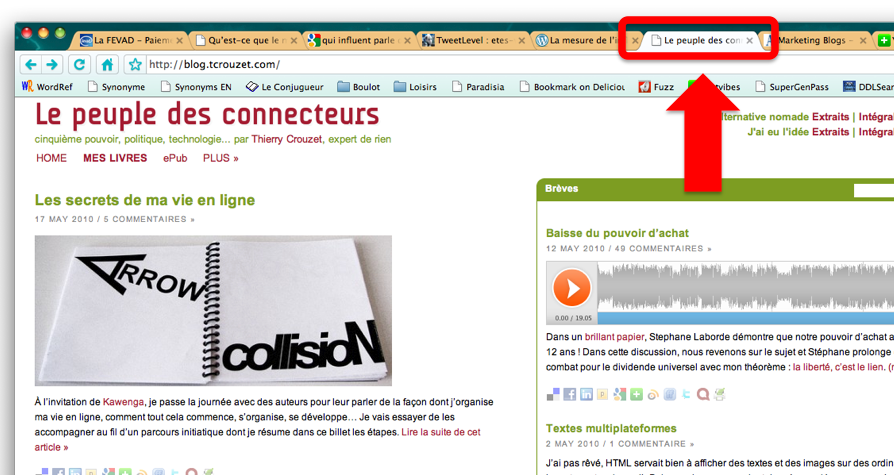

# Relation ambiguë avec le PC

Quand j’étais rédacteur en chef de *PC Expert* et de *PC Direct*, les amis de mes parents, plutôt de droite, croyaient que je travaillais pour une annexe de *L’humanité*. J’ai ensuite publié le *Peuple des connecteurs*, encore une histoire de PC, et voilà qu’une lectrice m’envoie une image étrange. Je me lancerais maintenant dans la promotion du *Peuple de cons*. Quelque chose me lie définitivement au PC.

#buzz #noepub #breves #y2010 #2010-5-18-21h0
