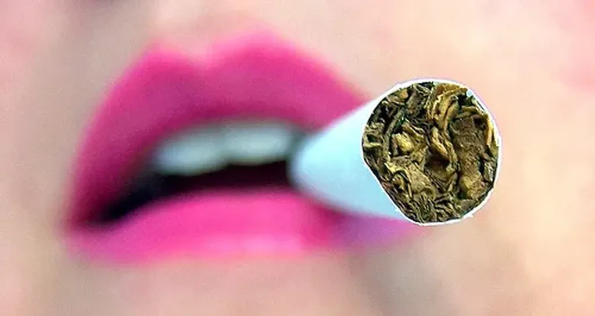

# La littérature contre l’information

Un journaliste ou un scientifique se doit de dire la vérité, en tout cas pour le peu qu’il sait. Il doit mettre en ordre, pratiquer une écriture politiquement correcte, sans choquer aucune susceptibilité. Un littérateur, en revanche, a tous les droits, même de dire des absurdités (mais si elles choquent ou dérangent sont-elles réellement absurdes ?).

Je m’inscris dans cette seconde famille, je ne suis ni journaliste, ni scientifique (même si j’ai un temps été payé comme journaliste et si j’ai reçu une formation de scientifique). Je n’effectue aucune recherche d’informations nouvelles, et pomper telles quelles celles trouvées par d’autres m’intéresse peu. Je n’écris pas pour raconter ce que pensent les autres, mais pour provoquer le lecteur.

Cette provocation se matérialise par le rire, un grincement de dents, une petite effervescence cérébrale et pourquoi pas une envolée poétique ou lyrique. Je ne m’interdis rien sur cette route. Grossir les traits a pour but d’amplifier les signaux faibles jusqu’à leur juste proportion, celle qu’ils gagneront si mon intuition ne me trompe pas. Dans le cas contraire, cela n’a aucune espèce d’importance du moment que quelque chose s’est produit dans une autre conscience lors de la lecture. Cette communication télépathique au-delà du sens n’a pas de prix pour moi.

[J’assume mes accusations](tuons-la-presse.md). Les hommes de presse ne sont que des narcotrafiquants qui s’adressent à des toxicomanes de plus en plus innombrables. Aucun argument politiquement correct ne m’a fait une seconde douter de mon affirmation. Au contraire, ils me font dire maintenant que l’intoxication est plus généralisée que je ne l’estimais tant elle brouille la raison d’esprits pourtant forts intelligents. Il est bien connu que la drogue détourne de la lumière. Un fou n’admet pas sa folie. Il fait tout pour s’en défendre. Il invoque même sa raison et révèle les manquements des autres.

Je n’en veux pas aux journalistes, j’en veux bien plus à tous ceux qui les écoutent et qui jacassent ensuite leurs jérémiades aux comptoirs des cafés physiques comme virtuels. Jamais je n’exhorterai l’interdiction de la presse (même si notre société ne s’en porterait que mieux), mais j’exhorte mes contemporains à se détourner de cet opium.

J’en vois d’autres de tout aussi nocifs. Exemple les entreprises comme s’il fallait s’enfermer en bande dans des bureaux pour accomplir de grandes choses. On finit alors par croire qu’il n’y a pas d’autres possibilités, que l’entreprise est d’une nécessité vitale, comme le prochain shoot. Chaque fois que je me retrouve dans des bureaux, j’ai la nausée.

Le salariat nous détruit aussi surement que les informations intempestives émises pas des plumitifs d’ailleurs salariés. Il n’y pas de fumée sans feu. L’industrie et la presse se développèrent main dans la main parce qu’elles poursuivaient le même objectif d’asservissement. Il existe ainsi des drogues assimilables sous différentes formes, qui paraissent sans aucun lien, mais qui dans les cerveaux libèrent les mêmes endorphines.

Religion. Information. Salariat. Même combat. Il s’agit chaque fois de rassurer en nous plongeant dans une église où nous nous sentons moins seul. Je préfère assumer ma solitude, la digérer, la surmonter, pour alors partir de moi-même vers les autres.

Dans cette quête, il y a l’art, il y a la littérature, il y a des gens qui transgressent l’information, qui font œuvre et qui nous transportent. Pourquoi devrais-je me détourner d’eux et de cette pratique, ne serait-ce qu’une seconde, pour consulter les news, pour aller à l’église ou m’enfermer dans un bureau ?

J’ai envie que ma vie soit elle-même une œuvre d’art, à la poursuite de l’embrasement qui survient au moment créateur. J’ai envie de me lier aux autres pour démultiplier mon intelligence et qu’ils démultiplient la leur et que nous nous enchantions mutuellement. Je n’ai jamais éprouvé cette sensation dans une église, dans un journal ou dans une entreprise. Je ne vois pas pourquoi nous devrions consacrer plus de temps que le strict nécessaire à des expériences de moindre intensité.

#journalisme #litterature #netlitterature #coup_de_gueule #y2010 #2010-6-24-9h45
