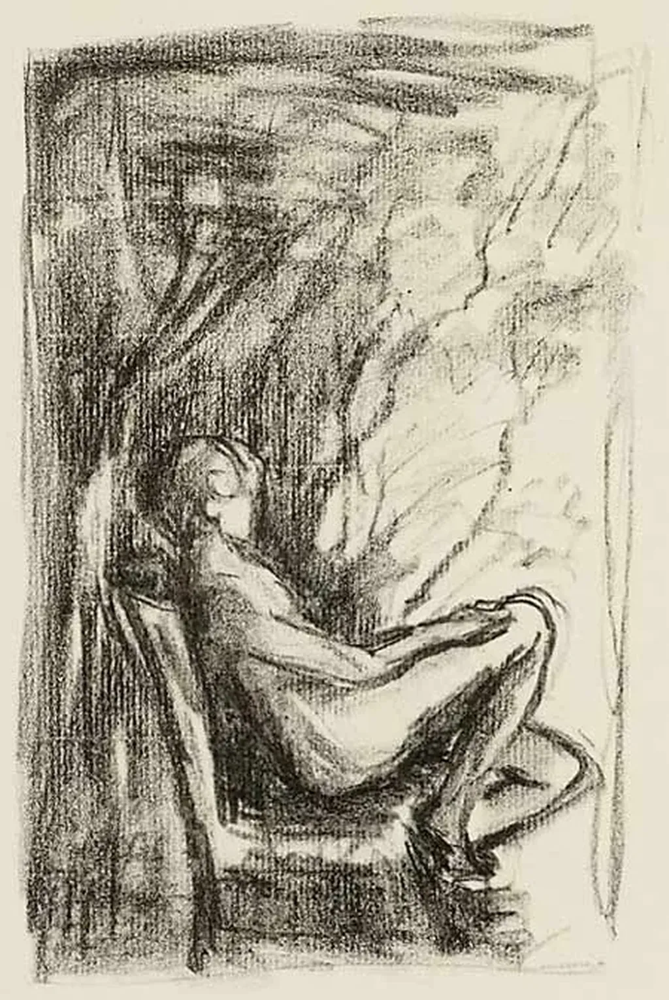

# Connexion avec Paul Valéry

Isabelle a rangé par ordre alphabétique les livres de notre bibliothèque, les siens et les miens, qui depuis dix ans étaient dans le plus grand désordre. Maintenant, elle regarde ce que nous avons sur les auteurs qu’elle croise au fil de ses lectures. Elle clique en quelque sorte de livre en livre. Elle est tombée sur mon vieil exemplaire de *Tel quel* de Paul Valéry.

Je l’ai lu il y a peut-être 25 ans et l’ai digéré au point d’être incapable de parler de ce texte, mais Isabelle a collectionné une série de citations qui toutes pourraient prendre place dans *[L’alternative nomade](../../books/alternative-nomade.md)* et dans les scribouilleries qui m’occupent en ce moment.

> Rien de plus original, rien de plus soi que de se nourrir des autres. Mais il faut les digérer. Le lion est fait de mouton assimilé.

> Le nouveau est un de ces poisons excitants qui finissent par être plus nécessaire que toute nourriture ; dont il faut, une fois qu’ils sont maîtres de nous, toujours augmenter la dose et la rendre mortelle à peine de mort.

> Il est étrange de s’attacher ainsi à la partie périssable des choses, qui est exactement leur qualité d’être neuves.

> Vous ne savez donc pas qu’il faut donner aux idées les plus nouvelles je ne sais quel air d’être nobles, non hâtées mais mûries ; non insolites, mais existantes depuis des siècles ; et non faites et trouvées de ce matin, mais seulement oubliées et retrouvées.

> Nos disciples et nos successeurs nous en apprendraient mille fois plus que nos maîtres, si la durée de la vie nous laissait voir leurs travaux.

> Le goût exclusif de la nouveauté marque une dégénérescence de l’esprit critique, car rien n’est plus facile que de juger de la nouveauté d’un ouvrage.

> Presque tous les livres que j’estime et absolument tous ceux qui m’ont servi à quelque chose, sont livres assez difficiles à lire. La pensée peut les quitter, elle ne peut les parcourir.

> Mais des livres, les uns sont excitants et ne font qu’agiter ce que je possède ; les autres me sont des aliments dont la substance se changera dans la mienne. Ma nature propre y puisera des formes de parler ou de penser ; ou bien des ressources définies et des réponses toutes faites : il faut bien emprunter les résultats des expériences des autres et nous accroître de ce qu’ils ont vu et que nous n’avons pas vu.

> La plus forte et la plus nécessaire haine va à ceux qui sont ce que nous voudrions être : et d’autant plus âpre que cet état est plus attaché à la personne même. C’est un vol que de posséder la fortune ou le titre qu’un autre voudrait ; c’est un assassinat que de posséder le physique ou l’intellect, ou les dons qui sont l’idéal de quelqu’un. On lui fait voir par un seul coup d’œil que cet idéal n’est pas chimérique et que la place est prise. Mais ce jaloux oublie le grand et véritable avantage de ne pas avoir ce qu’on désire, qui est de le considérer d’un point interdit à qui le possède et de devoir s’instruire à le déprécier pour vivre !

> L’injustice est un amer qui redonne goût à la solitude, aiguise l’appétit de séparation et de singularité, ouvre à l’esprit ses profondes voies, qui vont à l’unique et à l’inaccessible.

> Il faudrait peut-être en venir à donner à notre philosophie cette base : que nous reposons sur une complication infernale d’éléments et d’événements élémentaires.

> Un esprit capable de saisir la complication de son cerveau serait donc plus complexe que ce qui le fait être ce qu’il est… puisqu’à chaque pensée il devrait joindre l’idée de cette machinerie toujours différente d’elle-même, et, à chaque représentation de cette machinerie, l’actualité tout différente que sa pensée est à chaque instant.

En relisant la préface de *Tel quel*, j’ai trouvé un passage qui définit mon travail.

> On y trouvera aussi des contradictions. Puisqu’il n’est pas de pensée qui s’en prive, et qu’on n’est pas ici en géométrie, leur présence statistique est presque de rigueur.

La contradiction, c’est la vie. Une pensée en mouvement ne peut que se contredire. Si elle ne le faisait pas, elle serait morte.

Mais d’où me vient cette proximité avec Paul Valéry ?

1. Du fait que je l’ai un peu lu et qu’ils m’influencent toujours subliminalement.

- Du fait qu’il était un génial visionnaire, ce qui me pousse à le réécrire malgré moi, en même temps que ses visions se réalisent.

- Du fait que je suis né 92 ans après lui à Sète et que nous avons respiré le même air durant nos années fondatrices.

#litterature #netlitterature #dialogue #y2010 #2010-7-26-11h44
