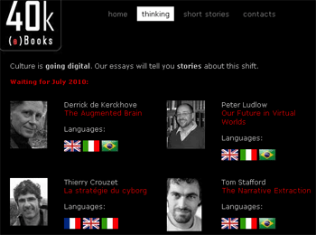

# Édition numérique multilingue

À l’initiative de [40k (e)books](http://www.40kbooks.com/), je participe à une expérience intéressante, la publication de textes numériques inédits simultanément dans plusieurs langues. Mi-juillet [*La stratégie du cyborg*](../6/aidez-moi-a-devenir-cyborg.md) sera disponible en français, mais aussi en italien et en anglais. Plus d’une quinzaines d’auteurs de nombreux pays participent à l’aventure. Suivez les news de 40k sur [Facebook](http://www.facebook.com/pages/40k/122586614419616).

#cyborg #ebook #edition #noepub #breves #y2010 #2010-7-3-13h41
