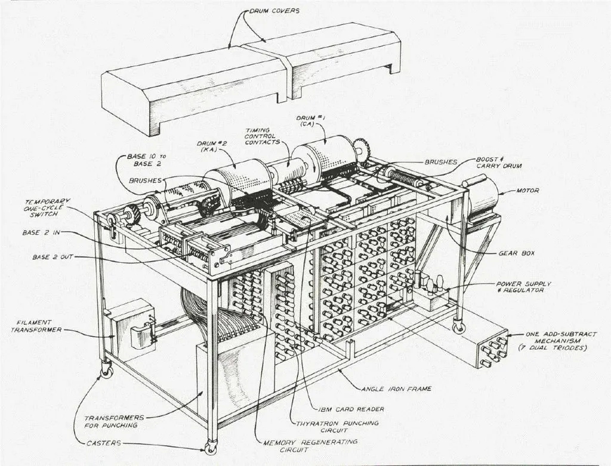

# L’arrivée des 0 et des 1

John Atanasoff, penché sur son bureau, ses mains plongées dans ses cheveux noirs coupés en brosse, fixait sans les voir des feuilles couvertes de calculs. Comme si quelqu’un venait de l’appeler, il se redressa, regarda autour de lui, puis se leva.

Dehors, un faible soleil éclairait le campus de l’Iowa State University. On était en décembre 1937, Roosevelt venait de déclarer la civilisation en danger et avait annoncé que les États-Unis cesseraient tout échange économique et diplomatique avec les pays qui bafoueraient la paix.

John secoua la tête. Il avait 34 ans et tout cela le fatiguait. Depuis qu’il était physicien, il passait le plus clair de son temps à calculer. C’était exaspérant. Certaines équations lui demandaient une journée de travail. Il lui fallait en résoudre des dizaines et les calculateurs mécaniques qu’il utilisait ne l’aidaient pas beaucoup.

Il arracha sa cravate, dénoua sa chemise, saisit sa veste, sortit de son bureau, quitta l’immeuble baroque de l’université et grimpa dans sa voiture. Sans laisser le moteur chauffer, il accéléra et s’échappa de la petite ville d’Ames. À plus 140 km/heures, il fonça vers Des Moines.

Il ralentit devant plusieurs bars. Il était tout juste midi. Il accéléra à nouveau et s’éloigna de la capitale de l’État. Il s’engagea sur l’Interstate en direction de l’Illinois. À fond de train, il roula pendant près de trois heures jusqu’à Rock Island et s’arrêta dans un bar au bord du Mississippi.

Après trois scotches, il sentit mieux, il sourit, une pensée fulgurante le traversa : « 1 et 0, le binaire, c’est la solution. »

Sur la nappe devant lui, il lista les grandes caractéristiques des tous les ordinateurs numériques que nous avons depuis construits . Ils seront électroniques et non plus mécaniques. Ils travailleront avec des 0 et des 1 représentés par des interrupteurs on ou off. Ils disposeront d’une mémoire. Ils effectueront des opérations logiques.

Depuis des années, John cherchait à automatiser les calculs et il venait de découvrir une nouvelle approche révolutionnaire. Sa mère mathématicienne lui avait appris le calcul binaire alors qu’il était enfant et cet enseignement portait ses fruits vingt ans plus tard.

Rentré à l’université de l’Iowa, John construisit avec son assistant Clifford Berry, le premier ordinateur numérique de l’histoire. Comme pendant des années John avait été un calculateur humain, un computer comme on disait alors en anglais, il appela computer sa machine, heureux qu’elle puisse le dispenser de la tâche qui pour lui était devenue insupportable.

À la fin de 1939, l’ABC (Atanasoff Berry Computer) entra en service. Capable d’une opération toutes les 15 secondes, il pesait plus de 300 kilos. C’était un petit pas pour John, enfin libéré d’un pénible labeur, mais un immense pas pour l’humanité. De 300 kilos, les ordinateurs allaient bientôt se miniaturiser et devenir omniprésents. Nous allions peu à peu changer de façon de travailler, de communiquer, de jouer, de penser le monde et même de faire de la politique, c’est-à-dire de mener nos vies.

#netculture #noepub #une_breve_histoire_de_linformatique #dialogue #y2010 #2010-7-1-22h0
