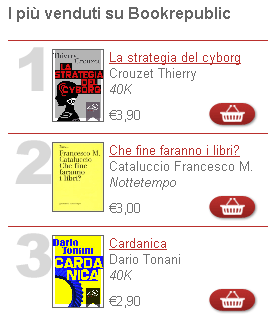
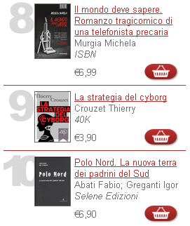
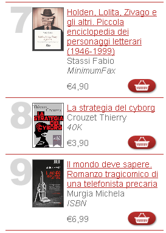
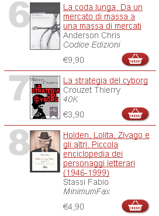
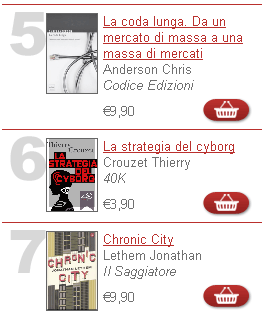
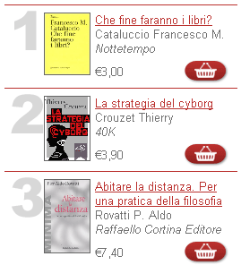

# Cocorico en Italie

Après quatre jours déconnecté, je découvre que *[La strategia del cyborg](../../page/la-strategie-du-cyborg)* est dans le top 10 des ventes sur [bookrepublic.it](http://www.bookrepublic.it/). Devant moi, des auteurs que j’aime bien comme Taleb ou Anderson. J’ai envie de dire que les geeks sont les premiers à acheter des ebooks. Mais alors pourquoi Nothomb est-elle en pole position ?

*PS1 : Le 11 août, je suis monté en huitième position... la gloire. Si seulement ça représentait des milliers d’exemplaires et non quelques dizaines. J’espère que nous prenons nos marques pour l’avenir.*

*PS2 : Le 24 août, mon texte progresse, mais comme souvent aucune statistique de vente n’est indiquée. Peur de la transparence dans les domaines qui se cherchent, ces domaines justement où la transparence est la plus nécessaire.*

*PS3 : Le 1er septembre, irrésistible !*

*PS4 : Le 4 septembre, vertigineux ! Hier j’avais disparu du classement, aujourd’hui deuxième.*

*PS5 : Le 6 septembre, summum ! Je pourrais pas faire mieux.*

#buzz #cyborg #noepub #breves #y2010 #2010-8-9-16h27
