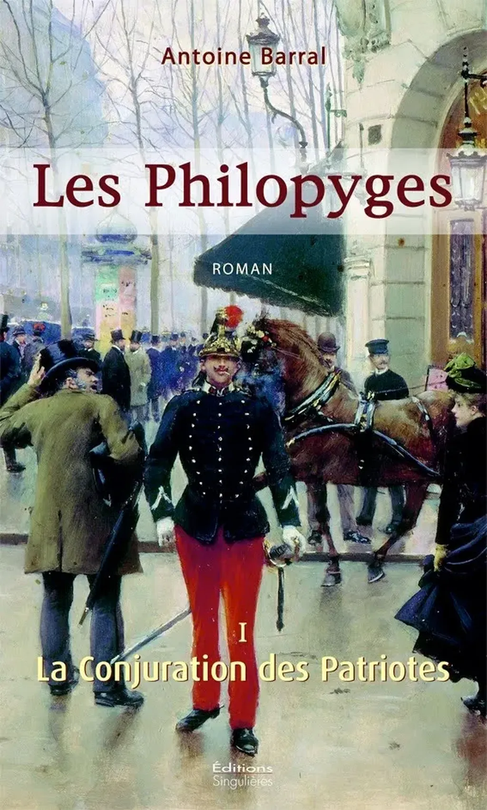

# Nouveau métier : imprimeur d’ePub

Depuis quelques mois, je joue avec le format ePub, un format dérivé d’HTML pour mettre en forme les textes électroniques et les diffuser sur toutes les liseuses, même l’iPad. J’ai ouvert des centaines de fichiers créés par d’autres. Presque chaque fois, j’ai été horrifié.

C’est une réaction habituelle chez moi. Quand je regarde le code d’un site Web dont les pages ont été composées avec Dreamweaver, je constate le même amateurisme. Les pros, ils codent à la main, en direct. Si vous étiez écrivain, est-ce que vous dicteriez vos textes à un étranger qui parle mal votre langue et qui retranscrirait votre texte dans sa langue à lui ? A priori, non. C’est pourtant ce que font la plupart de ceux qui créent des fichiers ePub, souvent avec InDesign.

Leurs mises en page, non contrôlées, non maîtrisées, sont loin de la qualité optimale que permet le format, et que nous devons atteindre si nous voulons rivaliser avec les livres papier. J’ai alors commencé à [mettre en ePub tous mes livres](http://txt.tcrouzet.com/). J’ai testé tous les logiciels. Comme aucun ne me satisfaisait, j’ai créé pour mon usage [une application PHP qui convertit mes fichiers Word en ePub](http://lab.tcrouzet.com/epub/) (publique, mais développée pour mon usage). Si j’ai un texte propre en entrée, automatiquement j’obtiens un ePub qui approche ce qui se fait de mieux aujourd’hui.

Ainsi armé, j’ai proposé d’aider quelques amis ([même Giono](../7/le-petit-livre-de-la-revolution.md)). Chaque fois que j’ai vu leurs documents arriver, j’ai mis les mains sur la tête. Les feuilles de styles n’ont pas été inventées pour les chiens. Je savais que les éditeurs ne pipaient rien à la technique, mais c’est un comble que les écrivains n’aient pas intégré une innovation qui date du milieu des années 1980. J’ai du mal à comprendre.

Comment peut-on écrire aujourd’hui sans styler son texte ? Titre 1, titre 2, titre 3… paragraphe normal… La plupart des écrivains travaillent devant leur écran comme leurs ancêtres devant une machine à écrire. Pire : les maquettistes qui composent leurs textes ne font pas mieux. Ils ont vraiment du temps à perdre (et j’en ai vu des fichiers Xpress).

En veux-tu des sauts de lignes, des tabulations, et autres techniques d’alignement hasardeuses. Je passe les mises en forme des titres et autres babioles, effectuées chaque fois en dur sur le texte. C’est un peu comme si avec un stylo vous étiez incapables de tirer un trait droit. Peut-on écrire des choses de son temps quand on ne sait pas utiliser les outils de son temps ? Je n’ose répondre, mais vous imaginez ce que je pense. Ce n’est pas une condition suffisante, mais peut-être nécessaire. En tous cas, vous comprenez pourquoi le passage au livre électronique n’est pas de la tarte pour les éditeurs.

Bon sang, vous autres auteurs, apprenez à styler vos textes… si vous voulez qu’ils tiennent la route lors d’une conversion en ePub ou tout autre format. C’est une façon de séparer le fond de la forme, de faire en sorte que la forme soit reconfigurable en quelques secondes. Si vous formatez en dur, il faut se palucher tout le document pour propager une variation. C’est absurde… et aucun automate ne pourra se charger de cette tâche.

Utiliser des styles, c’est accorder autant d’importance au fond qu’à la forme. Je crois que c’est plus d’actualité que jamais pour tous les auteurs, nos textes étant destinés à s’incarner simultanément d’une multitude de façons.

C’est ainsi qu’au fil de mes expériences j’ai pensé à un nouveau métier : metteur en page d’ePub. L’auteur qui sait utiliser son traitement de texte envoie un fichier dument stylé au metteur en page qui fabrique un ePub impeccable et qui intègre les derniers raffinements à la mode.

Je ne vais pas me lancer dans ce métier de manière industrielle, mais je trouve intéressant aujourd’hui d’aider les livres à gagner le monde numérique. On ne peut pas demander à tous les éditeurs de maîtriser cet art nouveau, pas plus qu’à tous les maquettistes qui travaillent chez les éditeurs, il y a donc de la place pour une nouvelle profession.

Après [*L’homme qui plantait des arbres*](../7/le-petit-livre-de-la-revolution.md) de Giono, j’ai digéré [*Les Philopyges*](http://www.editions-singulieres.fr/bookstock/produit.php?id=247) d’Antoine Barral, mon compatriote de l’autre bout de l’étang. J’ai récupéré l’Xpress de son éditeur, je l’ai exporté dans Word, j’ai stylé, j’ai donné à manger à ma moulinette, et hop, un ePub que j’ai immédiatement [soumis à iBooks Store](http://itunes.apple.com/fr/book/les-philopyges/id386923005). En attendant, j’ai barbouillé un PDF que j’ai chargé sur Scribd.

        

En juin, on avait improvisé un podcast avec Antoine, c’est aussi l’occasion de le diffuser.

#ebook #epub #edition #dialogue #y2010 #2010-8-2-10h47
