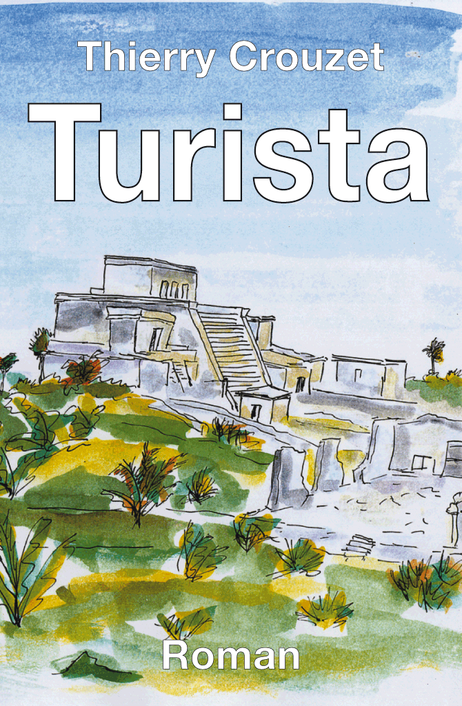

# Récit d’un voyage touristique

        
[Encore un roman pour l’été](../../page/turista) ([téléchargement](http://blog.tcrouzet.com/turista/#download)). C’était en juillet 1999. Je suis parti au Mexique avec une inconnue dans le seul but de tenir le journal du voyage. J’ai retranscrit mes carnets en août 1999, trois mois plus tard j’ai dû envoyer le manuscrit à une paire d’éditeurs avec mon laxisme habituel. Aucune réponse.

Un éditeur a toutefois remarqué *[Turista](../../page/turista)*, mais ailleurs, par hasard. Regardez comment marche l’édition. François Bourin passe chez une amie qui avait laissé mon manuscrit sur la table de son salon. François le prend, il le lit, puis on déjeune ensemble. À l’époque, il n’est plus éditeur, il a plutôt bien vendu sa maison et contractuellement il n’a pas encore le droit d’en créer une nouvelle. Je lui suggère de se lancer dans l’édition électronique.

Quelques mois plus tard, alors qu’avec Isabelle nous partons habiter à Londres, François, mon amie et d’autres, créent Olympio, dans mon idée une espèce de Scribd. Ça capotera après pas mal de fric jeté par les fenêtres et, plus tard, quand François Bourin relancera une maison d’édition, il publiera *[Le peuple des connecteurs](../../page/le-peuple-des-connecteurs)*.

Depuis dix ans, je n’avais pas relu *[Turista](../../page/turista)*. J’ai bien aimé me retrouver dans ces pages à forte dose d’ébullition cérébrale. J’ai bien aimé revoir mes gribouillages d’aquarelliste dilettante. Je suis tombé sur une note de présentation du livre écrite à l’époque :

> Dans un roman, l’auteur imagine une histoire. Dans un journal, il écrit son histoire au jour le jour. Dans *Turista*, j’imagine une histoire et je la vis pour l’écrire. Ce journal romanesque, ou ce roman vécu, est le récit en direct d’une performance : partir en voyage dans un pays inconnu avec une femme inconnue. L’un, le Mexique, et l’autre, Vania, auraient pu être autres et engendrer une autre histoire. Celle retranscrite était peut-être inévitable, mais rien au préalable n’était décidé. Je ne savais pas où me conduirait la situation dans laquelle je me plongeais.

> Mon intention n’était pas d’écrire telle ou telle histoire, ou de développer telle ou telle idée, je voulais simplement que le réel me dicte une histoire et des idées. Le sujet du livre était en quelque sorte l’influence des contingences sur la pensée d’un homme, cet homme étant moi-même.

> Le livre s’est donc construit au hasard du voyage, d’où les brusques changements de sujet et de ton. Devant une statue aztèque, je m’interroge sur l’évolution des formes, passe une belle femme et je songe à l’amour, arrive ma belle inconnue et l’amour m’échappe.

> Après coup, je peux résumer *Turista* : « Un homme veut voir le monde tel qu’il apparaît. Une femme veut voir le monde tel qu’elle croit qu’il est. L’homme admire les mystiques et refuse l’usage des drogues. La femme hait les mystiques et se drogue. »

> Turista est le récit d’un divorce avant le mariage.

#netlitterature #dialogue #y2010 #2010-8-3-11h40
