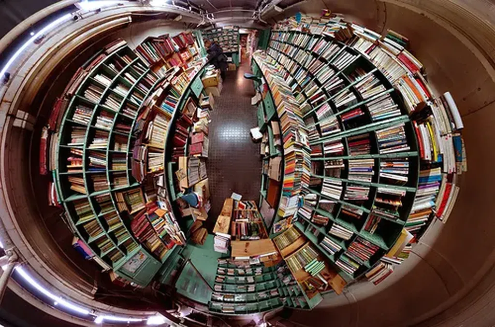

# La fin du livre unique

À sa sortie, un livre nous arrive en grand format, avec un prix autour de 20 euros. Quelques mois plus tard, on le retrouve parfois en poche pour 6 ou 8 euros ou en édition club pour une quinzaine d’euros. Toutes ces éditions cohabitent sur le marché malgré la loi sur le prix unique du livre. Cette loi exige, en fait, un prix unique pour une édition donnée. Qu’à cela ne tienne. Pour outrepasser cette loi, il suffit de créer de nouvelles éditions.

Mais le jeu en vaut-il la chandelle ? Avec les progrès de l’impression à la demande, il sera bientôt envisageable de proposer des livres à l’unité ou en petite série au même prix qu’en grande. C’est presque déjà le cas. La notion d’édition, qui n’existait que pour des contraintes de coût, perdra alors toute pertinence. Est-ce la fin des libraires indépendants ? Pas nécessairement.

Vous avez les yaourts Carrefour, demain vous aurez les livres Carrefour. Ils seront plus grands ou plus petits, avec des couvertures flashes ou gaufrées avec des lettrages dorés, imprimés en polices maison et peut-être même préfacés par une plume complaisante. Le prix sera sans doute moins cher que dans les Fnac.

Ces dernières réagiront. Panégyristes de la culture, elles proposeront des éditions chics, peut-être avec un appareil critique. Elles offriront même des impressions à la demande directement dans les boutiques, avec pourquoi pas un mot de l’auteur envoyé directement depuis le Net.

Le prix unique ne s’applique plus dans ce monde du livre à l’âge des technologies numériques (et je parle bien du livre papier). Chaque point de vente devient créateur de valeur ajoutée. Il part d’un fichier source proposé par l’éditeur, une matière première, qu’il remodèle en fonction de sa clientèle.

Les petites librairies ne seront pas laminées. Elles aussi pourront créer les livres à leur image. Associées à des typographes, elles développeront une véritable expertise et fidéliseront les lecteurs, même s’ils doivent débourser 2 ou 3 euros supplémentaires par exemplaire.

Aujourd’hui, un libraire fait le même travail qu’un pharmacien. Il pousse des boîtes, distillant quelques conseils au passage. Demain, le libraire pourrait ressembler au pharmacien d’antan qui préparait lui-même ses breuvages (aussi au libraire d’antan).

Dans cette logique, l’éditeur ne fabriquera plus des livres mais des textes qui prendront une multitude de formes, tant matérielles que numériques, et il s’occupera de les propulser vers d’autres propulseurs.

Ce scénario est-il crédible ? Rien techniquement n’empêche la révolution numérique du livre papier. Mais les éditeurs ont-ils réellement envie d’innover ? Ne sont-ils pas presque tous en position d’attente ? La loi sur le prix unique du livre bloque toute initiative depuis des années (d’autant qu’elle garantit une plus grosse marge aux plus gros libraires). La grande distribution n’a donc pas envie de se casser la tête pour le livre, une part faible de son chiffre d’affaires général.

Alors on sommeille, on attend la mort du papier. C’est ce qui condamne sans doute mon scénario (et les libraires de quartier). Le livre sera électronique ou ne sera pas. Dans tous les cas, le prix unique ne sera plus qu’une vieille bizarrerie franco-française.

### Notes

1. La loi sur le prix unique a peut-être protégé les libraires mais n’a pas favorisé la lecture. La France est loin d’être le pays où on l’on vend le plus de livres par habitant.

- On ne veut pas payer plus pour un objet identique, mais on veut bien payer plus, ou moins, pour un objet différent au contenu identique. C’est pour cette raison qu’il existe déjà différentes éditions.

- C’est le texte qui compte, pas l’emballage. J’aime l’électronique parce qu’elle donne plus de poids aux contenus qu’aux objets.

- Trop longtemps les éditeurs, et surtout les distributeurs, nous ont faire croire qu’un texte existait parce qu’un objet lui était associé. Nous devons éviter de tomber dans ce piège matérialiste.

- Nous avons besoin d’en finir avec le prix unique pour sauver les auteurs et les éditeurs. Il faut qu’en direct, chez eux, on puisse payer moins cher qu’ailleurs. Il faut privilégier le producteur au profit de la distribution.

- Pour sauver les libraires, on a sacrifié les auteurs et les éditeurs. Est-ce logique ?

- L’éditeur doit s’occuper du contenu, pas du contenant. Il existe dorénavant trop de possibilités formelles. C’est aux distributeurs de packager. L’éditeur doit éditer et propulser.

*PS : Billet qui fait suite à [quelques échanges avec Nicolas Ancion](renverser-economie-du-livre/#comment-80767.md).*

#netlitterature #prix_unique_du_livre #dialogue #y2010 #2010-9-7-9h38
