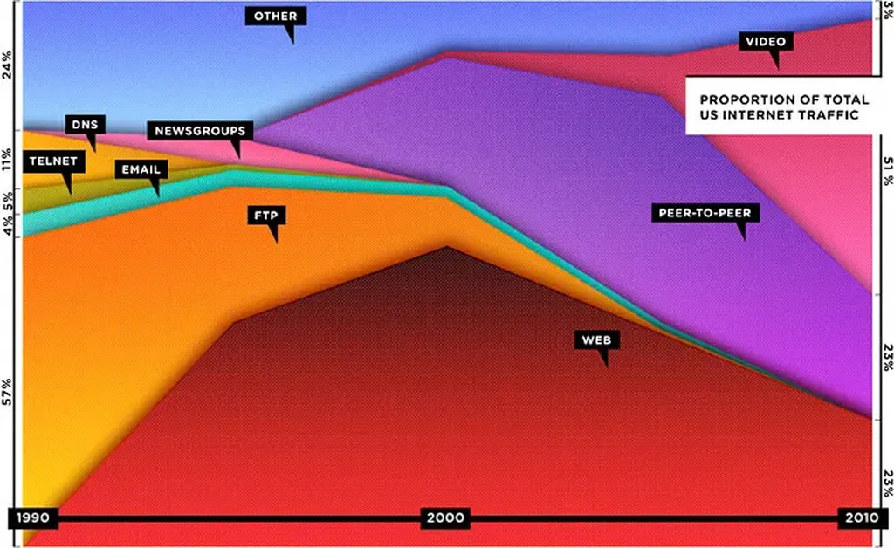

# Le Web est mort deux fois

J’ai tardé à réagir à [l’article de Chris Anderson dans *Wired*](http://www.wired.com/magazine/2010/08/ff_webrip/), parce que, depuis plus d’un an, j’ai [annoncé cette mort du Web](../../2009/8/vers-un-web-sans-site-web.md), et qu’il me semblait inutile de me répéter, et puis parce que la position capitalo-libéraliste d’Anderson commence à me courir sur le haricot. Il oscille au gré des modes, surfant la vague idéologique du moment, pour mieux la rejeter quand il entrevoit une nouvelle possibilité de business. La plupart des auteurs de son espèce ne pensent que gros sous. Ils croient que tout se règlera par des contrats (et par les séries TV qui constituent le summum de leur culture).

Le graphique publié dans *Wired* paraît définitif. La messe est dite. Mais, à y regarder mieux, il ne s’agit que d’un comparatif en parts de marché. Ce n’est pas parce que le Web perd des parts qu’il meurt. Aujourd’hui par exemple, on publie plus de livres que jamais même si les gens passent proportionnellement moins de temps qu’avant à les lire. Le discours d’Anderson est biaisé, collé au seul plan commercial. Il se vautre sur le culturel et le politique. Dans l’absolu, en termes de trafic et de quantité d’information disponible, le Web n’a jamais cessé de progresser.

Ne croyez pas que je sois devenu un défenseur du Web. Je dénonce juste une certaine rhétorique.

> This is the natural path of industrialization: invention, propagation, adoption, control, explique Anderson.

Qu’est-il en train de faire sans le dire ? De mettre en pièce sa théorie de la longue traine. Michael Wolf écrit en parallèle :

> According to Compete, a Web analytics company, the top 10 Web sites accounted for 31 percent of US pageviews in 2001, 40 percent in 2006, and about 75 percent in 2010. “Big sucks the traffic out of small,” Milner says. “In theory you can have a few very successful individuals controlling hundreds of millions of people. You can become big fast, and that favors the domination of strong people.”

On dirait qu’ils viennent de découvrir une loi universelle, et de se mettre à genoux devant elle. On comprend mieux ce qu’entendait Anderson par longue traîne, et que j’ai parfois dénoncé. Pour lui, des vendeurs monopolistiques créent la longue traîne en leur sein pour accroître leur part de marché.

De mon côté, je défends l’idée d’une longue traîne exogène, externe à toute entreprise, qui s’observe dans l’ensemble de l’écosystème. Comme je l’explique dans *[L’alternative nomade](../../books/alternative-nomade.md)*, nous devons nous battre pour développer cette traîne si nous voulons défendre nos libertés. La longue traîne sur le catalogue d’Amazon est une bonne chose, mais insuffisante à mes yeux. Nous devons lutter avec nos nouvelles armes d’interconnexion contre cet avenir qui serait déjà écrit.

En fait, avec Anderson, toute l’industrie médiatique se félicite de la mort du Web, c’est-à-dire de la mort des systèmes ouverts et de la décentralisation incontrôlée. De nouveaux opérateurs monopolistiques émergent, avec comme Apple leurs plates-formes propriétaires, et leurs systèmes de micro payement, ce qui injecte de nouveaux revenus dans la boucle. Et comme par hasard, *Wired* qui a frôlé l’asphyxie en début d’année, voit peu à peu le retour des publicités.

Toute personne qui veut faire fortune sur Internet ne peut que prôner une forme ou une autre de centralisation, c’est-à-dire une forme de contrôle. Nous devons en être conscients et lire leurs déclarations suivant cette perspective.

Nous ne sommes plus à l’époque où un business décentralisé séduisait par le seul nombre de ses usagers. Il s’agit aujourd’hui de les fliquer pour les faire payer. Alors oui, l’idéal du Web est bien mort, mais rien ne nous empêche de nous battre contre les barons de la finance, contre tous ces gens qui ont remisé leurs rêves, contre tous ceux qui veulent que rien ne change, sinon nos jouets technologiques.

J’en reviens maintenant aux causes de la mort du Web. J’en vois deux.

1. **L’émergence des applications propriétaires.** Avec les Appstores qui les accompagnent, elles n’utilisent plus obligatoirement HTML et les URL, deux des trois innovations de Tim Berneers Lee, et, quand elles le font, c’est sans que l’utilisateur puisse accéder au processus, encore moins se brancher dessus. Elles nous enferment dans un réseau occulte, avec la promesse d’une plus grande ergonomie et la tarte à la crème d’une plus grande sécurité. Au passage, nous banquons. Il devient difficile de créer des liens vers ces écosystèmes qui se veulent autonomes (comment est-ce que je linke depuis mon blog vers la météo affichée dans une appli iPhone ?).
2. **Le passage au flux.** Nous nous retrouvons avec des objets mouvants, des fichiers ePub par exemple, qui ne sont plus statiques dans le cyberspace comme l’étaient les sites. Tout le monde va bientôt comprendre leur importance. Plus besoin de s’embêter avec un serveur ou un hébergeur pour exister en ligne.

Ces deux tendances s’opposent. La première veut nous ramener avant le Web (minitel, AOL, CompuServe…), la seconde après le Web. Je vois mal comment il pourrait survivre dans ces conditions.

Le retour des applications propriétaires, c’est la victoire des marchands. Plutôt que de développer un espace ouvert avec des sites difficiles à monnayer, on referme les interfaces, les associe à des appareils particuliers. Apple a initié ce mouvement rétrograde.

Il ne faudrait toutefois pas oublier l’enseignement philosophique du vingtième siècle. Il n’existe aucun langage universel. HTML est insuffisant et sera toujours insuffisant. Il est préférable d’entretenir un écosystème divers, ce qui implique des difficultés d’interfaçage. Nous devons en passer par là si nous voulons, après une phase apparente de régression, connaître un nouveau boom créatif. L’innovation suit une respiration entre les hippies idéalistes et les marchands réactionnaires.

Si la première tendance est nécessaire, elle ne m’en déplait pas moins, et je préfère me consacrer à la seconde, qui plutôt que centraliser le Web l’éclate plus que jamais.

Les ePub, et j’espère pour bientôt les ePub sociaux, circuleront partout, aussi bien dans les mondes fermés que les mondes ouverts. Ils reprennent tout ce qui faisait le Web : HTML ou plutôt XML, les objets inclus, les scripts… Il ne leur manque que la possibilité de se parler entre eux. Leur force, c’est leur liberté plus grande que jamais, leur capacité à être avalés par une multitude d’applications ouvertes ou non, d’être monnayables ou non.

Il nous reste à inventer un nouveau protocole de communication entre ces fichiers libres et riches, sans doute sur une base P2P. Le Web est bien en train de mourir, il restera une immense galerie marchande et un point de propulsion pour nos contenus qui vivront ensuite librement dans le flux, voire atterriront dans des applications.

PS: 20h, petite précision sur les applications propriétaires, suite à échange sur Twitter avec [karlpro](http://twitter.com/karlpro).

#netculture #dialogue #y2010 #2010-9-21-11h5
