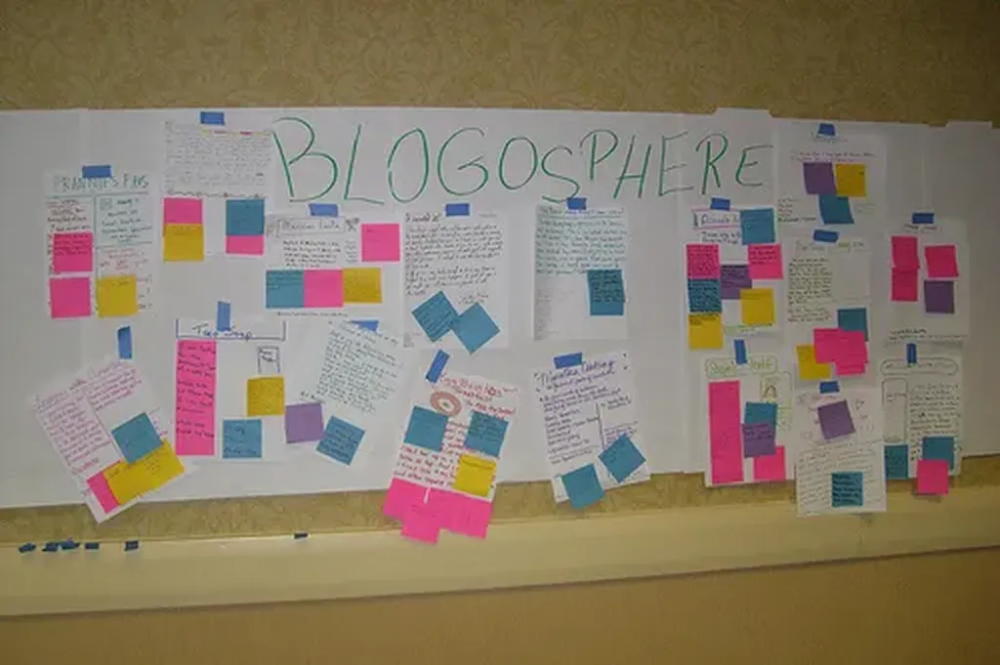

# Réinventons la blogosphère

J’ai parfois eu des idées bizarres et stériles. coZop.com se voulait une plateforme de republication alors que je suis un apôtre de la décentralisation. J’avais l’espoir de réussir à générer assez de revenus pour en reverser 50 % aux blogueurs. Échec complet malgré 10 000 à 20 000 visiteurs uniques quotidiens, d’autant qu’il aurait fallu travailler dur et j’ai envie de solutions techniques ultrasimples. Depuis un mois, le serveur de coZop est en rade, et je n’ai pas envie de le redémarrer. J’ai une autre idée, dont j’ai un peu parlé avec [Narvic](http://novovision.fr/). Fédérer la blogosphère. Il ne me faut qu’une vingtaine de blogueurs volontaires pour démarrer une expérience.

Il ne s’agit plus cette fois d’attaquer au sacrosaint principe de l’indépendance et de la décentralisation, mais, au contraire, de lui donner plus de force vis-à-vis des autres acteurs médiatiques. En résumé : faire tout le contraire de Rue89, Le Post ou même Owni.

Pour commencer, il faudrait fédérer les statistiques des blogueurs participants. Sur le coZop new look, ils disposeraient d’un formulaire où ils indiqueraient leur compte Google Analytics. Chaque jour le site publierait les stats du réseau, établirait la liste des billets les plus lus et pointerait vers les sources. Ce site minimaliste serait en quelque sorte un observatoire automatique de blogueurs volontaires. Le but n’étant pas de créer un agrégateur, mais juste un outil de pondération et d’autopromotion. Les lecteurs pourraient l’utiliser pour prendre la température du réseau. La lecture se ferait à la source.

Par ce procédé techniquement simple, nous connaîtrons notre audience globale et notre poids par rapport aux médias centralisés. Si notre poids approche du leur, voire le dépasse, nous pourrons rêver de nous organiser en agence média décentralisée. Par exemple, recevoir des livres à critiquer. Il suffirait que les éditeurs indiquent les titres qu’ils veulent proposer sur un formulaire, un blogueur du réseau se porterait volontaire pour le recevoir.

Inutile de rêver plus loin. Étape 1 : consolidons nos audiences. Dans un but de transparence, je viens d’afficher le nombre de lectures pour chacun de mes billets et [de créer un classement général](../../page/top). Ces scores ne sont pas impressionnants, mais rien d’étonnant pour un blog expérimental comme le mien. [Ce n’est que quand je déraille que j’ai de l’audience.](../../2009/9/qui-a-la-plus-grosse-quequette-sur-twitter.md)

Je n’ai pas réfléchi plus avant. Faut-il créer des groupes de blogueurs par affinité ? Faut-il ouvrir l’expérience à tous les volontaires ? Je pense que oui. Il faut juste des volontaires pour tenter quelque chose. Manifestez-vous.

*PS : Je reste persuadé que l’avenir du Web, c’est la fin des sites Web.*

#netculture #dialogue #y2010 #2010-9-6-21h18
