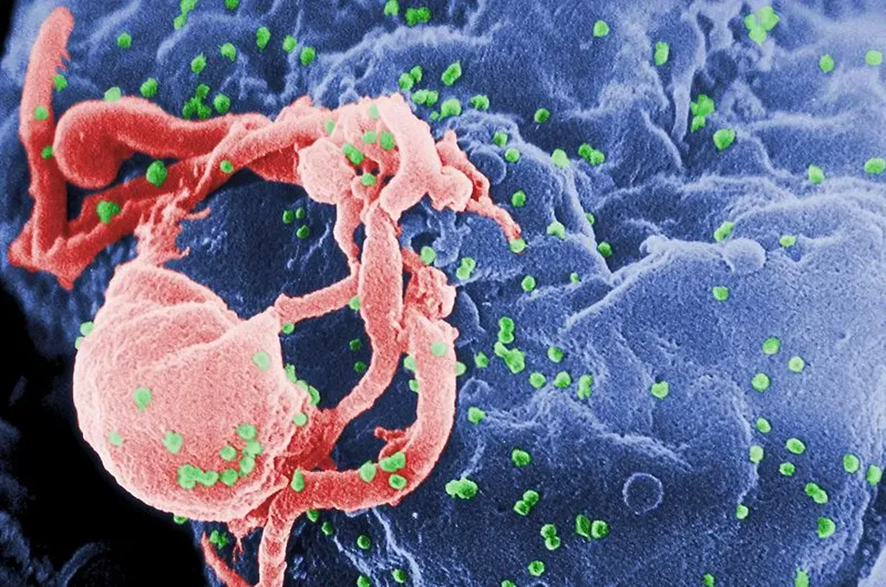

# Bit, Sex and Bug

Mi-mai 2003, dans l’avion qui de Londres me ramenait à Montpellier, j’ai lu dans *NewScientist*, [une brève sur l’origine de HIV qui m’a stupéfié](http://www.newscientist.com/article/mg17823953.100-hiv-puzzle-cracked.html).

> THE origins of a less virulent form of HIV, called HIV-2, have finally been confirmed. Scientists think the main cause of AIDS, HIV-1, crossed over to humans from African chimpanzees sometime after 1700, and mutated into the current human form around 1930. But they have been less sure about the origins of HIV-2, which now infects about 1 per cent of the population of West Africa. Anne-Mieke Vandamme from the Catholic University of Leuven (KUL) in Belgium and her team compared HIV-2 to a similar virus found in sooty mangabeys, a monkey thought to be the virus original host. An analysis of the genetic differences between them indicates that two strains of HIV-2 crossed from mangabeys into humans during the first half of the 20th century. HIV-2 A mutated into its current form around 1940, and HIV-2 B around 1945. Mangabeys became extinct in that part of Africa in the 1950s.

C’est la seconde phrase qui m’a arrêté. À en croire l’auteur de cette brève, l’histoire de HIV-1 semblait presque une évidence. Moi, je n’en avais jamais entendu parler. J’appartenais à la génération sida et je ne savais rien de la maladie. Je ne savais surtout pas que les biologistes connaissaient les grandes étapes de son évolution.

Je devais raconter cette histoire. Une véritable frénésie s’est emparée de moi. Entre juin et septembre 2003, j’ai consulté des centaines de sites et lu plusieurs livres, dont [*The River: A Journey to the Source of HIV and AIDS*](http://www.ofspirit.com/tw-theriver.htm). En même temps que je menais mon enquête, j’ai écrit celle de Julien. Après la mort de Michel, il poursuit son tueur, le virus HIV, remontant peu à peu jusqu’aux origines de la vie et de la complexité.

J’étais alors conscient de n’écrire ni un roman, ni un documentaire, mais un entre-deux, un docuroman. Je m’appuyais sur les derniers résultats scientifiques et, en même temps, je m’aventurais dans des affabulations de plus en plus improbables. Un ami homosexuel m’a un jour dit que seul un hétéro pouvait prendre autant de distance avec la maladie. Au final, j’ai esquissé une histoire généralisée des virus biologiques, informatiques, économiques…

Comme souvent, j’ai fait circuler ce texte sous le manteau, sans plus m’activer pour le publier. Je viens de m’y replonger avec plaisir et surprise, un peu comme si c’était un texte d’un autre. Huit ans plus tard, c’est devenu un roman historique.

J’ai surtout pris conscience que c’était le premier texte que j’ai réellement écrit à l’aide d’Internet. Je me souviens que je surfais en même temps que j’écrivais et que ma fiction se déformait en conséquence. En quelque sorte, je pratiquais déjà une forme d’écriture interactive, par sites Web interposés. Je retrouve dans le texte actuel des vestiges de la jubilation que j’ai éprouvée.

Aujourd’hui, ce sentiment d’augmentation cérébrale est presque banal pour nombre d’entre nous. En 2003, je goûtais à une drogue nouvelle et à laquelle je n’étais pas encore accoutumé. Elle a eu un effet stupéfiant.

Vous en jugerez vous-même lorsque vous lirez le texte. Avant de le publier, j’ai encore quelques doutes sur le titre, d’où cet article. Quand j’écrivais, mon fichier s’appelait *HIV*. Après, j’ai titré *Bug* parce que c’est une histoire de virus au sens large. Aujourd’hui, je me rends compte que ce texte est avant tout l’histoire de Julien, c’est un road book. Je pourrais l’appeler *Julien*, tout simplement. *Bit, Sex and Bug* est un autre titre que j’aime bien, plus fun, peut-être plus intriguant.

#cuisine #dialogue #y2011 #2011-1-20-19h29
