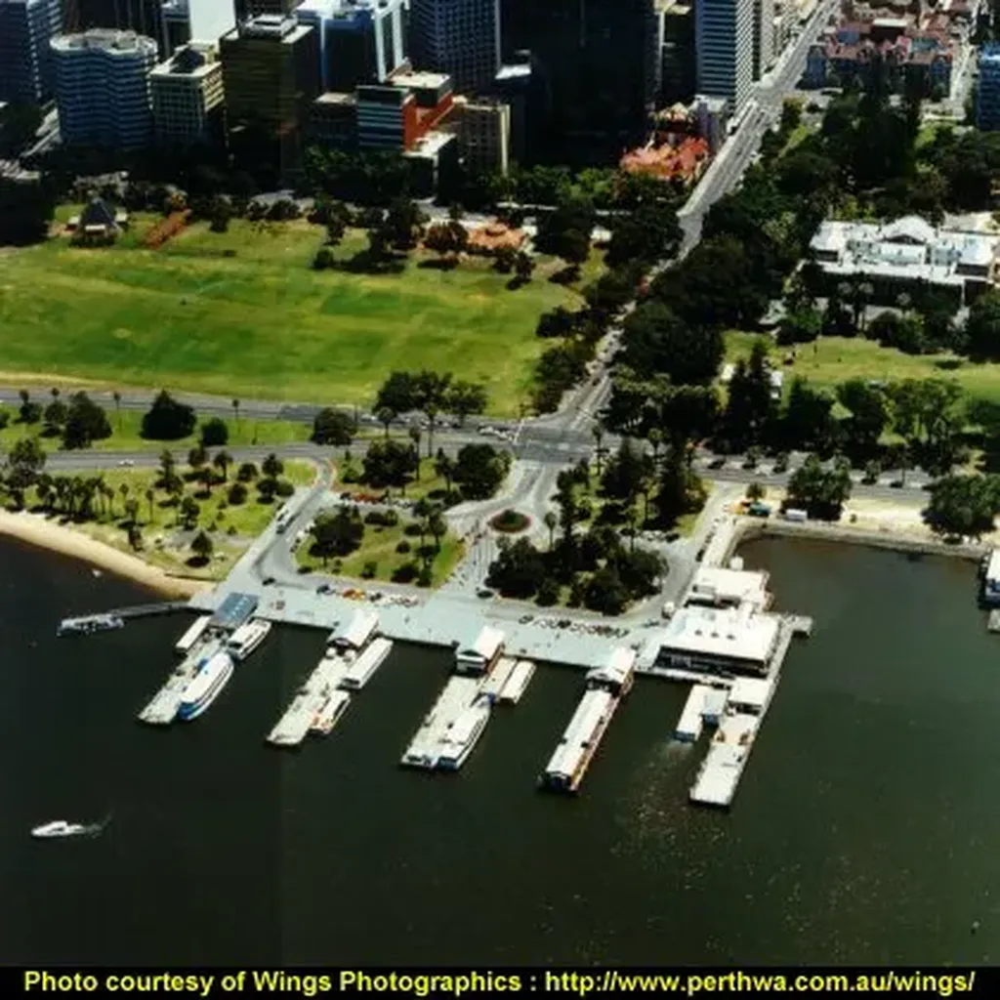
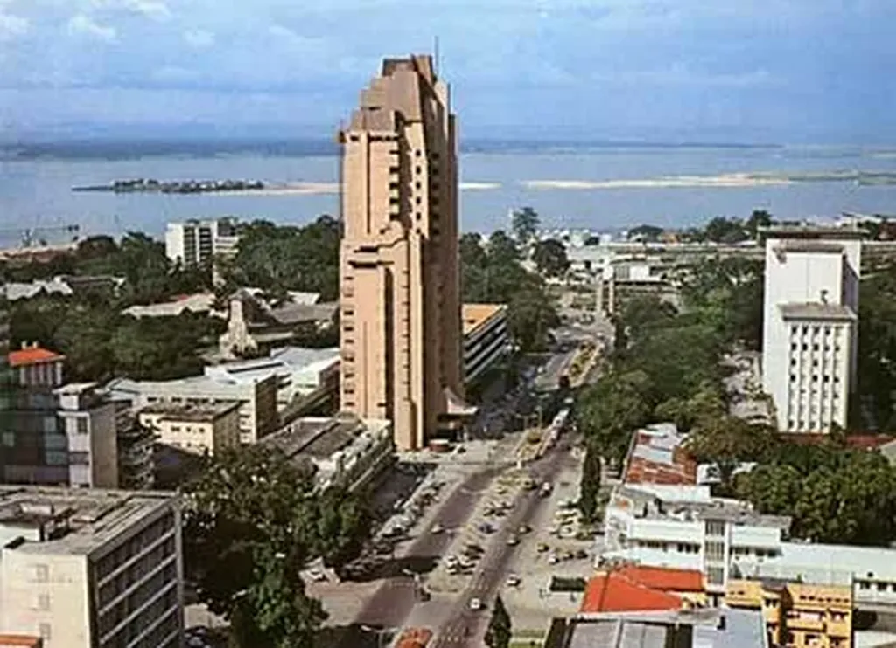
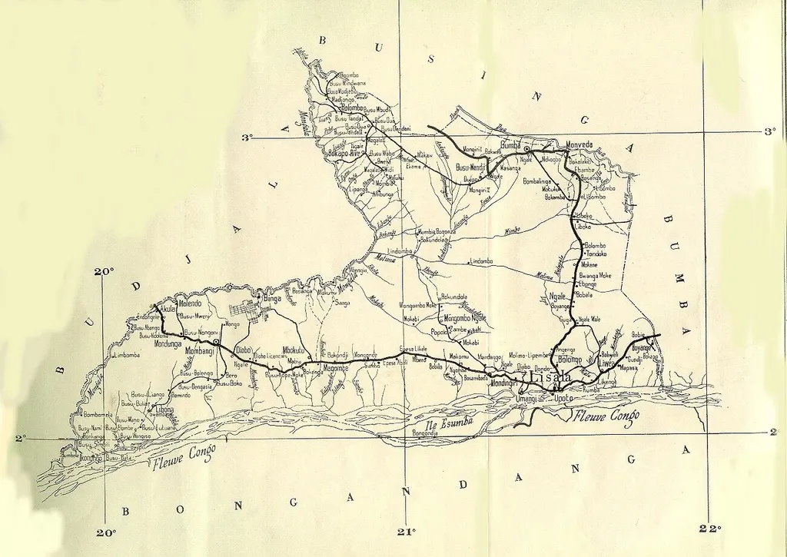
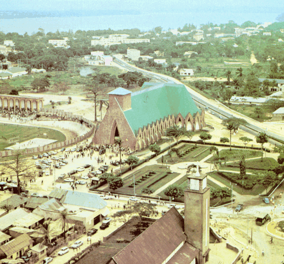
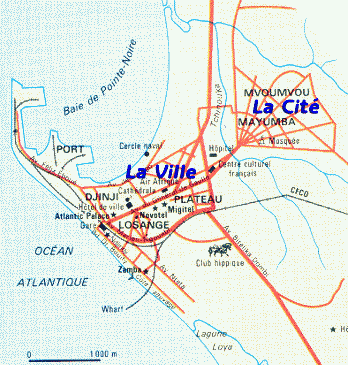
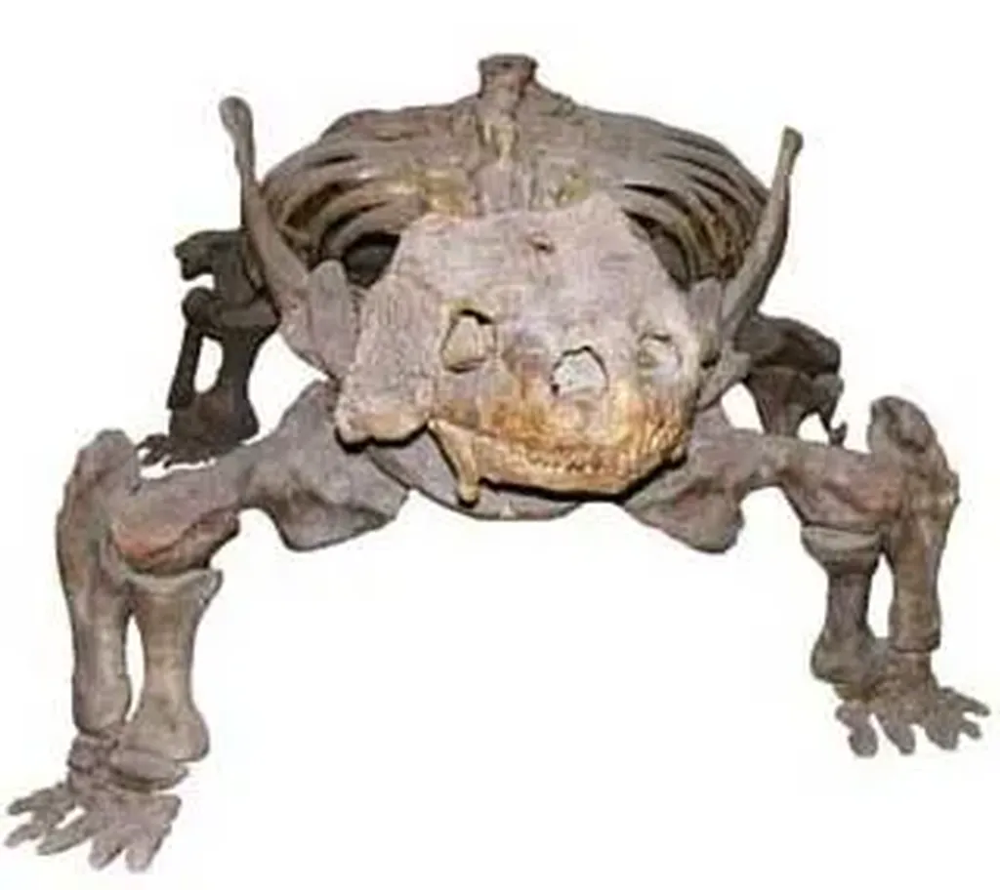

# Histoire d’un texte écrit grâce au Net

Le Net modifie notre façon d’écrire en même temps que ce que nous écrivons. Dans *[La stratégie du cyborg](../../page/la-strategie-du-cyborg)*, j’ai évoqué la dimension sociale de la pratique artistique contemporaine. Cette socialisation peut s’effectuer en direct ou par sites interposés. C’est cette seconde forme qui la première a été possible. Je l’ai [pour la première fois mise en œuvre en 2003](bit-sex-and-bug.md) lorsque j’ai écrit *[Bit, Sex and Bug](../../books/bit-sex-and-bug.md)*.

J’avais déjà abondamment utilisé le Net pour écrire mes livres de vulgarisation. J’avais déjà l’habitude de fouiller les tréfonds des sites méconnus et de lire des PDF pour remonter des informations peu visibles. Mais je ne m’étais jamais servi de ce travail même comme matière d’un texte.

Quand je me suis lancé dans cette histoire du virus HIV, j’ai consciemment fait du Web mon partenaire d’écriture. Chaque site que je consultais influençait ce que j’écrivais et mes lectures Web se retrouvaient mêlées à ma narration. C’est ainsi que les extraterrestres firent leur apparition et donnèrent une forme récursive à mon propos. Les théories conspirationnistes en devinrent la colonne vertébrale.

Avant d’écrire *Bit, Sex and Bug*, j’avais déjà travaillé sur un roman historique, la vie d’Ératosthène. Mais sur le Web, je trouvais peu d’informations pertinentes. J’allais plutôt les glaner dans de vieux livres à la British Library, sur un rythme d’acquisition propre à l’érudition traditionnelle.

Durant l’été 2003, il en alla tout différemment. Le Web regorgeait d’information sur le sida. Articles scientifiques, témoignages de malades, théories fumeuses, photos, vidéos… La proximité de toutes ces sources, leur disponibilité immédiate, répondait à l’urgence de mon écriture. Je songeais à quelque chose, j’avais la réponse. Mieux : des dizaines de pistes s’ouvraient devant moi et je n’avais qu’à les suivre.

J’étais moi-même sur la route. Les informations se déroulaient devant moi comme des paysages. Elles m’envoyaient des sensations directes. J’étais devenu une espèce de sismographe. Avant l’avènement d’un Web superchargé d’informations personne n’aurait pu expérimenter ce que j’ai connu. Amener l’érudition à se consommer avec la légèreté d’une expérience physique immédiate. Comme les cyberpunks de Gibson, j’ai jonglé avec les lignes de forces du cyberspace.

Ce que j’étais en train de vivre et ce que j’écrivais ne se différenciait plus. Ce qui comptait c’était de vivre cette écriture. J’imagine que dans les ateliers d’écriture les participants éprouvent la même sensation. J’ai prolongé cette expérience durant une soixantaine de jours tout en menant une véritable enquête scientifico-policière.

A posteriori, à côté du texte finalisé, il reste une liste d’URL qui témoignent de mes explorations et quelques photographies que j’ai sauvegardées et qui m’ont inspiré des scènes et parfois des chapitres.

Ce portrait indistinct de Gaétan Dugas, un temps surnommé le patient zéro.

Kinshasa...

Une péniche sur le Congo...

La région de Lisala...

Brazaville...

Pointe Noire...

Un bradysaurus...

Perth Barrackstreet Jetty...

Ces photos sont comme un album souvenir d’un grand surf sur le Web qui devint l’histoire de Julien, l’histoire de ma propre lutte avec la complexité, celle de l’écriture et de la vie.

#cuisine #dialogue #y2011 #2011-1-22-11h27
