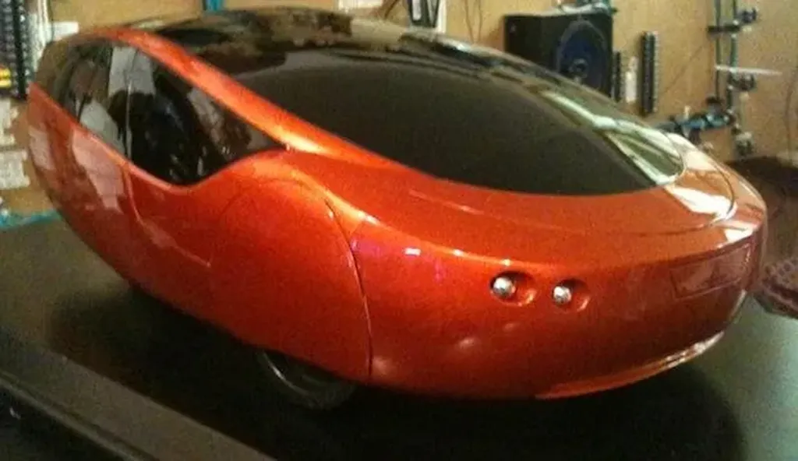

# Imprimez votre voiture

Après avoir lu *[La tune dans le caniveau](../../page/tune-caniveau)*, certains lecteurs se sont moqués de l’idée [d’imprimante 3D](../../2010/7/la-revolution-dans-un-garage-encore.md). Ils jugeaient ces machines farfelues et m’ont fait passer pour un olibrius. Je suis toujours stupéfait de l’aplomb que peuvent avoir certains commentateurs sur le Net. Ils sont d’autant plus sûrs d’eux qu’ils font preuve d’une crasse ignorance.

Dans ma nouvelle, Extase porte une paire de tennis fabriquée par une imprimante et les insurgés fabriquent des armes. Bientôt nous imprimerons nos voitures. [Ce n’est pas de la science-fiction](http://nextbigfuture.com/2010/11/additive-manufacturing-company.html). Comme en a démontré la possibilité Von Neumann à la fin des années 1940, les imprimantes 3D seront aussi capables de s’imprimer elles-mêmes. 

#netculture #dialogue #y2011 #2011-1-5-15h46
