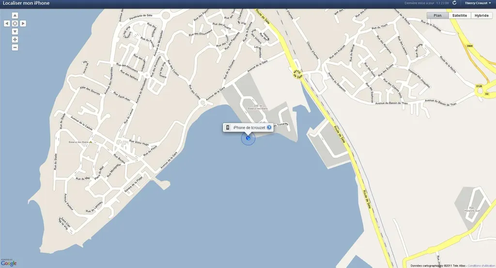

# J'ai retrouvé mon iphone

[MolibeMe](https://me.com/find/fr-fr/) propose de [géolocaliser les iPhone](http://www.apple.com/fr/iphone/find-my-iphone-setup/). Le mien est dans l’eau en ce moment. C’est tellement inutile que c’est risible. Quoique j’ai vu un ami rechercher ainsi son iPad et se rendre compte qu’il l’avait oublié à son bureau. Ça lui a évité du stress !

#netculture #breves #y2011 #2011-1-20-13h38
