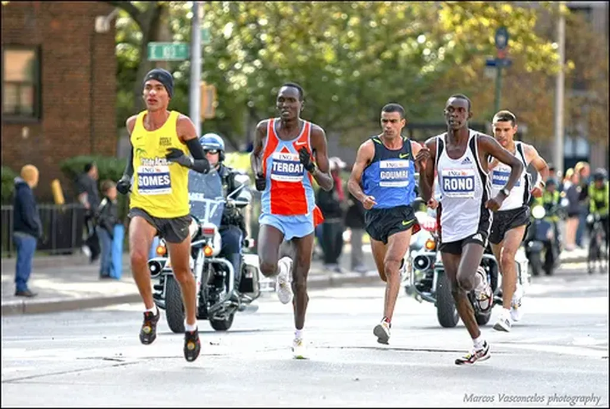

# Nous serons les premiers

J’ai fais aujourd’hui quinze minutes de voiture et j’ai écouté France Culture ! Je suis alors tombé sur une [discussion au sujet du journalisme participatif](http://www.franceculture.com/emission-place-de-la-toile-journalisme-et-reseaux-sociaux-documentaire-la-rue-est-a-eux-2011-01-23.h) avec [Philippe Couve](http://twitter.com/#!/couve) notamment. J’ai noté des préoccupations communes à celles qui interrogent les littérateurs.

À l’antenne, il a été notamment question des trois temps du travail journalistique à l’âge 2.0. Je résume.

1. La conférence de rédaction ouverte, avec possibilité de voir des sujets être proposés par les internautes eux-mêmes.

- L’investigation coopérative.

- La propulsion qui devient une tâche importante des journalistes mais aussi de tous les lecteurs.

À ces trois temps du journalisme correspondent [trois temps littéraires](../../2010/12/ebooks-gratuit-ca-marche.md) qui sans être identiques s’y apparentent.

1. Si un journaliste travaille pour une entreprise, doit en assurer la rentabilité, un auteur en général travaille à son compte, et bien souvent ne se préoccupe pas de rentabilité. Il ne recherche donc pas les sujets à traiter. Les sujets s’imposent à lui et il n’a pas besoin de tenir des conférences de rédaction. En revanche, tout auteur qui est aussi blogueur sait que l’activité sur son blog influence sa pensée, sa créativité et, en conséquence, oriente son écriture.

- Si les journalistes pratiquent encore peu l’investigation coopérative, il me semble que du côté littéraire on a pris de l’avance. Depuis longtemps des outils comme [CommentPress](http://www.futureofthebook.org/commentpress/) nous aident à travailler à plusieurs sur un texte, sans pour autant que la notion d’auteur disparaisse. De son côté, le blog, et les interactions qu’il induit, imprime sa marque dans l’écriture elle-même, au jour le jour. Un auteur suivant ce que j’ai appelé *[La stratégie du cyborg](../../page/la-strategie-du-cyborg)* peut ainsi ouvrir la bouche créative. Nous sommes nombreux à nous être engagés sur cette voie depuis quelques années. Il faudra faire l’étude de cette influence, [qui parfois ricoche de site en site](histoire-d%E2%80%99un-texte-ecrit-grace-au-net.md).

- Après avoir produit une œuvre, il reste à la diffuser. Dans *[Propulseurs dans le flux](../../page/propulseurs-dans-le-flux)*, j’ai fait de tous les créateurs de contenus des diffuseurs. Écrivains et journalistes se retrouvent à égalité, même s’ils naviguent dans des environnements sociaux différents.

Mais la propulsion ne se résume pas à promouvoir, elle reboucle avec les deux temps précédent qu’elle nourrit sans cesse. La boucle s’est refermée. Il n’existe plus une chaîne qui irait du producteur au consommateur mais un flux continu. Une espèce de cycle de l’eau qui transporte des informations, des histoires et des rêves. Nous sommes tous devenus propulseurs.

Cette imbrication des trois temps, leur fusion en un continuum sans frontières définies, a de profondes conséquences. En particulier, il devient impossible d’assigner les trois moments du processus à des personnes différentes, à des professions différentes. Dans un univers en cours de fluidification et de complexification, la segmentation suivant la vieille logique cartésienne est dépassée.

[François Bon](http://www.tierslivre.net/) est l’exemple même de l’homme-orchestre propre au flux, l’homofluxus. Il n’est pas en haut ou en bas, il est partout en même temps. Il écrit, édite, monte sur scène, illustre, met en page… et propulse bien sûr. C’est une position inconfortable, bancale, épuisante, qui pousse parfois au découragement, mais c’est la seule où désormais nous pouvons vivre. Dans un monde complexe, sans frontière, sans limite, dominé par les feedbacks, il n’existe plus de positions stables, de perchoirs clairement étiquetés. Un homme qui veut n’en occuper qu’un, être seulement le directeur d’une maison d’édition, s’accroche à un rocher abandonné dans le passé par le flux.

Nous sommes les premiers homofluxus. François est l’un des premiers. Nous sommes les premiers parce que nous vivons à un embranchement historique, en tout cas pour ce qui concerne l’écrit. Notre position de premiers, gagnée parce que nous sommes nés au bon moment, ne nous garantit pas une place au regard de la postérité mais, tout moins, nous fait sentir les potentialités qui se libèrent autour de nous. Il faudrait être fou pour ne pas s’en gorger.

Je suis stupéfait de voir ceux qui se dressent sur la berge et crient qu’il y a trop de courant pour se baigner. Pourquoi ne plongent-ils pas avec nous ? Le train est parti, vous ne l’arrêterez plus. Vous vous condamnez à être les derniers.

Si la plupart des premiers seront oubliés, vous autres le serez plus vite, peut-être du temps même de votre vie. Vous n’aurez contribué qu’à nous faire perdre du temps. Pourquoi cet acharnement, je vous le demande ? Au nom de la tradition ? Croyez-vous que nous n’en soyons pas nous aussi amoureux ? Qu’est-ce que la tradition ? Sinon un flux qui s’altère de génération en génération. Si vous voulez préserver les anciens modèles, vous endiguerez le flux, vous briserez la tradition elle-même. Malgré votre attachement, vous la trahirez. Toutes les traditions sont en cause. Celle du journalisme par laquelle j’ai commencé, celle de la littérature par laquelle j’ai enchaîné, toutes les traditions au cœur desquelles l’écrit joue un rôle central.

#netculture #coup_de_gueule #y2011 #2011-1-23-21h11
