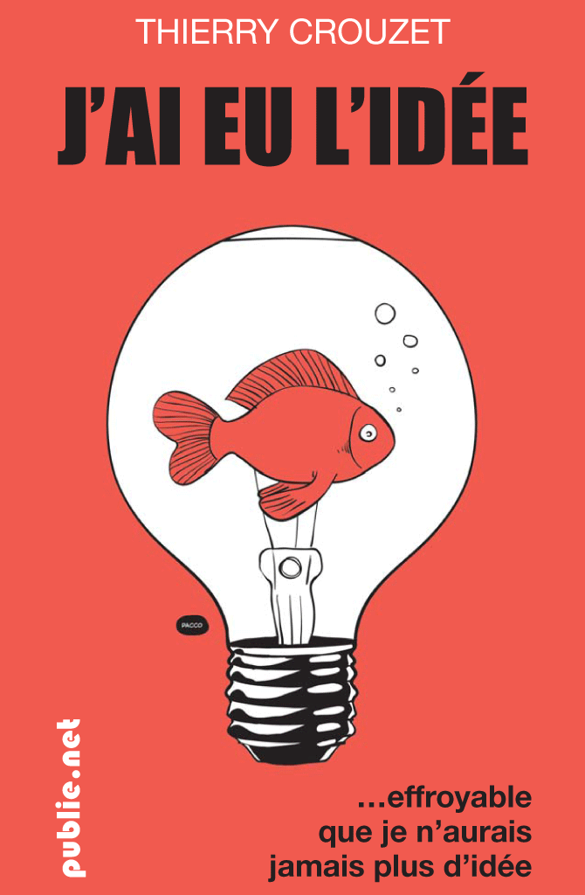

# Quelques idées pour les blogueurs

Dans la série *[J’ai eu l’idée](../../page/id)*, j’ai quelques propositions pour les blogueurs.
1. J’ai eu l’idée d’offrir à des entreprises, ou pourquoi pas à des anonymes, de payer pour publier des billets sur mon blog. Mon slogan serait : « Payez pour écrire. »
2. J’ai eu l’idée d’afficher un bouton de don à tous ceux qui me lisent plus de cinq fois par mois.
3. J’ai eu l’idée d’ouvrir une souscription pour financer mes futurs billets.
4. J’ai eu l’idée que le blogueur qui n’était pas sous l’influence de ses commentateurs et des autres blogueurs n’était pas un blogueur, juste un journaliste ou un chroniqueur.
5. J’ai eu l’idée que seul le titre d’un billet avait de l’importance.
6. J’ai eu l’idée de tester les titres de mes billets sur Twitter et de n’utiliser que les plus retwittés.
7. J’ai eu l’idée d’insulter les blogueurs populaires pour qu’ils s’énervent contre moi et me rendent plus populaires.
8. J’ai eu l’idée que traiter des mêmes sujets que les autres était la meilleure manière d’avoir des lecteurs.
9. J’ai eu l’idée que la blogosphère ne développait pas une pensée alternative mais renforçait la pensée dominante et ses faux clivages.
10. J’ai eu l’idée que les blogs littéraires étaient animés par des auteurs qui comme moi n’auraient jamais été publiés ailleurs.
11. J’ai eu l’idée que les blogueurs se regardaient écrire plus que n’importe quels autres auteurs. Aucun rédacteur en chef ou éditeur ne nous met le nez dans nos maniérismes. Et nos lecteurs n’ont pas le courage de dénoncer nos tics d’écritures.
12. J’ai eu l’idée qu’un blogueur avait le plus souvent peu de lecteurs car seuls les lecteurs indifférents à ses défauts manifestes peuvent le supporter.
13. J’ai eu l’idée que les blogueurs s’aimaient les uns les autres, car il n’y a personne d’autre pour les aimer. En conséquence, la blogosphère est exsangue.
14. J’ai eu l’idée que je ne pourrais plus me passer de bloguer.
15. J’ai eu l’idée que, en dehors des blogs, la plupart des textes écrits aujourd’hui étaient ennuyeux, ce qui n’empêche pas la plupart des blogs d’être encore plus ennuyeux.
16. J’ai eu l’idée que le plus important de mes livres était mon blog, donc autre chose qu’un livre.
17. J’ai eu l’idée que le coût nul de production d’un blog autorisait un nombre quasi nul de lecteurs donc dispensait l’auteur de réellement penser à ses lecteurs.
18. J’ai eu l’idée d’écrire mon blog pour qu’il soit lisible dans cent ans. Je sais, je suis prétentieux.
19. J’ai eu l’idée de proposer des sondages et de n’écrire que sur les sujets plébiscités.
20. J’ai eu l’idée de prendre quotidiennement les cinq articles de presse les plus populaires et de montrer que les faits relatés sont systématiquement interconnectés (ou plutôt interconnectables).
21. J’ai eu l’idée de ne plus lire les blogueurs qui pour se donner un genre littéraire font sans cesse l’élision du verbe être. Si ce verbe vous gêne, débrouillez-vous pour ne pas tomber sur lui.
22. J’ai eu l’idée que la blogosphère me servait de stimulateur faute de trouver une véritable énergie en dehors d’elle. J’ai tendance à m’ennuyer quand je rencontre des humains en chair et en os.
23. J’ai eu l’idée que la nécessité de publier souvent pour avoir des lecteurs était ce qui tuait la créativité des blogueurs.
24. J’ai eu l’idée que nous étions trop nombreux à bloguer et que nous partagions trop peu de lecteurs, nos lecteurs n’étant que des blogueurs, voire d’anciens blogueurs.
25. J’ai eu l’idée qu’un blog ne pouvait avoir une colonne vertébrale que si son auteur travaillait par ailleurs à des textes plus longs.
26. J’ai eu l’idée qu’un blog ne pouvait devenir œuvre que si sa forme était pensée au-delà du jour le jour et développait une structure plus générale.
27. J’ai eu l’idée qu’un blog pouvait nous arracher à la vieille linéarité littéraire. Ne plus lire les billets dans l’ordre chronologique mais suivant des axes transversaux offerts par des tags.
28. J’ai eu l’idée que personne ne lisait réellement les blogs et que personne ne leur attachait une réelle importance. Le livre fait encore sérieux, comme s’il était le seul endroit où s’exprimait la créativité littéraire.
29. J’ai eu l’idée que les prix littéraires ne célébraient rien d’autre que les auteurs qui n’ont pas vu que la littérature ne se faisait plus sur le papier mais en ligne.
30. J’ai eu l’idée que le jour où les blogueurs seraient célébrés à l’égal des romanciers, il serait temps d’aller écrire ailleurs. J’aurai alors la preuve que ma forme est effectivement morte.
31. J’ai eu l’idée que les liseuses électroniques ouvriraient enfin les blogs à un plus grand nombre de lecteurs. Il nous reste à repenser nos blogs pour qu’ils s’adaptent aux nouvelles pratiques de lectures.
32. J’ai eu l’idée que nous devions apprendre à combiner le temps court de la lecture d’un billet et le temps long de la lecture d’un tag. Aujourd’hui, nos textes ne se prêtent pas réellement à une lecture bidirectionnelle, encore moins multidimensionnelle.
33. J’ai eu l’idée que la plupart des blogueurs adoptaient la forme blog sans la questionner. C’est comme s’ils écrivaient des romans parce que tout le monde écrit des romans et qu’on a ainsi une chance d’obtenir une petite reconnaissance.
34. J’ai eu l’idée de continuer à bloguer.
35. J’ai eu l’idée que ces idées pour blogueurs n’avaient pas leur place dans *J’ai eu l’idée*, c’est pour ça que je les publie sur mon blog.
36. J’ai eu l’idée que vous devriez acheter *J’ai eu l’idée* chez publie.net.

#blogosphere #buzzlitt #id #netculture #dialogue #y2011 #2011-1-2-15h48
