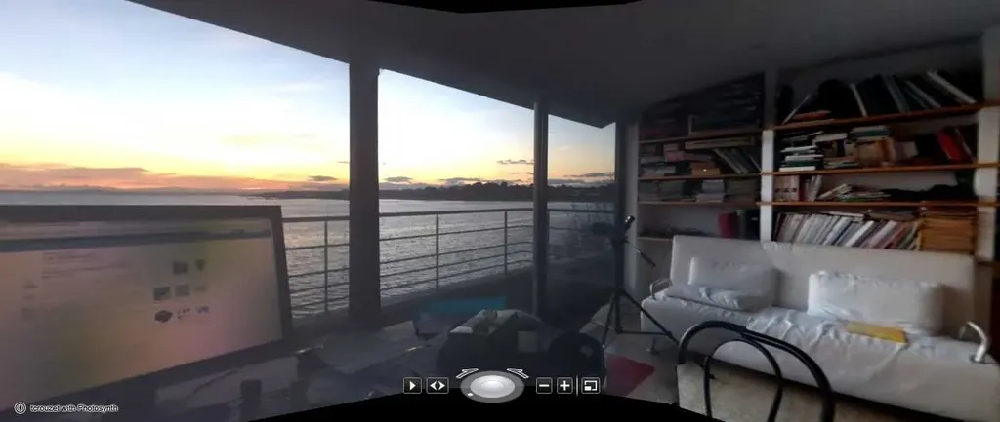

# Bloguer, un art de vivre qui paye

Moins je blogue, plus j’ai envie de parler des blogs. Comme quoi il y a dans la forme quelque chose qui vous tient et ne vous lâche pas. C’est [le tweet de Narvic](https://twitter.com/#!/narvic/status/151317009546739712), Narvic qui ne me donne plus de nouvelles depuis 9 mois, qui me pousse à entrer dans le débat évoqué par Éric Mettout dans *L’Express* : [Ah bon, blogueur, c’est un métier ?](http://blogs.lexpress.fr/nouvelleformule/2011/12/21/ah-bon-blogueur-cest-un-metier)

Bien sûr. Tout dépend ce qu’on entend par métier. Se demander si blogueur, c’est un métier, c’est exactement comme se demander si écrivain, peintre, sculpteur, musicien, parent… en est un. Il est possible dans chacun de ces cas, dans certaines circonstances exceptionnelles, de gagner de l’argent.

Toutes les activités devraient avoir un statut comparable, à savoir rapporter hypothétiquement. On devrait se lancer dans les carrières par passion et non par appât du gain. Dans une humanité radieuse, les métiers nécessaires à la survie devraient disparaître. Il faut croire que nous n’avons pas encore atteint ce stade heureux de notre histoire… où bloguer sera entendu comme un art canonique où nous plongerons par mégarde, où nous nous abîmerons souvent et où par chance nous rencontrerons la renommée et pourquoi pas la richesse.

Bloguer, c’est un métier noble. Un métier auquel tous les autres devraient ressembler. C’est un métier d’après l’esclavage. Un métier d’hommes et de femmes libres de dire ce qu’ils pensent et de réagir aux bêtises professées par les autres êtres humains morts ou vivants, et même de se prémunir contre les absurdités à venir.

Cette liberté passe par une maison à soi, un endroit dans l’espace numérique qui nous appartient en propre. Elle n’empêche pas d’aller se promener dans d’autres lieux en versant [de vases communicants en vases communicants](http://www.scoop.it/t/les-vases-communicants) ou même en nous glissant dans des immeubles de bureaux richement éclairés. Nous devons préserver cette liberté, entrer sortir sans avoir à signer aucun contrat. Ne jamais nous abaisser à réclamer un statut juridique ou faire corporation. Nous ne nous ressemblons pas. C’est notre force.

Mais comme les insectes débiles, nous ne devons pas foncer aveuglément vers les feux trop brûlants. J’ai connu des blogueurs qui ont fermé leur maison, qui l’ont même détruite, pour travailler dans des immeubles en échange de salaires dérisoires. Refusons ce pas de côté. Regardons ailleurs, tout en restant nous-mêmes. Et quand cet ailleurs nous déplait n’hésitons pas à le dynamiter comme [l’a fait merveilleusement Seb Musset](http://sebmusset.blogspot.com/2011/12/chere-anne-sinclair.html).

La différence entre un blogueur et un journaliste est aussi grande qu’entre un auteur et un journaliste. Le blogueur et l’auteur ne savent pas s’ils gagneront un jour de l’argent, mais ils sont libres. Bloguer, ça paye à tous les coups parce que ça nous procure une puissante sensation de vie. C’est pourquoi nous persistons, et pourquoi cette forme perdurera même si des entreprises tentent d’avaler les blogueurs en leur sein.

#blog #netlitterature #coup_de_gueule #y2011 #2011-12-26-18h9
