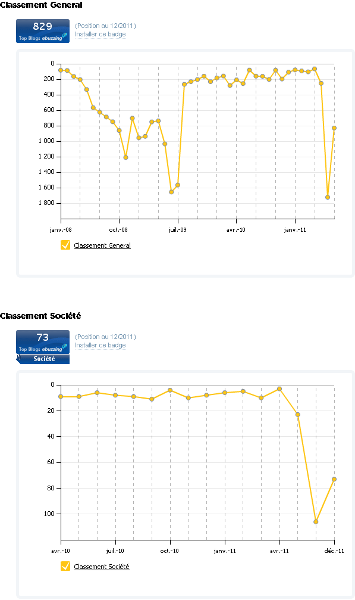
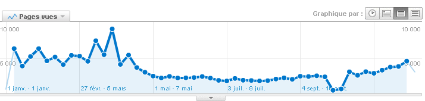

# Ne pas bloguer, c’est mourir

[Depuis mon retour en ligne](#jai-debranche), je nettoie mon blog. Il reste ma maison numérique, et même si je ne lui ajoute guère de nouvelles pièces en ce moment, j’aime redécorer les anciennes. À cette occasion, j’ai cliqué sur le lien qui envoie vers [mon classement ebuzzing](http://labs.ebuzzing.fr/top-blogs/source/blog.tcrouzet.com-Sv6G).

Le graphique parle de lui-même. Quand on cesse de bloguer, on disparaît de la blogosphère. C’est comme si à leur mort on brûlait les livres des auteurs, détruisait les immeubles des architectes ou effaçait de nos mémoires les erreurs des politiciens. Je n’aimerais pas vivre dans cette humanité atteinte de sénilité précoce. Et si la blogosphère lui ressemble déjà ce n’est pas fait pour me motiver à y replonger. Ou alors en tournant le dos avec obstination à tout ce qui la fait briller aux yeux des observateurs épris de chiffres. Mais en serais-je capable ?

#jai_debranche #netculture #breves #y2011 #2011-12-17-10h9
