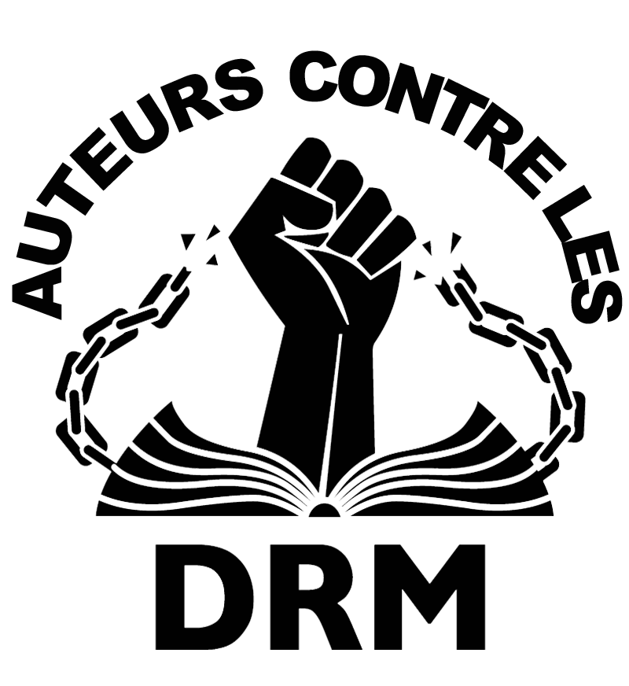

# Conséquences politiques de l’édition électronique

Je n’ai pas envie d’être pris pour un VRP d’Amazon ou d’Apple, ou même de la Fnac. Je milite pour le livre électronique au nom de la création et de sa portée politique. Je me moque de savoir comment les textes sont lus du moment qu’ils sont lus. J’ai publié en février dernier *[L’édition interdite](../../page/edition-interdite)* pour défendre ma position. Il est temps de libérer ce texte.

Je vous conseille de [télécharger l’EPUB](https://app.box.com/s/jrg6yufyw5kdqcitve5q) dans lesquels on retrouve une préface et les réactions de [Nicolas Ancion](http://www.nicolasancion.com/), [Sam Dixneuf](http://samdixneuf.wordpress.com/)… et des dessins de [Didier Millotte](http://croquismillotte.blogspot.com/). Vous pouvez bien sûr toujours [acheter l’édition originale en librairie électronique](../../page/edition-interdite).

Un dernier avertissement : *[L’édition interdite](../../page/edition-interdite)* n’est pas un brûlot contre l’édition traditionnelle. J’ai tenté de décrire un moment d’histoire collective.

#connecteur #ebook #edition #edition_interdite #noepub #y2011 #2011-12-20-14h21
