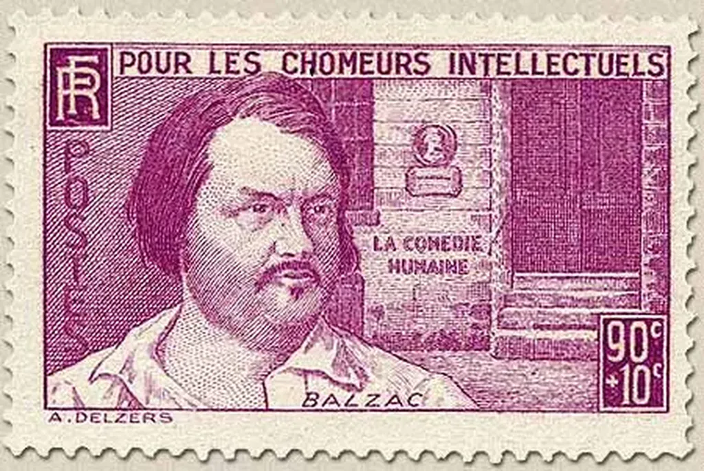

# Le feuilleton 2.0

Au XIXe siècle, on n’achetait pas comme aujourd’hui les journaux pour y lire les prévisions météo, les horoscopes et les nécrologies, mais pour retrouver la suite des aventures narrées par les feuilletonistes, tel Dumas ou Balzac.

C’est ainsi que la forme romanesque populaire se canonisa. Nos thrillers et polars ont été pensés à cette époque. Et même la littérature en fut changée.

Depuis que j’ai défini ce qu’était pour moi un livre électronique, [pardon un codex](../1/definir-livre-electronique.md), je me dis que nous devrions expérimenter une forme de feuilletons adaptés au Web. Il ne s’agirait pas simplement de publier une fois par semaine les épisodes d’un roman, mais de tenter une expérience qui mettrait en jeu différentes techniques expérimentées ces dernières années, voire encore utopiques.

Pour le site qui publierait le feuilleton 2.0, le but serait le même que pour les journaux du XIXe siècle, pousser les lecteurs à revenir. Pour les auteurs, ce serait une façon peut-être d’expérimenter de nouvelles formes (et de bien se marrer j’espère).

Voilà une ébauche de cahier des charges.

1. Le codex se compose de textes, de liens et de codes. Les actions des lecteurs sont analysées et la suite du récit dépend en partie de ce qui a déjà été lu. Le lecteur n’est pas plongé dans une trame linéaire.
2. La suite du feuilleton tient compte du parcours des lecteurs et de leurs commentaires (comme je l’ai expérimenté en écrivant *[La quatrième théorie](../../page/la-quatrieme-theorie)*).
3. L’écriture peut utiliser les mécanismes du jeu de rôle. Un auteur écrit le scénario. Il pose le décor. Provoque les évènements. Les personnages sont joués par d’autres auteurs. Les personnages secondaires étant l’œuvre d’auteurs invités. Les lecteurs peuvent se glisser dans na trame.
4. Des dessinateurs, photographes, vidéastes… peuvent pimenter l’aventure.

Un feuilleton 2.0 se travaillerait comme une série. Il faudrait monter une équipe. Seul un site avec un peu de cash pourrait financer une telle aventure sur la durée, pourquoi pas en relation avec une marque qui serait sponsor de l’aventure. Et oui les auteurs ont besoin de manger… surtout depuis que les journaux et les radios ne financent plus trop les feuilletons à la mode 1.0.

*PS : À la fin de l’aventure on ne publie pas un livre mais une application !*

#netlitterature #dialogue #y2011 #2011-2-7-11h19
