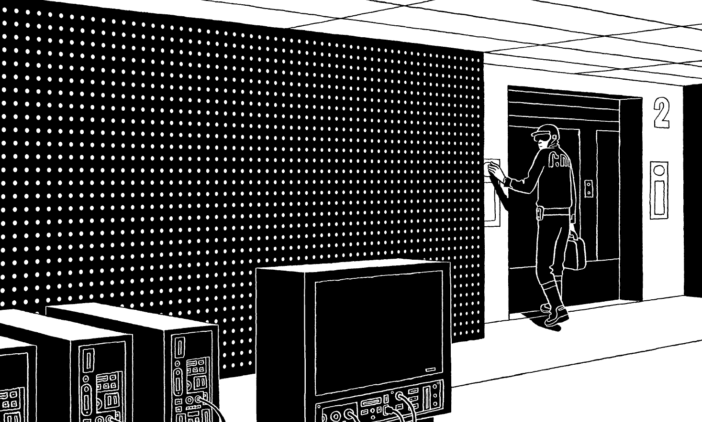

# Nicolas Ancion : notre futur auteur à succès

Quand je lis le livre d’un ami, c’est toujours avec appréhension. Si je n’aime pas, je dois m’expliquer. Comme les auteurs sont toujours susceptibles, comme je ne suis pas très diplomate, ça mène tout droit au drame. Avec [*L’homme qui refusait de mourir*](http://www.amazon.fr/Lhomme-refusait-mourir-Nicolas-Ancion/dp/2914563574/ref=sr_1_fkmr0_1?ie=UTF8&qid=1297083732&sr=8-1-fkmr0) de [Nicolas Ancion](http://www.nicolasancion.com/), je suis sauf.

J’ai juste une énorme critique : mais c’est trop court ! J’étais bien dans ton histoire (je dis tu as Nicolas non seulement parce que c’est un ami mais parce qu’il dit tu à son héros). J’avais envie de te suivre plus loin, jusque dans des régions encore plus glauques et aussi celles peut-être plus merveilleuses.

J’ai beaucoup ri au début, car j’ai retrouvé de nombreux échos au *Peuple des connecteurs*. Il est question d’un professeur Karinthy. [Tu connaissais Frigyes Karinthy ?](../../2010/11/la-carte-et-le-reseau-social.md) Tu savais que c’était le premier à avoir imaginé l’humanité comme un vaste réseau social ?

Dans ta novela illustrée par [Patrice Killoffer](http://fr.wikipedia.org/wiki/Patrice_Killoffer), ce Karinthy est un généraliste, un spécialiste de rien qui pratique l’interdisciplinarité. Autant de thèmes évoqués dans tous mes livres. J’ai même fait de l’expertise de rien mon devoir. Comment pourrions-nous être spécialistes de quelque chose dans un monde mouvant où toutes les choses s’interconnectent et s’interpénètrent ?

Cette remise en cause des spécialités, de toutes les spécialités, de toutes les idées reçues aussi, m’a poussé à remettre en question l’idée même de la mort tout comme Karinthy. On m’a beaucoup reproché le dernier chapitre du *Peuple des connecteurs* consacré au transhumanisme. Tu l’abordes avec distance, avec humour, cynisme… et avec légèreté.

C’est pour toutes ces raisons que je pense que tu deviendras un écrivain à succès. Tu t’intéresses aux questions les plus contemporaines, déjà avec [*L’homme qui valait 35 milliards*](http://www.amazon.fr/LHomme-qui-valait-35-milliards/dp/2507002603/ref=sr_1_1?ie=UTF8&qid=1297083939&sr=1-1), et tu as ce don pour ne pas en faire un combat trop visible. Du coup, je pense que les lecteurs pourront à travers tes textes s’attaquer à des sujets qui exposés de manières trop théoriques ou trop militantes les rebuteraient. C’est un art difficile que d’être à la pointe et d’être accessible. Tu le maitrises.

Ton Karinthy est détestable mais je ne l’ai réellement détesté que quand il déclare :

> C’est en manipulant des mécanismes simples que l’on peut comprendre les mécanismes les plus compliqués, tous les scientifiques savent que l’on doit réduire le problème à une question simple pour le résoudre.

Quand il y a interconnexion généralisée, on entre dans le domaine de la complexité. On ne peut plus réduire les problèmes à des sous-problèmes plus simples. La méthode d’analyse cartésienne ne fonctionne pas. Karinthy ne pouvait qu’aller dans le mur ! J’arrête. J’en ai déjà trop dit.

*PS : Étrange coïncidence. J’ouvre le dernier *NewScientist* après avoir refermé ton livre et je tombe sur [Bugs from your gut to mine](http://www.newscientist.com/article/mg20927962.600-faecal-transplant-eases-symptoms-of-parkinsons.html). En transplant des bactéries d’un individu à l’autre, on pourrait bientôt soigner le diabète, la maladie de Parkinson, l’obésité… et pourquoi pas prolonger la durée de vie… ou quand la fiction rejoint la réalité (logique car tu t’es inspiré des travaux de [François Taddéi](http://www.necker.fr/tamara/pages/francois.html)).*

#critique #dialogue #y2011 #2011-2-7-14h44
