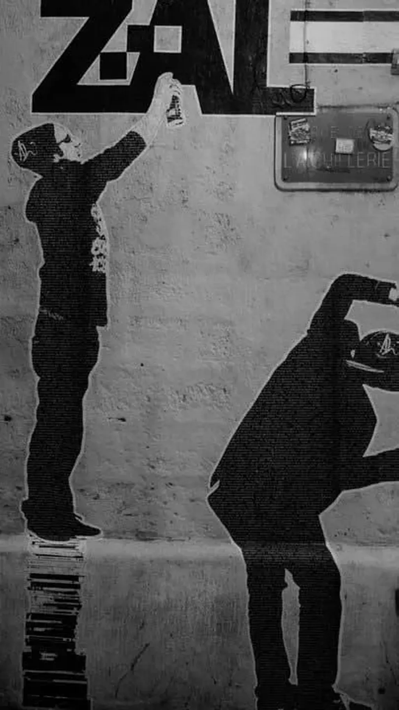

# Papier, numérique : faites l'amour pas la guerre

Le 25 janvier, à l’occasion de la [ZAL](../1/zone-d%E2%80%99autonomie-litteraire.md) qui se tenait à Montpellier, j’ai discuté avec Marion Mazauric de l’édition numérique. J’ai fini par repêcher l’enregistrement du débat dans les méandres de mon iPhone.

[audio:20110129ZAL.mp3]

Le son laisse à désirer et vous devrez jouer du volume pour nous entendre. On a bien fait l’amour tous les deux, notre seul véritable désaccord : [le prix unique du livre numérique](#prix-unique-du-livre), sur lequel on n’a pas débattu, d’ailleurs.

Mais pourquoi j’ai attendu aussi longtemps avant de sortir cet enregistrement des limbes ? Comme il fait plus de 5 Mo, je n’ai pu l’envoyer depuis mon iPhone vers mon PC. Comme je n’ai pas enregistré avec une application Apple, je n’ai pu synchroniser l’enregistrement avec iTunes. Pour accéder à l’enregistrement, j’ai dû [jailbreaker l’iPhone](http://worldissmall.fr/2011/02/06/tuto-wijailbreak-iphone-4-ios-4-2-1-untethered-avec-greenpois0n/), puis utiliser [iFunBox](http://i-funbox.com/) pour explorer les fichiers du téléphone.

Mais pourquoi Apple interdit aux utilisateurs d’accéder à leur machine ? C’est tout simplement de la dictature. J’avoue que l’ergonomie de leur téléphone est réussie, mais, au nom de l’ergonomie, on ne peut tout accepter, surtout pas cette sournoise forme de dictature.

C’est un peu comme dans nos démocraties où on nous fait croire qu’on est libre en nous distribuant des bonbons pour nous tenir au calme. Mais surtout que nous n’utilisions pas les véritables armes à notre disposition. Surtout, ne jailbreakons pas la société. Laissons cela aux victimes des véritables dictatures, c’est-à-dire à celles qui n’ont pas les moyens d’offrir des bonbons.

#ebook #edition #zal #dialogue #podcasts #y2011 #2011-2-15-20h57
