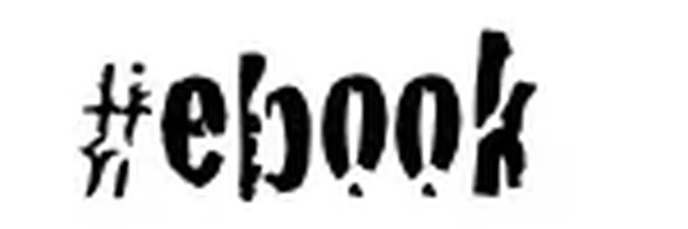
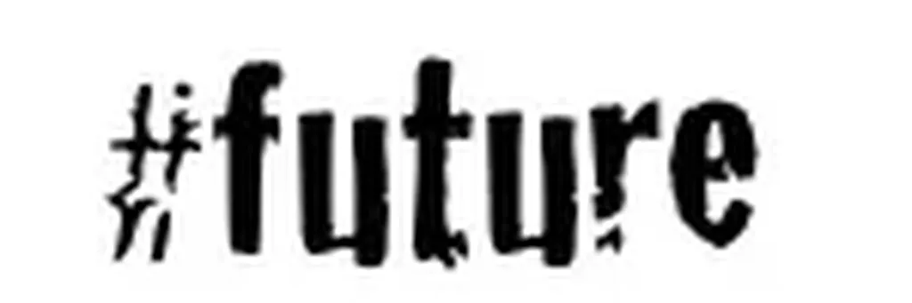
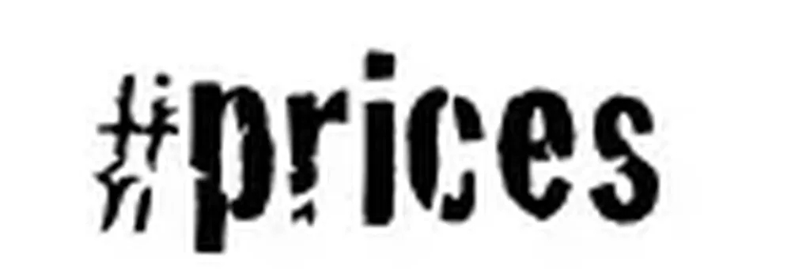
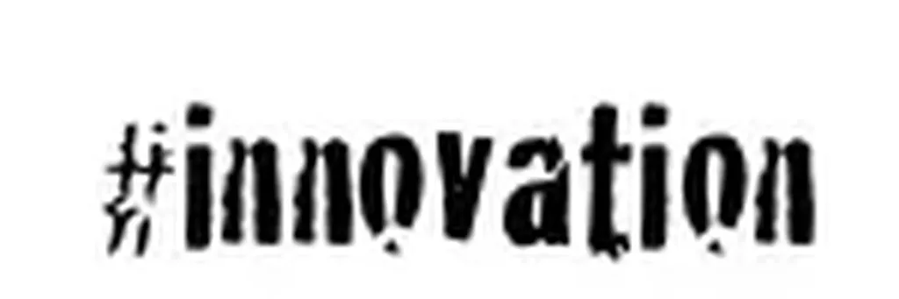

# Si des millions de personnes m’imitent, alors nous changeons le monde

Mon éditeur italien, [40K](http://www.40kbooks.com), propose à ses auteurs et à d’autres éditeurs de [réagir sur cinq tags en rapport avec le livre électronique](http://www.40kbooks.com/?p=5086). Je me suis livré à ce petit jeu. Voici mes réponses en français.
Un texte électronique est bien plus qu’un livre transposé du papier à l’électronique. Imaginez un texte où la fonction de recherche est fondamentale dans la lecture. Dans ce cas, parler encore de livre n’a plus aucun sens. De toute façon, les livres papier disparaîtront très vite. J’entends souvent dire qu’un nouveau média n’a jamais fait disparaître un ancien média, la télévision n’ayant pas fait disparaître la radio par exemple. Mais ce n’est pas du tout ce que nous vivons. Dans notre cas, le média est le texte et non le papier. Nous découvrons simplement une nouvelle façon d’accéder aux textes. Tablettes en argile, papyrus, parchemins, papiers, bits… c’est une évolution logique et irréversible.

À force de penser au futur depuis que je suis enfant, j’ai l’impression de ne jamais être compris par mes contemporains. Le futur est déjà là pour qui veut y vivre. Quand j’écris au sujet du présent, beaucoup de lecteurs, dont les éditeurs, me prennent pour un auteur de science-fiction.

Si je peux publier ce que je veux, sans risquer d’être censuré, si des millions de personnes peuvent m’imiter, nous révolutionnons le monde. Nous passons du modèle top-down, qu’on peut qualifier de transcendantal, au modèle grass root, qu’on peut qualifier d’émergeant. Une nouvelle civilisation ne peut que très vite en découler.

Un concept désuet. Dans une société de l’abondance, tous les biens devraient être disponibles gratuitement et les producteurs devraient être récompensés a posteriori par les consommateurs. Comme les ebooks sont faciles à pirater, leur donner un prix revient à indiquer la récompense espérée. Elle n’a pas à être proche de 0, vu que nous offrons beaucoup de temps de lecture à nos lecteurs.

Nous avons appris à transposer les livres du papier au numérique. Il est temps d’apprendre à écrire des textes qui n’auraient pas pu être imprimés. Je ne pense pas aux livres augmentés, ça c’est de la rigolade pour les éditeurs qui manquent d’imagination.

#ebook #edition #dialogue #y2011 #2011-2-24-9h44
