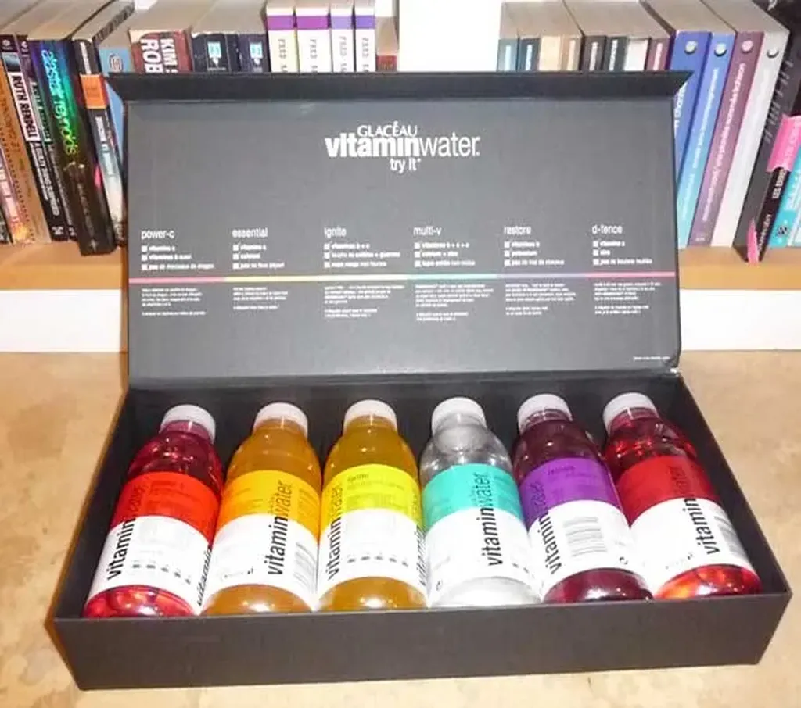

# Une frayeur dans la nuit

La nuit dernière, je me réveille en sursaut. J’ai du mal à respirer. Je bois. Rien ne change. J’ai l’impression d’avoir la poitrine compressée. Je n’ai jamais connu ça. Je réveille Isa. Elle me dit que je suis blême et elle appelle le 15.

Je me retrouve bien vite dans une ambulance avec des électrodes plantées dans tout le corps. J’ai retrouvé une respiration normale. Je me sens un peu con. Je ne sais vraiment pas ce qui m’a pris. J’ai failli twitter, mais j’ai résisté, ce n’était pas assez grave.

J’ai passé la matinée à enchaîner électrocardiogrammes, échographie cardiaque et test d’effort… A priori, j’ai le cœur qui fonctionne à la perfection. « Vous devez être un peu fatigué m’ont dit les docteurs. Reposez-vous. »

Isa m’exhorte aussi de me débrancher, de ne pas passer douze heures chaque jour à écrire ou à bloguer. Je suis un workaholic. Je vais essayer de me soigner. De réinventer cet *Art de ne rien faire sans fainéanter* au sujet duquel j’ai théorisé au milieu des années 1990.

Peut-être que mon coup de mou vient d’une autre fatigue, celle d’avoir l’impression de ramer depuis des années à contre-courant. Je sais que je ne suis pas le seul à remonter le fleuve dans cette direction, mais j’avoue que parfois j’ai envie de devenir ermite.

Je suis bassement humain. J’ai besoin qu’on me cajole de temps en temps. De ressentir que mon travail connaît quelques échos. Je ne crois pas au mythe de l’écrivain qui n’écrit que pour lui. Nos mots n’existent que dans la tête du lecteur. Sans lecteur, notre travail reste inachevé.

J’ai beau être un guerrier, il m’arrive aussi de connaître mes moments de découragements. Mais le hasard me joue toujours des tours. Je n’ai pu m’empêcher d’écrire ce billet parce que quand je suis rentré chez moi j’ai découvert un cadeau promotionnel envoyé par une attachée de presse. [De l’eau vitaminée.](http://www.vitaminwater.fr) C’est exactement ce dont j’ai besoin.

#jai_debranche #dialogue #y2011 #2011-2-14-19h37
