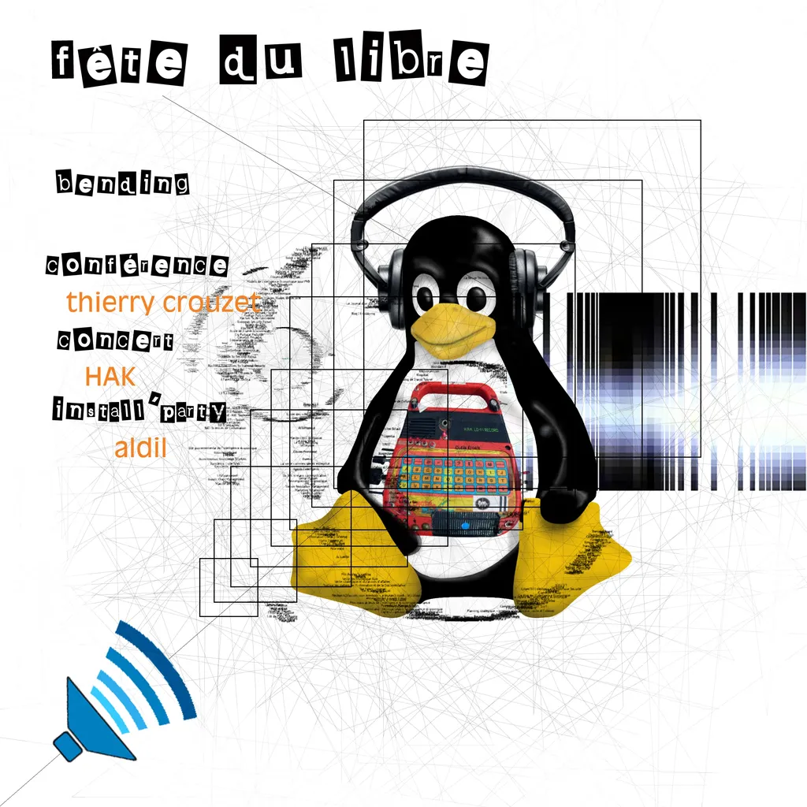

# Villeurbanne, Villeneuve-d'Ascq, Marseille

Trois conférences prévues en mars sur des sujets différents. Le 5, à 18h30, je serai à la [Maison du livre de L’image et du Son de Villeurbanne](http://mediatheques.villeurbanne.fr/) pour discuter d’Internet et de la liberté. Le 17, à 9h45, je serai à Villeneuve-d’Ascq, université Lille 3, à l’invitation des étudiants du [master GIDE de l’UFR IDIST](http://egide2011.jimdo.com/programme-de-la-journ%C3%A9e/), pour parler du nomadisme. Enfin, le 30, je serai à Marseille pour [parler politique 2.0](http://marseille20.psst.pro/).

#buzz #y2011 #2011-2-20-11h29
