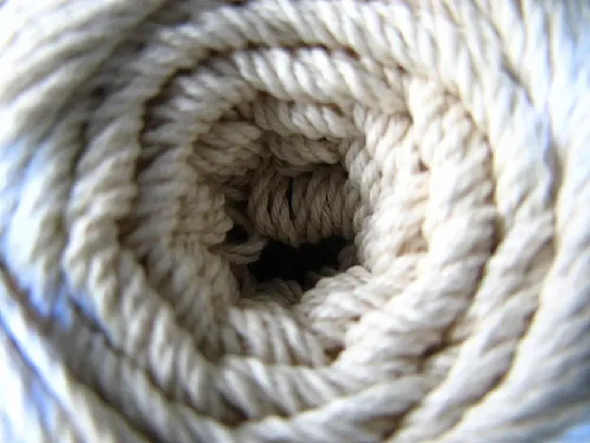

# Ces écrivains qui ne sont pas écrivains

Je reprends [la bobine déroulée par Éric Chevillard](http://www.oeuvresouvertes.net/spip.php?article880) et je vais tenter d’en tirer quelques fils plus abrasifs sur la réalité de notre littérature contemporaine.

Tous ces romanciers qui ne bloguent pas, qui ne s’adonnent pas aux timelines, aux feedbacks incessants de leurs lecteurs, ne vivent pas dans notre temps, ils ne peuvent même pas le percevoir, comment pourraient-ils en parler dans leurs œuvres ? En parlant d’œuvres, il n’en est point. Juste des paquets de texte au mieux commercialement attractifs pour ceux qui se sont attardés dans le xxe siècle.

Je ne nie pas [la nécessité pour un auteur de s’abstraire du flux](je-ferme-mon-blog.md), de produire des textes en vase clos, mais je pense que, sans la pratique du flux, ces textes ne peuvent tout au plus que poursuivre une vague nostalgie désuète qui indiffèrera nos descendants et qui, en attendant, m’agace.

À force de vivre avec pour fenêtre sur le monde TF1 et les vieux médias top-down, on ne vit plus dans le monde, mais dans un parc d’attractions. Et toute lecture qui en découle n’en est que plus factice. On célèbre en usant de critères esthétiques dépassés et on invente un panthéon déconnecté de la contemporanéité. Les auteurs innombrables qu’évoque Chevillard ne sont tout simplement pas des auteurs.

J’ai écrit qu’[un auteur qui ne serait pas cyborg ne serait pas auteur](../../page/la-strategie-du-cyborg). J’ai écrit qu’[un auteur qui ne pratiquerait pas l’autopublication, ce que je fais en cet instant même, ne serait qu’un réactionnaire](../../page/edition-interdite). Je peux tirer un constat de ces deux assertions : les auteurs qui ne pratiquent pas le flux manquent d’intelligence et ne veulent surtout pas que la société se transforme. Que peut-on attendre de tels artistes ? Ne cherchez pas. Lisez les auteurs des siècles passés, ils ont déjà tout dit à leur place.

Ces auteurs qui refusent le flux se positionnent encore dans la chaîne du livre. Il y avait un premier maillon, un second, un dernier maillon, faible, le lecteur. Nous, homofluxux, nous plaçons dans un écosystème : décentré, sans haut, sans bas, où tout le monde interagit constamment. Nous pratiquons cette littérature vivante en même temps que nous vivons.

Et si je projette [de me déconnecter de ce flux](je-ferme-mon-blog.md), ce n’est pas pour le nier, c’est pour en analyser à distance les merveilles, pour questionner le vieux monde dominé par les chaînes.

Nous pouvons sans nous renier écrire des textes homothétiques, ces textes imprimables éventuellement sur le papier, mais nous ne pouvons leur donner de la force, de la nécessité, du sens, que si nous sommes par ailleurs des habitants de l’écosystème fluxiste (je m’amuse avec ces dérivés de flux, mais il faudra bien de nouveaux mots pour parler de ce que nous expérimentons).

Des chaînes à l’écosystème, c’est la révolution de notre temps. Elle se joue sur le terrain politique comme artistique. Ceux qui forgent les maillons sont nos adversaires. Alors, contrairement à Chevillard, je ne suis pas surpris qu’ils ne nous rejoignent pas en plus grand nombre.

#netculture #coup_de_gueule #y2011 #2011-3-19-10h19
