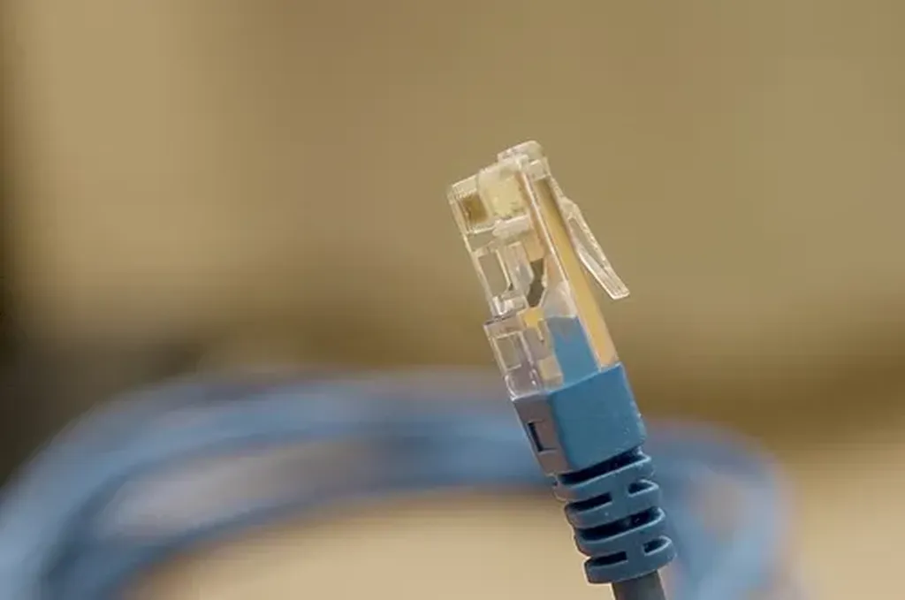

# Je ferme mon blog et me déconnecte

J’ai lancé [l’idée de me couper du Net pendant six mois](../2/deux-idees-de-textes-longs.md), puis une nuit une semaine plus tard [je me suis fait peur](../2/une-frayeur-dans-la-nuit.md) et me suis retrouvé à l’hôpital en train de lire les blogs sur mon iPhone, je me suis alors dit que [mon idée n’était pas qu’une idée de plus](../../page/id).

Quand est-ce que le Net me fait plus de mal que de bien ? J’ai éprouvé de façon pressante le besoin de faire la part des choses. Pour mieux comprendre ce qu’être connecté signifie, j’ai ressenti le besoin de me déconnecter et de m’arracher au stress des timelines. Je me suis dit que je devrais imiter les sages qui s’isolent quelque temps dans le désert. Il me fallait me couper du flux, de mon réseau social, de ma mémoire… d’une part peut-être essentielle de mon intelligence... pour retrouver un temps long dont j’ai perdu l’usage.

Sous l’impulsion d’[Arash Derambarsh](http://www.arashderambarsh.com/), j’ai proposé cette idée d’une enquête sur moi-même, [dans la lignée d’Hunter S. Thompson et du Gonzo jounalism](../../2009/3/narrative-nonfiction.md), à Olivier Nora, patron de Fayard, qui m’a tout de suite renvoyé vers sa directrice littéraire, Isabelle Seguin. L’idée les a séduits. Le livre, au titre provisoire *J’ai débranché*, sortira en janvier.

Qu’est ce que je vais faire d’ici là ? Du 1er avril au 30 septembre, je me placerai au niveau technologique 1985. Plus de Net et de mail. Je raconterai comment ma vie évolue, comment elle se réorganise, comment j’arrive à revivre à l’ancienne… tout en parlant de ma vie de connecté j’espère avec distance et humour.

J’en vois déjà qui diront que ça va leur faire des vacances et que surtout je ne réapparaisse jamais. Je ne les entendrai pas. Pour me faire parvenir des nouvelles, il faudra me téléphoner, m’écrire, m’envoyer des fax ou venir à ma rencontre chez moi ou dans [les conférences que je ne m’interdis pas de donner](#conf), bien au contraire, elles me seront vitales.

Après le bouclage du livre, je me reconnecterai. Mais je le ferai de manière invisible. Je ne bloguerai pas et ne dialoguerai pas ouvertement sur les réseaux sociaux avant la parution du livre. Si je réapparaissais avant, je serais incapable de tenir ma langue. Donc je vais m’éclipser du Web pendant neuf mois et suivre [un conseil que m’a un jour donné Nicolas Taleb](../../2007/9/conversation-avec-taleb.md) :

> People notice your absence, not your presence. Make yourself scarce.

Je ne veux pas m’inscrire dans la lignée de [Nicolas Carr](http://en.wikipedia.org/wiki/Nicholas_G._Carr), c’est-à-dire dénigrer le Net. Je veux mieux comprendre ce que je vis depuis vingt ans, ce que de plus en plus de gens vivent. J’atteins peut-être un point de questionnement que beaucoup d’autres atteindront très vite. Je ne fais que les précéder de quelques années.

Si je mesure la force politique du Net, si je n’ai cessé de la décrire et de la théoriser, je n’ai pas pris le temps d’élaborer un art de vivre avec le Net. C’est à cette tâche que je veux m’appliquer dans les mois qui arrivent, à la politique intérieure. Qu’est-ce qui m’est indispensable ? Qu’est-ce qui ne l’est pas ?

Avant de me lancer, j’ai besoin de vous encore une fois.

1. L’usage du Net modifie la topologie cérébrale. Il me faut trouver une équipe de neurologues qui accepterait de me scanner le bulbe rachidien au début de l’expérience et à la fin pour voir si une transformation se produit.
2. Je ne sais pas si je suis addict au Web, si je vais éprouver un manque, en tous cas je veux que des psychologues m’aident à objectiver l’expérience.
3. Ma vie sociale se déroulant essentiellement *via* le Net, je vais procéder à une espèce d’amputation de mon système de communication. Avant le 1er avril, envoyez-moi par mail vos numéros de téléphones pour que je puisse vous prévenir si je passe par chez-vous. Attention, je vais hanter les terrasses des cafés comme je le faisais avant de disposer d’une connexion en continu.
4. Je n’utiliserai plus qu’un téléphone mobile d’ancienne génération. Il me faut voir si Orange peut me fournir une puce (celle de mon iPhone n’allant pas dans les vieux machins). Sinon je prendrais un téléphone à carte, sans SMS.
5. J’écrirai l’ensemble de *J’ai débranché* sans me connecter au Net. Ce sera un livre documenté à l’ancienne.
6. Je n’impose pas la césure à ma famille. Isabelle et les enfants auront le droit de se connecter. Je vais vivre avec la tentation perpétuelle de me rebrancher (exactement comme l’alcoolique qui n’a qu’un geste à faire pour replonger).

En attendant, vous allez encore devoir me supporter pendant deux semaines.

#jai_debranche #netlitterature #dialogue #y2011 #2011-3-18-11h19
