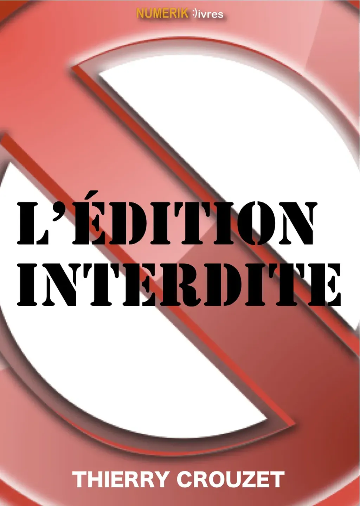

# La publication électronique change le monde

[Numériklivres](http://comprendrelelivrenumerique.com) vient de sortir [*L’édition interdite*](http://librairie.immateriel.fr/fr/ebook/9782923858043/l-%C3%A9dition-interdite). Dans cette suite de *[La stratégie du cyborg](../../page/la-strategie-du-cyborg)*, je développe les conséquences politiques du passage à la publication électronique, des blogs aux ebooks en passant par les tweets et autres status Facebook.
Pour moi, publier, c’est publier, peu importe par où s’écoule le flux. Si je parle dans cet essai d’auteurs et de créateurs, je n’insiste guère sur la forme que prennent leurs créations, ce sera le sujet d’un troisième essai encore hypothétique *L’œuvre inédite*.

Par édition interdite, j’entends tous ces textes qui n’avaient par le passé pas droit à l’existence publique. Ils restaient enfermés dans des tiroirs, souvent même dans les imaginaires parce que les auteurs savaient qu’ils n’auraient aucune chance de les diffuser. Combien de blogueurs écrivent alors qu’ils n’auraient jamais écrit dix ans plus tôt ?

Dans *L’édition interdite*, j’essaie de montrer que le passage d’une censure qui venait d’en haut, celles des États, des églises ou des éditeurs, à une autocensure qui vient des auteurs eux-mêmes entraînera un changement éthique dans la société.

Je n’ai pas écrit un pamphlet contre l’édition traditionnelle, ni contre l’édition tout court, mais j’ai montré que, parce que nous avons dorénavant tous le droit de publier, nous changeons le monde, en premier lieu sans doute les éditeurs eux-mêmes. Alors si des informations de nature différente circulent, nous percevons différemment le monde, nous y vivons aussi peut-être différemment. C’est en tout cas ce que j’expérimente depuis au moins dix ans maintenant et je pense que les transformations sont profondes et irréversibles.

Si, dans *L’édition interdite*, je parle des auteurs, je ne m’adresse pas qu’aux auteurs, mais à tous ceux qui ont envie d’utiliser les nouvelles armes éditoriales pour transformer la société. Je commence par dire que je suis un guérillero. Je crois que nous pouvons ensemble former une armée hétéroclite, une armée de connecteurs.

#ebook #edition #edition_interdite #dialogue #y2011 #2011-3-10-9h0
