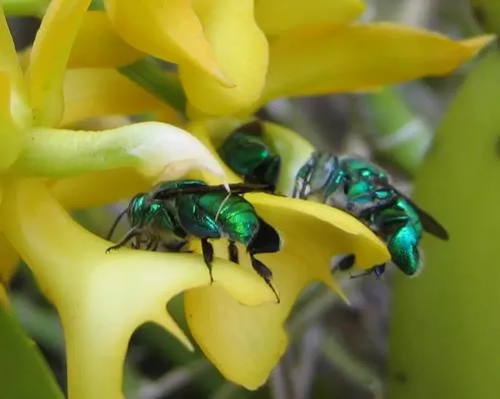

# La symbiose

Au Mexique, sur les hauteurs autour de Puerto Vallarta, dans la pénombre des forêts de chênes, poussent des orchidées jaunes qu’aiment butiner les abeilles. Au printemps, elles se posent sur les pétales et, lorsqu’elles remontent vers le cœur de la fleur, un sachet de pollen se colle à leur dos. Les abeilles s’envolent alors et butinent d’autres orchidées, y abandonnant le pollen et participant à la pollinisation.

Dans *De la fécondation des orchidées par les insectes et des bons résultats du croisement*, publié en 1862 , Charles Darwin expliqua cet échange de bons procédés. Mais un phénomène lui resta incompréhensible. Pourquoi certaines abeilles butinent-elles aussi les orchidées qui ne fabriquent pas de pollen ? L’explication ne devint évidente qu’à la fin du xxe siècle.

Il apparut que seules les abeilles mâles butinent ces orchidées. Elles y récoltent du parfum qu’elles stockent dans des appendices attenants à leurs pattes. Là, elles fabriquent des phéromones qui augmenteront leur virilité et attireront les abeilles femelles.

Les orchidées ont besoin des abeilles pour la pollinisation. Les abeilles ont besoin des orchidées pour se reproduire. Les deux espèces vivent au Mexique en symbiose.

La biosphère, loin d’être une arène où les espèces luttent à mort pour leur survie, apparaît comme un espace où les organismes coopèrent et dépendent mutuellement les uns des autres. L’évolution joue gagnant-gagnant. Par exemple, les cellules semblent être apparues après que des organismes qui vivaient en symbiose aient fusionné. Il y a 2 milliards d’années, l’enveloppe cellulaire et le noyau avaient sans doute une vie propre comme les orchidées et les abeilles.

En mars 1960, Joseph Carl Robnett Licklider, un des pères d’Internet, publia un article intitulé [*Man-Computer Symbiosis*](http://memex.org/licklider.pdf), la symbiose entre l’homme et l’ordinateur. Il y prédisait que nos destinées respectives se retrouveraient entremêlées.

Les ordinateurs nous aideraient à étudier et à contrôler les phénomènes complexes. Ils effectueraient le travail automatisable pendant que nous réfléchirions. En échange, nous développerions des ordinateurs toujours plus performants, toujours plus interconnectés. Pour Licklider, la mise en réseau, donc Internet, était indispensable à la symbiose. Il supposait que grâce à la coopération symbiotique nos capacités intellectuelles seraient décuplées.

Aujourd’hui, le rêve de Licklider s’est réalisé, tout au moins en partie. Comment des milliards d’êtres humains pourraient-ils cohabiter sans ordinateurs ? Nous devons modéliser le climat, réguler les flots monétaires, développer de nouvelles sources d’énergie qui exigent des micro-contrôles d’une précision que seules les machines numériques peuvent atteindre.

Comment scruter l’infiniment grand, comment analyser l’infiniment petit, comment poursuivre la recherche médicale, comment même effectuer les soins devenus les plus élémentaires, les IRM, les scanners, les analyses sanguines… Les ordinateurs sont partout. Ils supervisent le trafic routier, aérien, ferroviaire et naval. Ils comptabilisent nos dépenses, géolocalisent nos voitures, encodent et décodent nos communications téléphoniques.

Nos sociétés sont devenues trop complexes pour que nous puissions vivre sans ordinateurs, ordinateurs qui ont eux-mêmes décuplé cette complexité. Quand Licklider publia son article en 1960, nous étions 3 milliards. En 2000, nous étions déjà deux fois plus nombreux. À lui seul notre nombre contribue à la complexité. Il pose des problèmes de ressources, des problèmes écologiques, des problèmes sociaux… déjà difficiles à résoudre avec les ordinateurs mais qui, sans eux, auraient précipité le monde dans le chaos.

La symbiose ne se contente pas de nous servir, elle nous transforme. Nous ressemblons de moins en moins aux homos sapiens sapiens qui arpentent le globe depuis 200 000 ans. C’est d’ailleurs sans doute notre seule chance de survivre aux diverses crises qui frappent le début du troisième millénaire tout en marquant l’avènement d’une nouvelle forme de civilisation.

#netculture #noepub #une_breve_histoire_de_linformatique #dialogue #y2011 #2011-3-23-15h37
