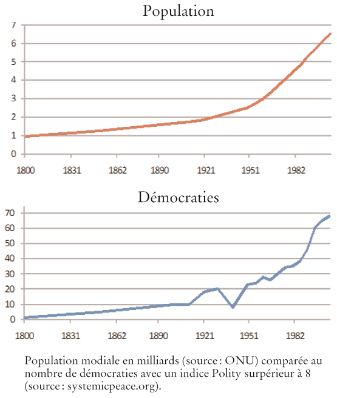
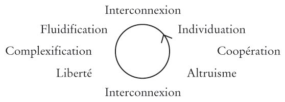

# Le citoyen augmenté par les réseaux sociaux

Canevas de mon intervention lors de [la journée Marseille 2.0](http://marseille20.capitale.pro/les-conferences-de-marseille-20-gouverner-20), dernière conférence avant ma [déconnexion totale](je-ferme-mon-blog.md).

### Churchill ne s’est pas trompé

Nous avons tous en tête la fameuse citation selon laquelle la démocratie serait la moins pire des formes politiques. La plupart des gens en déduisent que nous devrions nous en contenter et ils refusent d’entamer la moindre réflexion politique qui questionne la démocratie. Cette citation sans cesse répétée a un effet inhibiteur.

Mais qu’a exactement déclaré Churchill le 11 novembre 1947 devant la Chambre des Communes :

> Democracy is the worst form of government –except for all those other forms, that have been tried from time to time.

Churchill n’a pas fermé la porte à l’innovation. Alors pourquoi ne pas imaginer autre chose, surtout quand nous avons la démonstration quotidienne que la démocratie représentative n’est pas la panacée. À mon sens, tous ceux qui cherchent à sauver la démocratie grâce aux nouvelles technologies perdent leur temps. Un pansement sur une jambe de bois n’a jamais fait repousser une jambe en chair et en os.

### La démocratie représentative

Elle est à ma connaissance la seule forme de démocratie jamais expérimentée. Nous choisissons en votant, parfois en tirant au sort, ceux qui nous représenteront durant une période généralement assez courte. En parallèle de cette représentation, dans les démocraties directes comme la Suisse, on demande aux citoyens de se prononcer sur certaines questions par voie de référendum (la démocratie directe, ou participative, ne s’est jamais substituée à la représentation).

La démocratie telle que je viens de l’esquisser n’est qu’une évolution sommaire de la monarchie, une monarchie tournante. Elle s’apparente souvent à une oligarchie : une classe s’appropriant la plupart des postes électifs, surtout ceux décisionnels.

Le sociologue Vincenzo Susca fait culminer le mythe de la représentation avec la société bourgeoise, cette société des salons où on conversait entre gens de bonne compagnie.

La représentation n’est concevable que dans une société qui célèbre l’individualisme. Si je suis moi-même un individu fort, je veux voir un individu fort prendre les rênes du pouvoir en mon nom.

En introduction du *[Peuple des connecteurs](../../page/le-peuple-des-connecteurs)*, j’ai affirmé que cette époque de l’individualisme dominant était derrière nous. À force de nous interconnecter, de partager avec les autres, nous nous éloignerions de l’individualisme pour devenir des êtres réseaux, des cyborgs comme je le dis aujourd’hui.

Nous sommes hautement individués, c’est-à-dire différents les uns des autres, mais en même temps nous n’existons pas sans les uns et les autres. Pour des êtres réseaux, la représentation n’a aucun sens. C’est un concept dépassé. Un individu seul ne représente rien, sinon des intérêts particuliers. C’est pour cette raison que j’ai parlé de l’émergence d’un [cinquième pouvoir](../../page/le-cinquieme-pouvoir) : une force décentralisée d’organisation interne de la société.

### La démocratie ne favorise pas l’intelligence

Qu’est-ce que voter ? C’est dire oui ou non, voire choisir entre une dizaine de possibilités. Par sa nature même, le vote suppose que les citoyens ne sont guère capables de nuances et surtout de se positionner suivant un large spectre de possibilités.

Un certain nombre de citoyens, qui se définissent eux-mêmes comme l’élite, définissent les choix possibles, souvent peu différents des uns des autres, et nous demandent alors de nous prononcer.

Le peuple a-t-il le pouvoir ? Pas le moins du monde. On lui a simplement demandé de participer à une décision prémâchée. Or ce n’est pas décider qui est difficile, c’est imaginer des solutions et les mettre en pratique. Dans ces deux registres, il faut faire preuve d’intelligence, de courage, de responsabilité, d’abnégation… autant de qualités qui ont toujours été déniées au plus grand nombre. La démocratie maintient le peuple à l’état végétatif.

### Oubliez le tirage au sort

Imaginons une démocratie qui reposerait sur le tirage au sort comme le propose Étienne Chouard. Nos représentants se porteraient volontaires et ils seraient désignés aux dès, comme en Athènes.

Ce système, en écartant les campagnes électorales et les débats, du même coup bien des corruptions, porterait au pouvoir des gens peut-être plus honnêtes, il éviterait les magouilles et assurerait le renouvellement constant de la classe politique. Mais il aurait aussi pour effet d’assécher la vie politique, l’intelligence que peuvent injecter les citoyens dans les débats. Le tirage au sort serait à mon sens pire que les élections. Il ferait disparaître le peuple au seul profit de ses représentants.

Comme l’élection, le tirage au sort suppose que nous avons besoin de représentants. Nous avons besoin d’un roi. Nous avons besoin d’un chef. Nous sommes trop stupides pour nous gouverner nous-mêmes.

### La démocratie non représentative

Je crois malheureusement pour les petits-chefs en puissance que dans un monde complexe il n’existe plus d’autre possibilité que de basculer vers une démocratie non représentative.

Regardez ce qui s’est passé dans le monde arabe ces derniers mois. La révolte a surgi du peuple, elle l’a soulevé de l’intérieur, en chacun de ses points, sans coordination centralisée, sans la main mise de partis ou de clans. Une pure manifestation du cinquième pouvoir.

C’est pour moi observateur lointain le point le plus extraordinaire, le plus novateur, le plus subversif… J’espère que cette spontanéité des mouvements perdurera le plus longtemps possible, mais je crains un retour à des formes de gouvernance plus traditionnelles.

On ne peut prendre le pouvoir sur un système, physique ou social, que s’il est relativement simple, ou pour être plus précis, que si sa complexité est au plus égale à la complexité du système qui tente de le contrôler (Valentin Turchin).

Donc si dans un pays en révolte, après la chute du dictateur, les gens rentrent chez eux et se taisent, s’ils simplifient la société qu’ils avaient un temps enflammée, s’en est fait d’eux. Des chefs réapparaîtront, peut-être après une élection, mais ça ne change pas grand-chose. L’intelligence collective sera ignorée, qui plus est l’intelligence de chacun des citoyens. C’est ce que nous vivons dans toutes les démocraties occidentales.

### La révolution perpétuelle

Pour s’échapper de la représentation qui bride l’intelligence collective et individuelle au profit de quelques intelligences plus ou moins élues, il faut que chacun de nous complexifie volontairement la société.

Plus nous complexifions, plus nous rendons le contrôle difficile, plus nous augmentons nos libertés... libertés dans nos têtes, liberté de penser, aussi liberté d’agir et donc de mettre en œuvre nos idées.

Comment complexifier ? Si nous établissons de plus en plus de connexions avec de plus en plus d’interlocuteurs, nous complexifions le graphe social. Il ne s’agit pas juste de multiplier le nombre de ses amis sur les réseaux sociaux, il faut aussi animer les connexions, les faire vivre comme je l’explique dans *[L’alternative nomade](../../books/alternative-nomade.md)*.

La plupart des socionautes ont peu de conscience politique. La plupart ne cherchent pas à étendre leur réseau. Très peu franchissent la limite de Dunbar (150 connexions). Ma proposition n’est donc pas implicite.

J’estime que nos usages des outils sociaux ont déjà complexifié la société au point où elle devient difficilement gérable pour une dictature. Il ne dépend que de nous d’accroître cette complexité au point où elle deviendrait difficilement gérable par quelques représentants.

Pour quelles raisons ? Parce que nous avons des problèmes complexes à résoudre : écologiques, sociaux, économiques, spirituels… que les représentants n’ont aucune chance de résoudre à eux seuls. Nous devons nous y mettre tous ensemble.

Une fois plus connectés, plus liés aux pensées des autres, plus libres d’échanger avec eux, nous augmentons notre intelligence individuelle et collective, une intelligence que nous pouvons en partie mettre au service de tous.

### Liberté rime avec complexité

Face à des problèmes complexes nous n’avons il me semble pas d’autres choix que de hausser notre intelligence collective à la hauteur de la complexité des problèmes.

Tenter de simplifier la société par la force ne fera pas disparaître les problèmes, notamment écologiques, d’autant qu’un problème complexe ne peut être réglé par une mesure miracle, mais par une myriade d’initiatives concurrentes.

Nous devons poursuivre sur la route de la complexification, une complexification qui ne cesse de se déployer depuis l’origine du vivant.

J’aime rappeler que la croissance de la complexité est concomitante avec la croissance de la liberté. La synchronicité des deux courbes n’est pas une coïncidence, mais la conséquence de ce que j’ai appelé dans *[L’alternative nomade](../../books/alternative-nomade.md)* le cycle de transformation.

#netculture #dialogue #y2011 #2011-3-30-16h34
