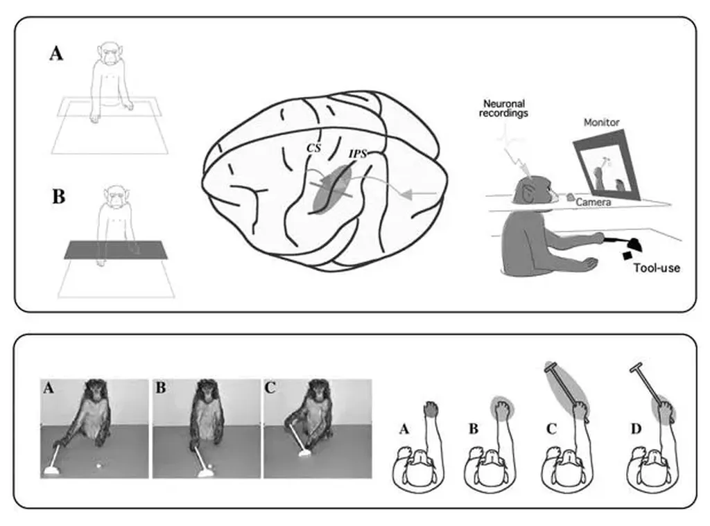

# L’outil fait l’esprit (et non l’inverse)

> Nous ne sommes pas adultes, [dit le professeur Iriki](http://www.newscientist.com/article/mg20026772.100-tools-maketh-the-monkey.html). Nous ne sommes qu’au milieu de notre évolution. Nous nous préparons à connaître un nouveau stade de notre développement. Jadis l’esprit émergea dans nos cerveaux. Qu’est-ce qui émerge en ce moment même ?

Mais pourquoi Iriki est-il aussi optimiste ou présomptueux ? L’homme n’est-il pas à l’image de Dieu ? La perfection dans la création. Et si l’homme évolue encore, c’est soit que Dieu évolue aussi, soit que le postulat religieux n’a pas de sens.

Iriki fait l’hypothèse que, il y a 2 millions d’années, suite à l’usage des outils, les cerveaux des premiers hominidés se seraient brusquement modifiés, déclenchant l’évolution à l’origine de nos fantastiques capacités intellectuelles. C’est parce que nous sommes des *homo habilis*, des hommes habiles, que nous aurions commencé à penser.

Quand les peintres, grâce aux boîtes d’aquarelle, quittèrent leur atelier, ils découvrirent de nouveaux champs d’expression. Après l’invention de la guitare électrique, un nouveau genre musical apparu : le rock. Quand on écrit avec un stylo sur du papier ou quand on envoie des SMS avec un téléphone, on n’écrit pas la même chose.

Iriki va plus loin. L’outil ne transforme pas uniquement ce que nous faisons, mais il nous transforme nous-mêmes. Nous n’avons nul besoin de manipulations génétiques pour devenir autres.

Pour étayer son hypothèse, Iriki élève au Japon dans son laboratoire de développement cognitif des macaques et d’autres singes en leur apprenant dès leur plus jeune âge à utiliser des outils.

Pin tire la langue quand Iriki lui tire la langue. Elle regarde un objet quand il le regarde. S’il ouvre une boîte, elle cherche aussitôt à l’ouvrir. Comme tous les enfants, Pin adore imiter. Sauf que pour elle c’est un exploit dont sont incapables ses congénères sauvages.

Iriki reproduit avec Pin l’évolution. En lui donnant des outils, il observe chez elle l’apparition de comportements étrangers à son espèce. Quand il scanne son cerveau, il y découvre de nouvelles structures cérébrales.

Au-delà de son don pour l’imitation, Pin démontre une conscience d’elle-même ainsi qu’une conscience des autres. Quand elle a faim, elle pointe du doigt son repas et elle fixe Iriki dans les yeux pour attirer son attention. Suivre les regards, réagir aux émotions, c’est le début de l’interaction sociale.

Iriki suppose que l’apparition de cette conscience du moi, qu’il date chez les hominidés à 1,8 million d’années, aurait signé le début de l’aventure humaine. Une fois devenus conscients de nous, nous sommes devenus conscients des autres et avons commencé à communiquer avec eux.

Pour Iriki cette histoire se poursuit de nos jours. Quels effets auront sur nous les nouveaux outils « métaphysiques » que sont les ordinateurs, les mobiles, Internet et les réseaux ? Peuvent-ils nous transformer en quelques années ? Allons-nous au cours de nos propres existences devenir autres ?

D’une certaine façon, l’homo sapiens sapiens est le fruit de la symbiose des hominidés avec les outils, dont la symbiose avec les ordinateurs n’est que la continuité.

#netculture #noepub #une_breve_histoire_de_linformatique #dialogue #y2011 #2011-3-24-11h4
