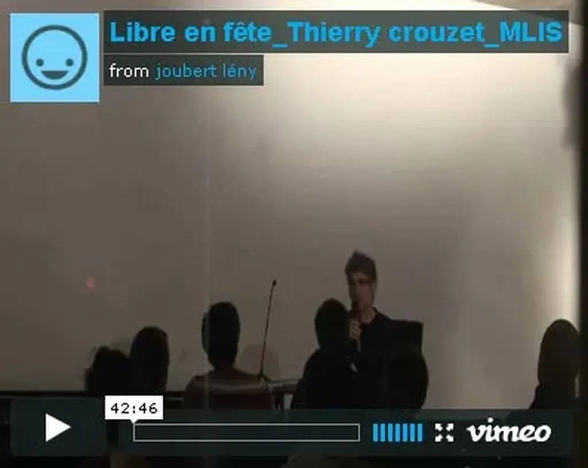

# Pirater, c'est résister

Enregistrement de ma [conférence de Villeurbanne](le-libre-et-la-liberte.md). J’ai juste écouté les premières secondes pour voir si le son était OK. C’est ma voix qui ne l’est pas. J’ai toujours du mal au démarrage. Comme je n’ai aucune appréhension à parler en public, j’ai toujours l’impression que je suis assis à une table de café avec des amis. Je suis incapable de me transformer en tribun.

[Libre en fête\_Thierry crouzet\_MLIS](https://vimeo.com/21522582) from [joubert lény](https://vimeo.com/user1662772) on [Vimeo](https://vimeo.com).

#conf #netculture #noepub #podcasts #y2011 #2011-3-27-10h5
