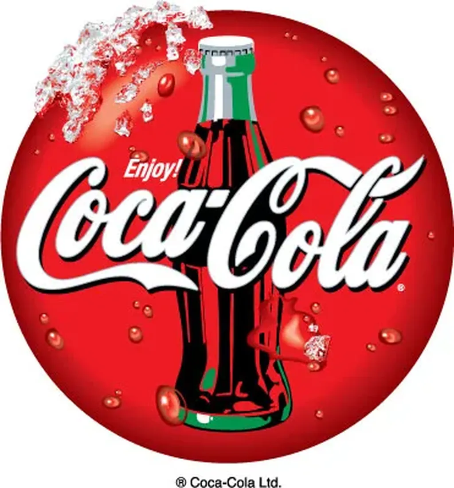

# Sans liberté point de culture

Quand nous buvons du Coca-Cola, nous ne savons pas ce que nous buvons. La formule du produit nous est cachée.

Quand un écrivain publie un livre, la formule et l’œuvre se confondent, c’est le texte.

Dans un cas il y a un secret, dans l’autre il y a transparence. Dans un cas le code est caché, dans un autre il est libre.

Parce que le code d’un texte est libre d’autres écrivains peuvent s’en inspirer, les critiques peuvent le discuter, les étudiants peuvent l’analyser, les étrangers peuvent le traduire, les cinéastes peuvent le scénariser… C’est ainsi, en s’appuyant sur la liberté du code, que la culture se construit.

Si le code du Coca-Cola avait été libre ([elle ne l’est plus vraiment](http://embruns.net/logbook/2011/02/27.html#recette-du-coca-cola)), tout un chacun aurait pu expérimenter avec la formule comme avec n’importe quelle recette. Le Coca-Cola serait entré dans la culture culinaire plutôt que de rester un produit industriel.

Pour le Coca-Cola, le secret n’a sans doute pas occasionné une grande perte à l’humanité. Mais qu’en est-il des formules de nombreux médicaments ? Ou de l’art de construire les Stradivarius ?

Le secret, moyen de protéger un capital potentiel, est aussi le meilleur moyen de limiter les possibilités de l’humanité.

-- Si quelque chose mérite une récompense, c’est bien la contribution sociale, écrivit Richard Stallman en 1983. La créativité peut être une contribution sociale seulement si la société est libre d’en profiter.

Depuis, il se bat pour appliquer ce principe aux logiciels. Comment un informaticien en arriva-t-il à cette conclusion ? Il travaillait au MIT. Il avait modifié le pilote de l’imprimante de son laboratoire, située un étage plus bas, afin d’être prévenu dès qu’elle avait terminé d’imprimer. Lorsqu’en 1980 elle fut remplacée par une laser Xerox, Richard demanda le code du pilote pour y ajouter sa fonction. Xerox refusa de dévoiler ce code. Richard estima que c’était une atteinte à sa liberté. Il jugea que le code des logiciels devait être libre comme le code d’un livre.

-- Les éditeurs de logiciels veulent diviser et conquérir les utilisateurs, interdisant à chacun de partager avec les autres, écrivit-il. Je refuse de rompre la solidarité. […] Pour continuer à utiliser les ordinateurs en accord avec ma conscience, j’ai décidé de rassembler un ensemble suffisant de logiciels libres pour me débrouiller sans logiciels non libres.

Aujourd’hui, non seulement l’ordinateur de Richard fonctionne avec des logiciels libres, mais aussi la quasi-totalité d’Internet.

Sans l’ouverture du code aux améliorations, aux initiatives les plus inattendues, le réseau des réseaux n’aurait pas pu se développer à une vitesse fantastique à la fin du xxe siècle. Il serait resté un jouet d’universitaire. Il aurait végété comme le Minitel en France.

Au fait. Richard montre une certaine surcharge pondérale. Mais ce n’est pas la faute du Coca. Il boit du Pepsi.

#liberte #netculture #une_breve_histoire_de_linformatique #dialogue #y2011 #2011-3-28-13h44
