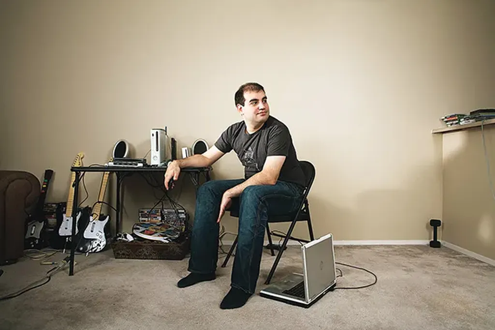

# Système vulnérable

Un dimanche de janvier 2008, le monde manqua s’arrêter et vous ne l’avez jamais su. Nous avons frôlé une crise planétaire comme si un météore avait manqué percuter la terre .

Vous auriez pu être ruiné. Des centaines d’entreprises contraintes à la faillite. Des pays auraient pu déclarer l’état d’urgence. Internet aurait pu partir en fumée. La confiance que nous accordons aux systèmes électroniques aurait pu être détruite à jamais.

Et il ne se passa rien. La journée se termina comme un dimanche ordinaire, dans le calme avant le rush du lundi.

Cet après-midi-là, Dan Kaminski, un trentenaire un peu enrobé qui porte presque toujours un t-shirt sombre, un jean sombre et des baskets noirs, découvrit [comment prendre le contrôle d’Internet](http://www.wired.com/techbiz/people/magazine/16-12/ff_kaminsky?currentPage=all).

Il réussit à créer de fausses pages sur le site d’une des plus grosses entreprises mondiales. Quand quelqu’un saisissait son mot de passe, Dan l’enregistrait. Il pouvait après l’utiliser quand il voulait, pour vider un compte bancaire par exemple.

Dan devenait capable de tromper tous les internautes. Il pouvait intercepter leurs emails. Dans ces emails circulent parfois des mots de passe pour encrypter les transactions sécurisées. En fait, plus rien n’était sécurisé. La faille découverte par Dan mettait en danger l’économie mondiale bien plus qu’une quelconque crise financière. Le système complet pouvait exploser.

-- J’ai cassé Internet ! s’exclama Dan.

Par chance, il était honnête. Il contacta quelques spécialistes qui dans le plus grand secret corrigèrent le problème. Le 8 juillet, ils proposèrent un correctif, un patch dans le jargon, et ils demandèrent à tous les administrateurs réseau de l’installer.

Certains experts en sécurités exigèrent des explications avant de s’exécuter. Dan finit par accepter de leur révéler sa découverte. Quelques jours plus tard, la faille de sécurité se retrouva décrite sur un blog. Les experts de la sécurité avaient été incapables de tenir un secret.

Combien de sites furent piratés avant que le patch soit installé sur tous les serveurs ? Personne ne le saura jamais. Des millions de dollars changèrent sans doute de main en toute impunité. Mais le pire avait été évité. Pour un temps tout au moins. D’autres failles attendent d’être découvertes et leurs découvreurs ne seront peut-être pas aussi honnêtes que Dan Kaminski.

Notre monde électronique est vulnérable.

#netculture #noepub #une_breve_histoire_de_linformatique #dialogue #y2011 #2011-3-31-10h9
