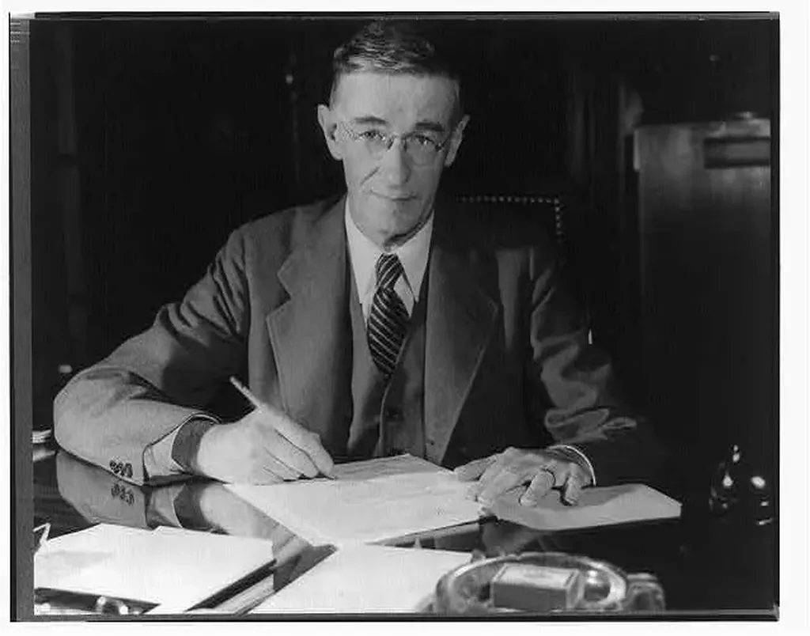

# Et si tout commençait quand tout finit

Boston Logan, 7h59, le vol American Airline 11 décolle en direction de Los Angeles. À son bord cinq terroristes armés de cutters.

Du même aéroport, à 8h14, le vol United Airlines 175 décolle avec 16 minutes de retard, lui aussi en direction de Los Angeles. À son bord cinq terroristes armés de cutters.

Nous sommes le 11 septembre 2001. Le premier avion percuta la tour nord du World Trade Center à 8h46. Le second percuta la tour sud à 9h03. Sans le retard initial, les deux appareils auraient percuté les tours au même moment.

Pendant ce temps, neuf autres terroristes détournaient deux autres vols en partance de Washington Dulles et de Newark Liberty. Au total dix-neuf hommes, que l’on supposa secondés d’une cinquantaine d’autres, plongèrent le monde dans la terreur.

À 9h50, la tour sud s’effondra comme un château de cartes. Trente-neuf minutes plus tard, la tour nord implosa de la même manière. Près de 3 000 personnes succombèrent lors des attentats. Quelques fanatiques avaient réussi à frapper le cœur du monde capitaliste.

Indépendamment du laxisme, puis de la réappropriation ultérieure de l’évènement par l’administration de Georges Bush, nous découvrions que des hommes déterminés disposent à l’aube du troisième millénaire d’une puissance gigantesque.

Les terroristes choisirent le coup d’éclat, le symbole, mais il aurait pu tout aussi bien frapper des centrales atomiques, provoquant bien plus de dégâts. Sans risquer leur vie, en posant des explosifs sur quelques nœuds du réseau électrique, ils auraient pu plonger l’Amérique dans un blackout catastrophique. Notre monde hypertechnologique, hypercomplexe, est devenu vulnérable à la folie de quelques individus qui le frapperaient à ses points névralgiques.

Dans le même temps, ce monde s’est ouvert à une infinité d’initiatives positives. Contre le terrorisme, chacun de nous peut agir sur la complexité comme avec un levier et entraîner des révolutions extraordinaires.

Les pères fondateurs de l’informatique rêvèrent avec leurs machines de donner aux individus la puissance qui jusqu’alors n’était détenue que par les Nations ou les grandes entreprises. Dans [*Mechanization and the record*](http://www.theatlantic.com/magazine/archive/1945/07/as-we-may-think/3881/), un texte précurseur de 1939 qui imprégna l’inconscient collectif de plusieurs générations d’ingénieurs et de scientifiques, Vannevar Bush, sans lien de parenté avec Georges Bush, imagina que les nouvelles technologies augmenteraient notre créativité et nos possibilités.

> Pendant des siècles nous avons développé des outils pour nous donner plus de forces physiques, nous devons maintenant en développer pour nous donner plus d’intelligence.

Il proposa un exemple :

> Les lois de la génétique de Mendel furent perdues pour une génération parce qu’elles ne parvinrent pas aux rares personnes qui auraient pu les exploiter ; des catastrophes de ce genre se produisent souvent à coup sûr, et nous perdons une grande quantité de découvertes fondamentales.

Pour éviter ce gâchis, Vannevar Bush prôna la création d’une technologie de stockages et d’échange des informations à grande vitesse. Sans cette nouvelle intelligence, les terroristes du 11 septembre n’auraient sans doute pas réussi à se synchroniser et à monter leur opération. Quelques secondes avant les décollages, ils se parlaient encore avec leurs mobiles, chose impossible une décennie plus tôt.

Faut-il accuser la technologie de nos maux ? Non, nous sommes les seuls responsables de nos usages. Par chance, pendant qu’une poignée de terroristes pervertissent nos outils, nous autres apprenons à canaliser cette nouvelle puissance individuelle et à la mettre au service du collectif.

#netculture #noepub #une_breve_histoire_de_linformatique #dialogue #y2011 #2011-3-23-10h17
