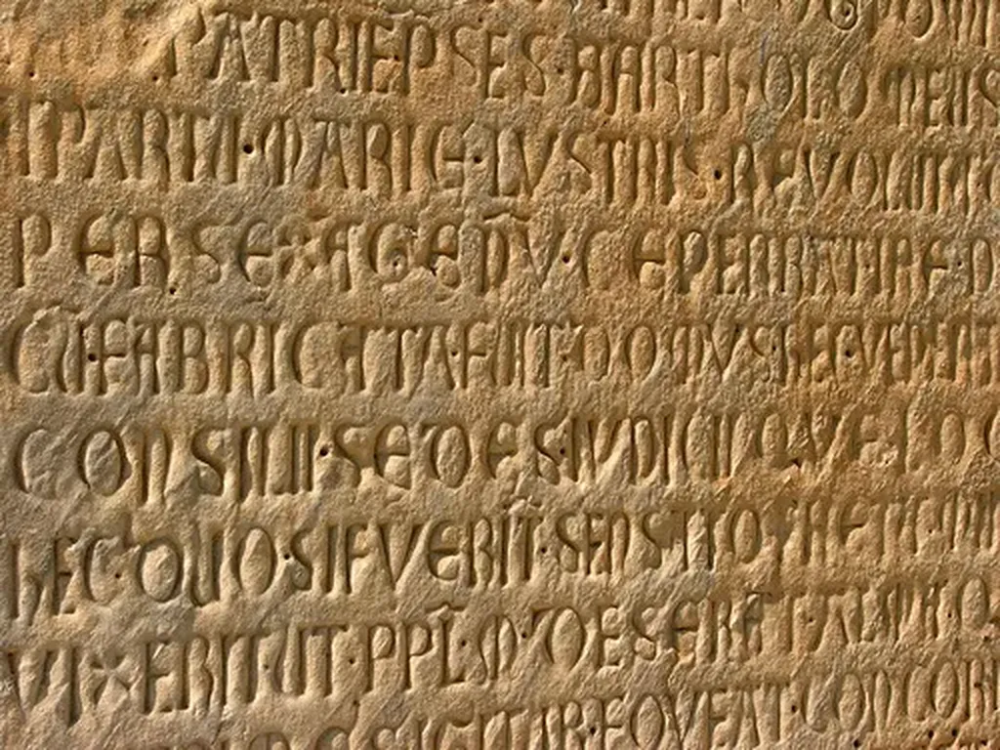

# Qu’est-ce qu’un écrivain&nbsp;?

Personne ne peut répondre à cette question et tout le monde peut y répondre. Je vais jouer à l’entre-deux. Tenter de lister des conditions plus ou moins nécessaires et en aucun cas suffisantes.
1. Un écrivain écrit, voire publie, mais n’est pas nécessairement édité.
2. Un écrivain a un style, une forme. C’est quoi un style ? Pas une chose belle, mais une chose identifiable. Peu importe que la chemise sorte du pantalon lui-même froissé. Le style, c’est une musique, une façon de tourner les mots, de les envoyer à la gueule du lecteur ou, au contraire, de les distiller en douceur.
3. Un écrivain a quelque chose à raconter, à dire, à transmettre, à faire passer…
4. S’il a du style et pas de fond et réciproquement, c’est raté. Le travail sur la langue ne suffit pas plus que d’affuter ses arguments théoriques.
5. Le style et le fond d’un écrivain ne sont pas ceux d’un autre écrivain, encore moins des auteurs qui l’ont précédé ou qui le suivront. Un écrivain habite son époque, soit pour la rejeter, soit pour l’épouser. C’est ainsi qu’il construit son style et son fond. Un œuvre ne peut s’écrire qu’à l’époque où elle a été écrite.
6. L’écrivain est conscient de ce qui se joue de son temps. Pour acquérir la conscience, il doit percevoir. Aujourd’hui, ne pas s’immerger dans le flux, ne pas avoir expérimenté l’écriture avec feedback des lecteurs, c’est se couper d’un sens qui n’existait pas avec autant d’acuité par le passé. On peut mépriser ce sens, le vénérer, dans tous les cas il faut y avoir goûté. Et user d’un sens ne veut pas dire parler de ce sens dans son œuvre. Les astronomes ne parlent pas de leurs télescopes en général, mais des objets célestes qu’ils aident à percevoir.

Cette liste qui ne saurait être exhaustive n’est qu’un début de réponse à mes commentateurs. C’est un exemple d’écriture avec feedback propre au flux et qui ne serait être possible sans son immédiateté et son ouverture. [J’en profite pour revenir sur quelques points que vous avez soulevés.](ces-ecrivains-qui-ne-sont-pas-ecrivains/#comments.md)
1. D’une phrase, je dis les uns sont écrivains, les autres ne le sont pas. Je ne classe que pour provoquer (ce qui peut échapper à ceux qui ne me lisent pas souvent). Personne n’aime être rangé dans la case qu’il ne veut pas être (surtout celle des non-écrivains quand on se veut écrivain).
2. Je défends la complexité, l’éclectisme, l’impossibilité de classer… Je sais que les cases existent et je n’aspire qu’à les faire sauter. (Être écrivain, c’est n’être écrivain pour personne.)
3. Pour le non-idéaliste que je suis, il n’y a pas ni cases ni définitions qui tiennent. Nous ne pouvons que parler de processus, d’expérience… vivre l’écriture plutôt qu’être écrivain.
4. Ne sont écrivains que les écrivains que j’aime ou auxquels je reconnais un talent. Je ne peux aimer les écrivains qui aujourd’hui ne pratiquent pas l’autopublication et entretiennent les structures de domination (voir *[L’édition interdite](../../page/edition-interdite)*). Ainsi la plupart des écrivains contemporains ne sont pas pour moi des écrivains.
5. Seuls les écrivains à succès, qui peuvent publier tout ce qu’ils veulent, peuvent se passer d’autopublier. Éditer pour eux équivaut à s’autopublier.
6. L’écrivain ne doit pas être nécessairement dans le flux (je vais me débrancher et tenter néanmoins d’écrire). Il doit avoir au moins expérimenté le flux pour avoir changé de perspective sur le monde (même quand il va acheter son pain).
7. Aujourd’hui, un écrivain se place dans un écosystème, le flux, ou s’en extrait pour marquer son opposition. Un écrivain qui ignore jusqu’à l’existence de cet écosystème ne peut pas écrire de la littérature contemporaine. Il peut nous faire de la littérature du xixe voire du xxe. Ça peut être un excellent écrivain, charmant, divertissant, doué, mais il sera oublié. Voici le sort réservé à 99,9 % des écrivains.
8. On se fiche bien de savoir par quel canal s’écoulent les textes. Ces chemins ne disent pas qui est écrivain ou ne l’est pas. Ce n’est pas parce que je parle de flux que je parle de blog ou d’ebook. Ça n’a strictement aucun rapport. Le flux, c’est le grand rebouclage, le passage dans les cycles, par exemple : auteur -> lecteur -> auteur. Il existe des centaines de cycles qui entraînent la totalité de l’humanité.
9. Notre monde contemporain est devenu flux (flux d’idées, d’informations, de matières…). Il s’écoule, sort de son cours tout droit tracé, il envahit la forêt comme l’Amazone après une crue. Être dans le flux, c’est comme porter des lunettes pour voir la réalité. On n’échappe pas au flux sinon en étant éjecté de la société. Ou c’est être à bord d’un bateau plutôt que balayé par la vague (et quelques outils sur le Web seraient ce bateau).
10. [En me déconnectant](je-ferme-mon-blog.md), je vais me reposer sur la berge, tenter de m’abstraire de quelques cycles.

#netculture #dialogue #y2011 #2011-3-20-21h12
