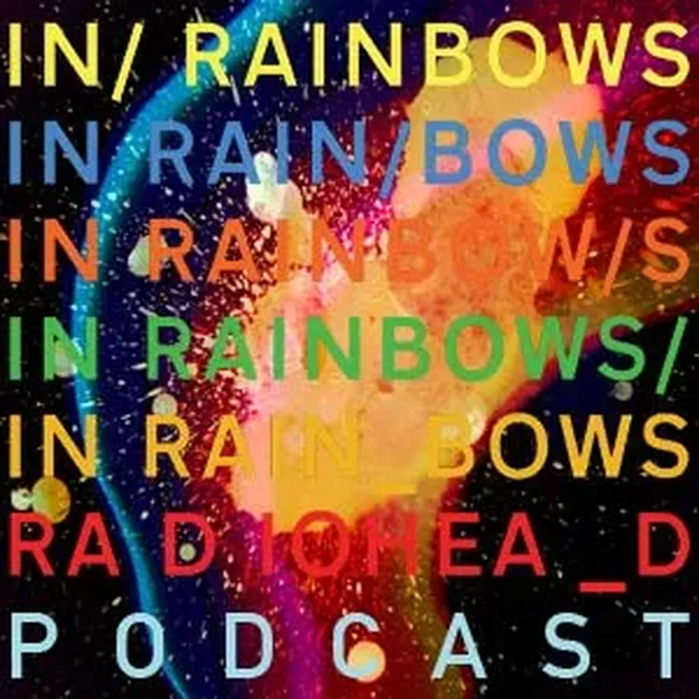

# Vers une société de pair à pair

Dans *In Raimbows*, le septième album de Radiohead, Thom Yorke chante :

> Has the light gone out for you?
> Cause the light’s gone for me
> It is the 21st century

Cri de désespoir du leader du groupe Rock le plus populaire du début du troisième millénaire.

> Est-ce que la lumière t’a quitté ?
> Parce que la lumière m’a quitté 
> C’est le xxie siècle

Pourtant Radiohead s’apprêtait à entrer dans une histoire plus positive. Pendant quelques semaines à partir du 10 octobre 2007, après deux ans de travail, le groupe diffusa gratuitement *In Raimbows* en téléchargement.

-- Nous avons vécu un moment excitant de connexion directe avec les fans, raconta Yorke à David Byrne , son grand inspirateur, leader des Talking Heads. […] Ce n’était pas une approche nihiliste, signifiant que la musique ne valait plus rien. Tout au contraire.

Radiohead donnait sa musique et laissait les fans payer à la hauteur de ce dont ils avaient envie. Ils payaient pour l’émotion et rien que pour l’émotion.

Plus d’un million de copies de *In Raimbows* furent téléchargées. 40 % des fans payèrent, en moyenne 6 dollars. Radiohead reçut 3 millions de dollars de revenu net.

Le groupe britannique avait cassé le vieux modèle de la distribution : les compositeurs cèdent leurs droits à une compagnie qui transforme leurs créations en produits, en fixe le prix, les diffuse et récolte les bénéfices.

-- Ce que nous appelons aujourd’hui le business de la musique n’est plus de produire de la musique, expliqua David Byrne. À un moment donné, il est devenu celui de vendre des CD dans des boîtes en plastique, et ce métier disparaîtra bientôt. Mais ce n’est une mauvaise nouvelle ni pour la musique, ni pour les musiciens.

Les membres de Radiohead, depuis la fin quatre ans plus tôt de leur contrat avec EMI, ne voulaient plus être esclaves du système. Ils voulaient regagner leur liberté, exister par eux-mêmes. Internet leur donna cette chance.

Loin d’être un coup de marketing génial, cette histoire, à côté de milliers d’autres, montre comment Internet et les technologies numériques nous donnent de nouveaux pouvoirs, ouvrent de nouvelles possibilités, laissent présager l’avènement de cette civilisation où les ordinateurs vivent en symbiose avec nous !

#netculture #noepub #une_breve_histoire_de_linformatique #dialogue #y2011 #2011-3-29-14h33
