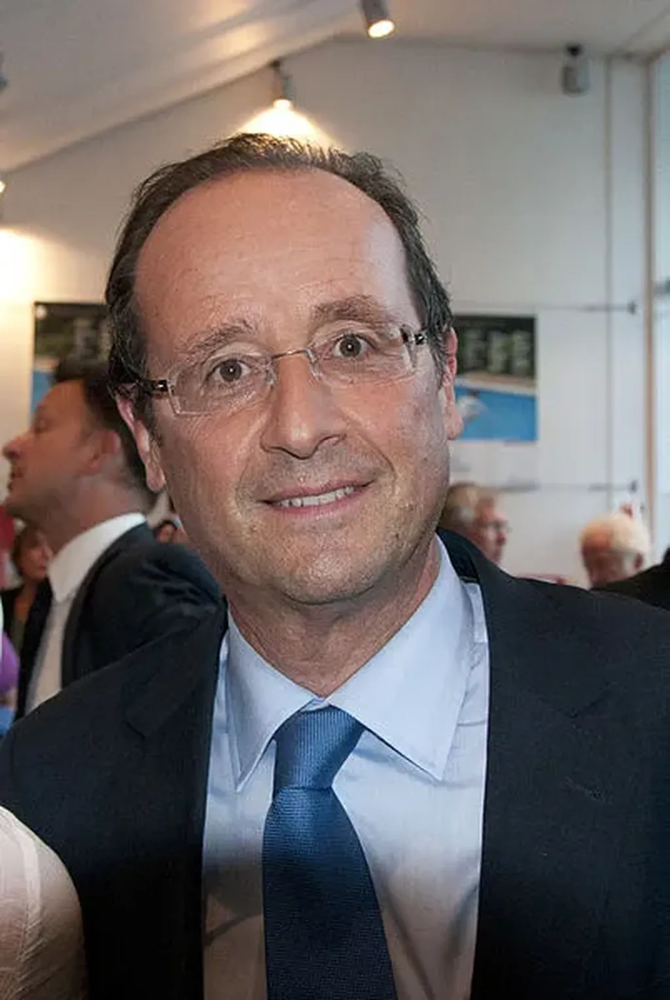

# Pourquoi François Hollande ne sera pas Président… ou ce sera la cata

Depuis [ma reconnexion](../../page/jai-debranche), je n’ai guère envie de bloguer, encore moins de m’intéresser à la prochaine élection présidentielle qui n’est l’occasion d’aucun débat de fond, par exemple sur le [dividende universel](#dividende-universel). En revanche, je ne peux m’empêcher d’effectuer une petite observation logico-psychologique.

J’ai 48 ans. En toute conscience, j’ai assisté à six présidentielles, toutes possèdent un point commun.

En 1974, Valéry Giscard d’Estaing est élu sans parti, soutenu par une coalition des Républicains indépendants et par une partie de l’UDR, cette coalition deviendra l’UDF en 1978.

En 1981 et 1988, François Mitterrand est élu après avoir pris le pouvoir sur le PS en 1971 deux ans après sa création.

En 1995 et 2002, Jacques Chirac est élu après avoir créé le RPR en 1976.

En 2007, Nicolas Sarkozy est élu après avoir créé l’UMP en 2002 sur les vestiges du RPR.

Créer son parti ou en prendre les rênes dès sa naissance n’est certes pas une condition suffisante, mais sans doute nécessaire pour l’emporter. Pourquoi ? Parce qu’un homme ou une femme qui se glisse mollement dans le costume taillé pour un autre ne s’y trouve jamais à son aise.

Quand on part au combat avec les soldats d’un autre, on risque à tout bout de champ la trahison. Je pense à la grande armée d’Alexandre le Grand. Ses généraux et leurs descendants s’entretuèrent durant des siècles après sa mort. Et François Hollande n’est qu’un des descendants politiques de Mitterrand. Il n’est pas un conquérant entreprenant. Il n’a pas eu l’énergie de lever son armée, de l’estampiller d’un blason aux couleurs nouvelles. Il part à la guerre avec la bannière d’un mort. Cela dénote certes de l’opportunisme, mais un manque évident d’amour propre, de confiance en son destin et l’incapacité à rassembler des forces nouvelles.

Pour 2012, face à Sarkozy, il n’existe qu’un leveur de troupe qui peut prétendre à la victoire : François Bayrou qui a créé en 2007 le Modem sur les vestiges de l’UDF. Il possède certes une armée hétéroclite et mal équipée, mais celle de son adversaire vieillit et les campagnes précédentes et les aléas économiques l’ont fatiguée. Alors pourquoi pas ? Si la série relevée plus haut se prolonge, notre prochain Président sera très probablement Sarkozy, avec Bayrou comme outsider.

**À moins qu’une tradition maintenant bien installée ne se brise. Mais alors les trahisons consanguines propres à la position de successeur ne risquent-elles pas de miner le pouvoir d’un François Hollande ? Mal fondé sera-t-il capable de piloter notre navire déjà défaillant à travers les crises de plus en plus graves qui se profilent ?

J’en doute quand je vois combien aucune idée neuve n’irrigue le vieux le PS. Incapacité à repenser l’exercice du pouvoir dans un monde complexe et hautement interconnecté. Refus du dividende universel, une mesure hautement sociale et équitable. Soumission face aux puissances financières. L’absence d’ouverture intellectuelle associée à l’opportunisme ne laisse rien présager de bon.**

Promis, je ne parle plus de cette politique bassement politicienne. Une seule chose m’inciterait à me lever, qu’ils changent de politique.

PS1 : Je ne suis pas de droite et la gauche me désespère et le centre m’endort. Encore une fois, [je ne voterai pas](../4/je-brule-ma-carte-electeur-100-raisons-pour-ne-pas-voter.md).

PS2 : Passage mis en gras suite à l’élection de François Hollande. Cas de figure pour moi pas plus réjouissant que si ses adversaires l’avaient emporté.

PS3 : La suite confirment le troisième scénario, le pire.

#politique #y2012 #2012-1-18-9h26
