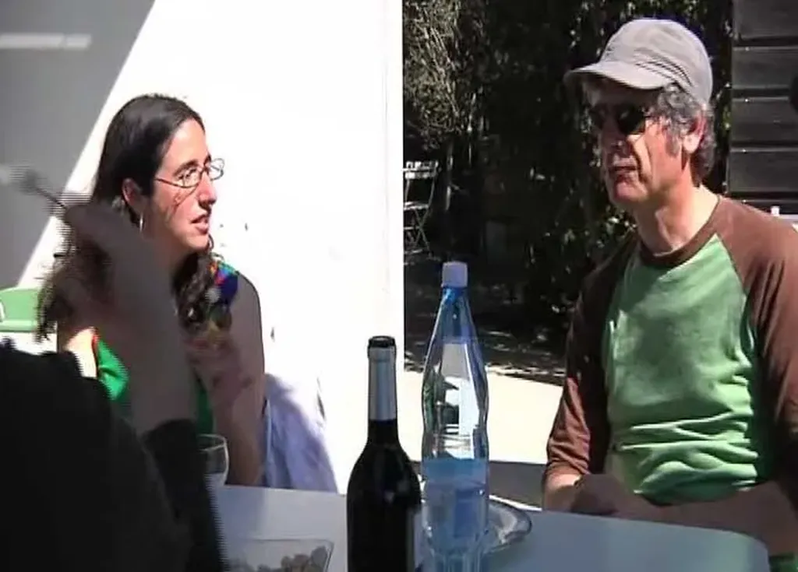

# Le jour où je me suis déconnecté

*[J’ai débranché](../../page/jai-debranche)* est arrivé dans toutes les librairies, traditionnelles comme numériques. Amazon a classé le livre dans sa rubrique psychopathologie. Je serais donc un psychopathe. C’est peut-être pas faux au vu de cette vidéo tournée par la réalisatrice [Laurence Kirsch](http://laurencekirsch.fr/). La scène se déroule juste après l’annonce de ma déconnexion au cours du repas évoqué dans le livre.

#buzz #podcasts #y2012 #2012-1-11-19h42
