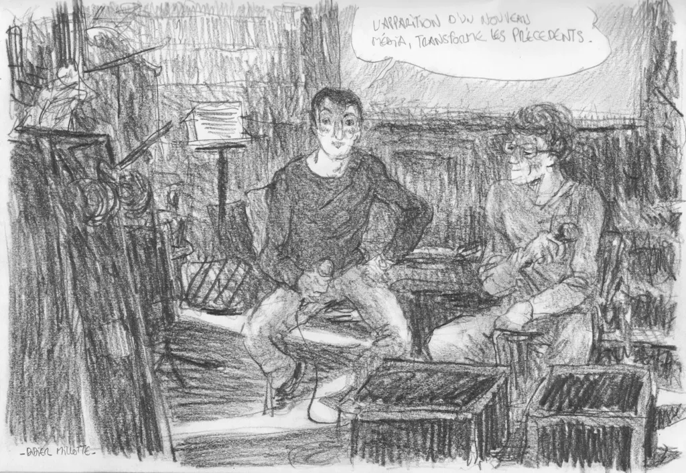

# La tragique tragédie du livre

Lors de la [ZAL](la-tragedie-du-livre-avis-de-tempete-numerique.md), Nicolas Ancion et moi avons parlé des conséquences de l’arrivée du livre électronique sous l’angle de la tragédie.

Résumé de notre discussion…

1. Tragédie pour l’objet livre papier, parce que lire en numérique c’est formidable. Une fois qu’on a commencé, on n’imagine plus faire marche arrière comme je l’expliquais dans [De la lecture numérique](la-tragedie-du-livre-avis-de-tempete-numerique.md).

- Tragédie pour les auteurs. Avant ils devaient se soumettre à une forme la censure des éditeurs, quasi religieuse, aujourd’hui ils doivent décider eux-mêmes ce qui doit être publié ou non, et ils publient pratiquement tout ce qu’ils écrivent, s’estimant invariablement géniaux, glissement dont je parle en termes politiques dans *[L’édition interdite](../../page/edition-interdite)* (avec Nicolas comme guest star d’ailleurs).

- Tragédie pour les lecteurs qui se jettent sur les textes les plus immondes publiés en ligne, [*Cinquante nuances de gris*](../7/cinquante-nuances-de-grey.md), les plébiscitent, en font des hits planétaires.

- Tragédie pour les éditeurs condamnés à courir après ces hits issus des bas-fonds. Constat amer de leur inaptitude à deviner ce qui attire le public, mais sorte de fierté, elle aussi tragique chez eux, de nous avoir durant longtemps protégés par leurs exigences esthétiques et commerciales de l’ignominie (n’oublions tout de même pas Musso). Comment investir aujourd’hui dans un jeune auteur avec l’espoir qu’il explosera dans dix ans ? Difficile si l’éditeur se transforme en analyste des statistiques de vente en ligne dans le domaine de l’autopublication.

- Tragédie pour les libraires qui trouveront difficilement leur place dans le nouvel écosystème, la fonction de prescription glissant peu à peu vers le net social.

- Tragédie parce que les livres se piratent comme la musique et les films, et encore plus facilement de par leur faible poids, mais encore une fois, toutes les études montrent que plus on pirate plus on achète par ailleurs, donc faux problèmes. Les DRM ne sont pas la solution, au contraire ils ralentissent le développement du livre électronique.

Merci à Renaud Vischi et sa bande d’avoir organisé cette ZAL 2012.

#conf #ebook #edition #zal #podcasts #y2012 #2012-10-21-10h48
