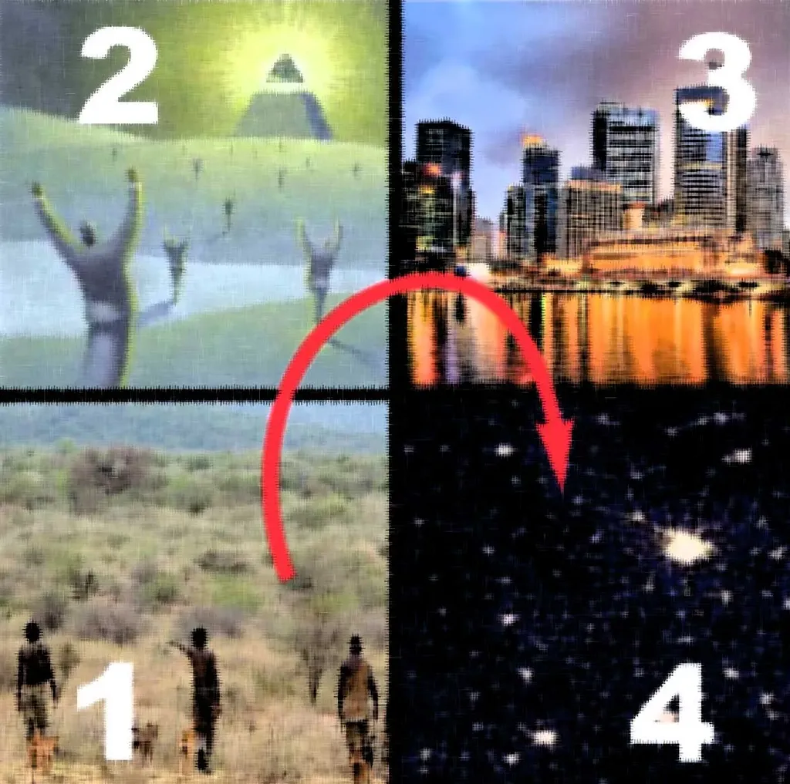

# Quel titre préférez-vous&nbsp;? «&nbsp;Freemen&nbsp;» ou «&nbsp;La quatrième théorie&nbsp;»

Vous vous souvenez de *[Croisade](../../page/la-quatrieme-theorie)*, le twiller. Il s’apprête à migrer de Twitter au papier/ebook. Il sortira en avril chez Fayard Noir.

Mais nous hésitons pour le titre. *Croisade*, ça ne marche pas. Parce que le titre est pris par une saga de fantasy, et surtout, parce qu’il évoque le moyen-âge plutôt que le présent tendu par le flux. Il nous faut autre chose.

Comme la rédaction de ce livre a été interactive, mettant en œuvre *[La stratégie du cyborg](../../page/la-strategie-du-cyborg)*, on se dit avec Lilas, mon éditrice, qu’on peut continuer à ouvrir le processus éditorial. Vos avis et suggestions sont les bienvenus.

Pour vous aider à choisir, voici deux interviews imaginaires.

### La quatrième théorie

*— Thierry Crouzet, c’est quoi la quatrième théorie ?*

— Si je vous le dis, plus personne ne lira mon roman. Mais je peux vous parler des trois premières. Au début, on a les chasseurs cueilleurs, une horde primitive inorganisée, tout juste arrachée à la tourbe organique. C’est la première théorie à laquelle se conforment nos ancêtres. Plus tard, ils construisent les villes et avec les villes des divinités qu’ils placent au-dessus d’elles. C’est la seconde théorie, la soumission à des entités supérieures. Ces villes grandissent, deviennent des mégalopoles, l’argent y remplace les divinités ancestrales. C’est la troisième théorie, que nous connaissons bien.

*— Votre roman sort en mai chez Fayard Noir qu’a-t-il de noir ?*

— Les trois premières théories ! En comparaison, la quatrième est lumineuse.

*— Polar, thriller, ou même twiller puisque vous avez écrit ce livre sur Twitter… dans quelle catégorie le rangez-vous ?*— Selon la quatrième théorie, les cases n’existent plus. C’est un polar, parce qu’il y a de méchants flics. C’est un thriller, par le rythme et les codes narratifs. C’est un roman populaire et en même temps une expérience littéraire oulipienne. C’est aussi un roman initiatique au cours duquel mes héros découvrent la quatrième théorie.

*— Pour savoir de quoi il s’agit, on va donc devoir patienter jusqu’en mai 2013 ?*

— Je crois bien que oui.

### Freemen

*— Thierry Crouzet, qui sont les Freemen ?*

— Des hommes et des femmes ont toujours vécu hors des partis, des églises, des écoles, des coteries. Souvent isolés, ou même exclus, ils ne se rencontraient que par hasard. Mais quelque chose est en train de changer. Avec les technologies numériques, ils s’interconnectent, se parlent, s’organisent, constituent une nouvelle force… et quand une nouvelle force émerge, les anciennes se serrent les coudes pour la combattre.

*— Votre roman sort en ma chez Fayard Noir qu’a-t-il de noir ?*

— C’est l’histoire d’une lutte à mort. Les anciennes forces sont prêtes à tout pour conserver leurs privilèges.

*— Polar, thriller, ou même twiller puisque vous avez écrit ce livre sur Twitter… dans quelle catégorie le rangez-vous ?*— C’est un livre de Freemen sur les Freemen, il est transgenre. C’est un polar, parce qu’il y a de méchants flics. C’est un thriller, par le rythme et les codes narratifs. C’est un roman populaire et en même temps une expérience littéraire oulipienne. C’est aussi un roman initiatique au cours duquel mes héros se libèrent de leurs chaînes.

#buzz #y2012 #2012-10-30-20h17
