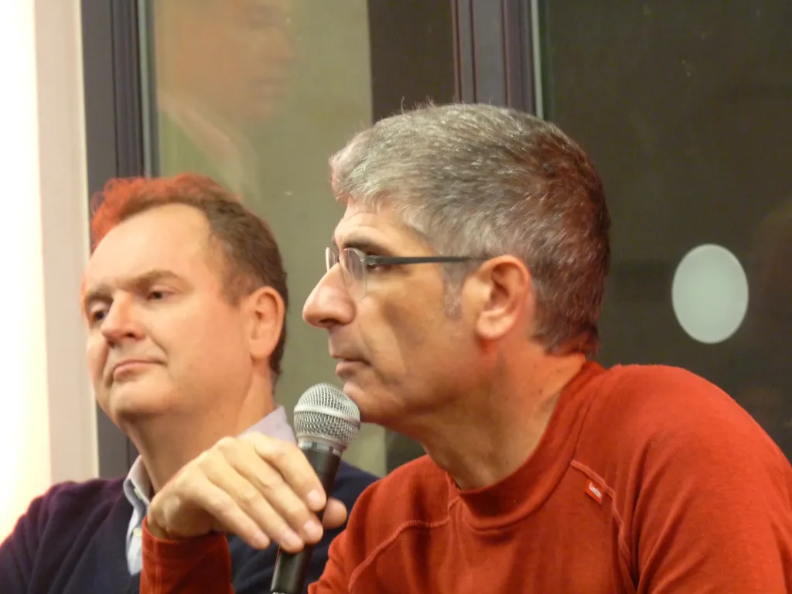

# Vivre en attendant de mourir 

Narvic n’est pas venu à [la Maison des métallos pour la conf revival sur le cinquième pouvoir](le-cinquieme-pouvoir-en-stase.md), mais il a posté un [long commentaire](le-cinquieme-pouvoir-en-stase/?cid=129900.md), comme toujours stimulant.

Pour mieux comprendre pourquoi je suis dans l’ensemble d’accord avec Narvic, vous pouvez écouter l’enregistrement des échanges, assez taquins entre Thierry Vedel et moi, nous formons désormais un vieux couple. Cette ambiance taquine m’a entraîné à chahuter certains questionneurs, je regrette comme toujours de me laisser entraîner par mon impulsivité méditerranéenne, mais un peu tard.

J’en reviens au commentaire de Narvic. Je ne suis pas sûr que nous ayons besoin d’invoquer Virilio pour annoncer une catastrophe inévitable. C’est avant tout une simple question de probabilité. Borges l’a parfaitement résumé en écrivant :

>En un temps infini toute chose arrive à tout homme.

En un temps suffisamment long, la catastrophe est aussi inévitable pour notre société globale. Quand on classe les conflits humains par ordre de mortalité, la Seconde Guerre mondiale arrivant en tête, on obtient une power law, qui traduit la structure fractale de la société humaine. Si on prolonge au-delà de la Seconde Guerre mondiale la courbe, on aboutit à une guerre hypothétique qui causerait 1 milliard de victimes.

Cette guerre se produira un jour en toute probabilité, le seul hic, nous sommes incapables de prédire quand. C’est un peu comme avec la date inévitable de notre mort. Alors soit on est lucide, on juge tout cela absurde et on se suicide ou se retire du monde, soit on est inconscient et on joue en attendant comme si on était immortel (les croyants ont sans doute plus d’options que l’athée que je suis). J’ai choisi la seconde stratégie parce que je la trouve plus fun.

Donc oui, notre monde s’écroulera. Mais comme nous ne savons pas quand, nous ne pouvons pas nous mettre dans une position de repli qui pourrait de loin dépasser le cadre réduit de notre existence. Je ne suis pas un adepte de la retraite prolongé, même si j’en conçois les vertus à court terme comme je l’ai décrit dans *[J’ai débranché](../../page/jai-debranche)*.

Effrayé par un désastre éventuellement imminent, on peut tout au plus tenter de s’en protéger comme Narvic le suggère. Malheureusement, dans un monde massivement interdépendant, c’est une chimère. Le feu atomique ne s’arrête pas aux frontières, pas plus que les virus aéroportés par les volatiles ou les hordes affamées des milliards de citadins fuyant les villes. Il n’existera pas de havres de paix en cas d’effondrement généralisé. Et peut-être que les villes seront encore préférables à la campagne, à ce moment. Qui peut jurer du contraire ?

Le cinquième pouvoir, force de décentralisation, est un facteur de résilience comme Narvic le décrit (et comme nous en avons discuté durant la conférence). Si nous produisons notre énergie, notre alimentation, nos outils, nos médicaments, notre électronique, nos OGM… nous sommes beaucoup moins dépendants des systèmes de distribution centralisés. Pour ma part, je n’encourage pas ce choix en vue de la survie en temps de crise extrême (ce que j’estime vain) mais pour faire redescendre le pouvoir au niveau des individus en vue de le retirer des organes centralisateurs et totalitaires (qui nous mènent droit au désastre il est vrai, ce pourquoi il faut tenter d’endiguer leur folie pour en retarder l’échéance).

Et je veux pas retirer le pouvoir de ces organes par jalousie, ou par une autre fantaisie, mais parce que je pense qu’ils sont incapables de gérer la complexité qu’ils ont en grande part eux-mêmes injecté dans le système, et qu’ils voudraient maintenant retirer (par exemple, [Facebook a réduit la viralité des messages](http://lioneldavoust.com/2012/le-racket-de-facebook-pourquoi-vous-ne-verrez-plus-le-contenu-qui-vous-interesse/), donc techniquement la possibilité d’un cinquième pouvoir à travers son service).

Avec Narvic, nous optons donc pour le même mode de vie, même si nous ne le justifions pas de la même façon.

Je veux en revenir à l’idée selon laquelle ce qui serait isolé et non technologique serait plus résilient. Après le feu et les armes, les hommes ont inventé une technologie extraordinaire : la ville. On l’oublie souvent, et elle a entraîné des désastres sanitaires en même temps que nos civilisations. Les villes sont fragiles pourtant elles n’ont pas cessé de se développer parce que leurs avantages compensent de beaucoup leurs désavantages.

De même, l’évolution ne favorise pas les êtres les plus résilients, mais ceux qui ont la plus grande capacité d’adaptation, l’homme étant particulièrement doué de ce côté-là. La résilience ne sourd pas de caractéristiques intrinsèques, mais de l’adaptation à un milieu sans cesse changeant. Les réseaux en démultipliant notre intelligence collective nous donnent, à mon sens, plus de résilience collective que toute autre approche, et notamment que l’isolationnisme de type Tarnac. Ils nous permettent, par exemple, de nous coordonner, comme en Tunisie en 2011, contre un despote. Ils nous permettent d’échanger du code, code qui sera bientôt injecter dans nos imprimantes 3D pour la fabrications des objets du quotidien, médicaments compris (on peu déjà imprimer de l’Ibuprofène).

Comme je le montre dans *[L’alternative nomade](../../books/alternative-nomade.md)*, l’isolation conduit à la simplification des structures sociales, donc impose inévitablement et assez rapidement le modèle pyramidal, parce qu’il est le plus efficace dans ces situations, ce qui mène tout aussi vite à une forme de dictature. On part pour fuir celle du réseau et on tombe dans une autre où il devient impossible d’appeler l’extérieur à l’aide. Les sectes maîtrisent ce mécanisme.

Si je prône la décentralisation massive, je prône en même temps l’interconnexion massive pour empêcher l’isolement mortifère. Oui, les réseaux numériques ne sont pas aujourd’hui résilients, oui les dictatures Facebook, Google, Apple… s’en emparent peu à peu… raison de plus pour favoriser les émergences de solutions alternatives, de ce côté-là aussi. La guerre peut sembler perdue, mais elle ne fait que commencer. Le niveau de conscience à ces sujets est encore très bas. Je continuerais à évangéliser, avec mes gros sabots.

*PS : Des commentaires comme celui de Narvic faisaient jadis la richesse de la blogosphère. Il l’électrisait et nous forçait à sans cesse argumenter et contre argumenter. Quand le blog devient plus qu’une exposition de soit, ou qu’un lieu de publication de son travail, il perd beaucoup d’attrait à mes yeux.

Je crois que le blogging que j’apprécie souffre du même mal que le rôle-playing. L’un et l’autre exigent un temps faramineux, tant pour les auteurs que les commentateurs, un investissement qui au-delà de quelques années devient insoutenable pour la plupart des gens.*

#politique #y2012 #2012-10-30-16h12
