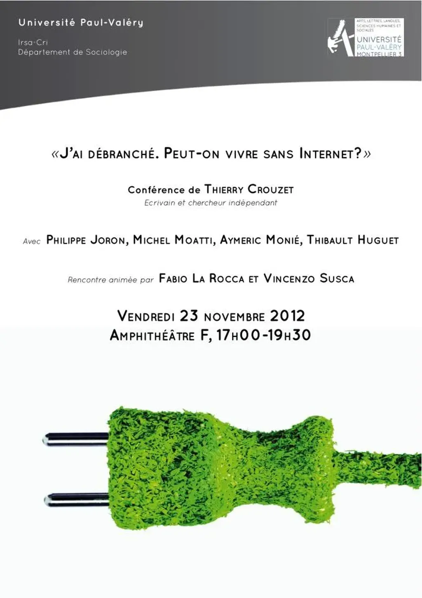

# J’ai débranché : deux inédits

[Vincenzo Susca](http://www.ceaq-sorbonne.org/node.php?id=885&elementid=827) m’invite à parler de mon expérience à l’université Paul Valéry de Montpellier le 23 novembre à 17 heures. Occasion de déterrer deux chapitres inédits où j’évoque notre rencontre.

### Les magiciennes

J’ai rencontré Vincenzo Susca à Sète, lors d’un café scientifique où m’avait traîné Raquel. Ce petit italien au large sourire et au regard malicieux parlait avec conviction de la fin de l’individualisme et de son pendant, la démocratie représentative. Qui représentera les être-réseaux ? Des réseaux et non pas des élus ! Avant de le quitter, je lui ai dit :

— Je peux me déconnecter, tu t’es emparé des idées qui me sont chères, à toi de les défendre maintenant.

Quelque temps plus tard, Vincenzo m’invite à un séminaire à l’université Paul Valéry de Montpellier. Le sujet : technologie et magie.

Je n’avais jamais considéré l’aspect magique de la technologie. Mais il a suffi que Vincenzo me demande d’intervenir pour que des liens apparaissent dans mon cerveau, ce qui en soit est magique.

J’ai songé au moment historique qui préside à l’invention des premiers ordinateurs : en 1936, Alan Turing démontra qu’un programme ne sait jamais s’il achèvera de s’exécuter. En quelque sorte, les ordinateurs ne peuvent pas s’autocontrôler. En eux réside une zone d’ombre, un ensemble de fonctions non testées, susceptibles de provoquer des bugs ou des réactions inattendues. C’est la magie à l’état pur. Avec les ordinateurs, nous sortons du déterminisme propre à la révolution industrielle, ce rouleau compresseur du rationalisme dont Max Weber avait dit qu’il désenchantait le monde.

— Ne sois pas trop technique, me prévient Vincenzo à mon arrivée. Il y a des premières années.

Je me retrouve devant une cinquantaine d’étudiants, ou plutôt d’étudiantes tant elles sont majoritaires. La plupart affairées sur leur téléphone me regardent de temps à autre pour s’assurer que je suis bien présent en chair et en os. Je ne leur parle pas de Turing, mais de l’auto-organisation. Je commence avec mon exemple favori : les étourneaux qui déboulent par millions sur les villes du midi au milieu de l’automne. Ils tracent des nuées de fumée, s’enroulent en pelotes de suie, s’effilochent, sans que le vent ne les disloque, puis ils se rassemblent et ondulent à la manière des cerfs-volants chinois.

— Chaque année, Rome nous offre ce spectacle extraordinaire, commente Vincenzo, les yeux brillants.

Je lui demande s’il sait comment les étourneaux s’organisent. Il secoue la tête. Les étudiantes n’ont également aucune idée. Je les rassure, la solution n’a été découverte qu’en 1986 par Craig Reynolds. Les étourneaux suivent scrupuleusement trois règles sélectionnées au cours de l’évolution.

1/ Je m’oriente dans la même direction que mes voisins.

2/ Je me place au milieu d’eux pour économiser mes forces.

3/ J’évite d’être trop près d’eux pour ne pas leur rentrer dedans.

— Voici la magie ! Aucun chef d’orchestre ne dirige la symphonie des étourneaux. Ils s’auto-organisent.

J’évoque les autres oiseaux qui les imitent, les poissons, les insectes, les mammifères et parmi eux les *homos sapiens*.

— Que s’est-il passé en Tunisie en janvier 2011 ? Sans aucun leader, sans aucun mot d’ordre issu d’un parti, la foule s’est soulevée contre la dictature. Les Tunisiens se sont auto-organisés, en eux-mêmes, par eux-mêmes, depuis les tréfonds de leur société, pour conquérir leur liberté politique.

Je reviens aux trois règles des étourneaux. :

— Elles mettent systématiquement en relation « le sujet » et « les autres ». *Je* me dirige dans la même direction que *vous*. *Je* me place entre *vous*. *J*’évite de *vous* percuter. *J*’agis en *vous* prenant en compte. Pour *vous* prendre en compte, *je* dois être connecté avec vous (visuellement, chimiquement, numériquement…). Plus nous sommes connectés, plus l’auto-organisation a de chance de se produire grâce aux liens que nous tressons.

Je présente un corolaire :

— Plus nous nous auto-organisons, moins les chefs, les managers, les gouvernements… ont d’emprise sur nous.

Quand je finis de parler, des étudiantes viennent vers moi avec enthousiasme.

— C’est la première fois que quelqu’un nous explique que nous pouvons changer le monde par nous-mêmes. Parce que ce monde, il ne nous convient pas. Nous n’en voulons pas.

Je suis le messie.

— Vous pouvez refaire votre démonstration ? me demande une étudiante lorsque nous nous retrouvons dans une librairie autour d’un verre.

Près d’elle se tient une brune flamboyante, aux yeux en pétard, au sourire dévastateur.

— Ma copine n’était pas là, précise l’étudiante.

Si elle avait été présente, je n’aurais parlé que pour elle, ce que déjà je commence à faire, revisitant mon tour de magie par un autre chemin :

— En 1977, le cybernéticien Valentin Turchin a montré qu’un organe de management peut contrôler un système à condition que sa complexité soit au moins égale à celle du sous-système le plus complexe. Par exemple, le gouvernement central d’un pays doit être au moins aussi complexe que chacun des corps d’État

Je m’en veux de ne pas être un musicien ou un chanteur. J’aurais suscité moins de froncements de sourcils.

— Dans une société où les individus se lient sans cesse davantage, donc augmentent la complexité sociale, les structures de contrôle doivent, elles aussi, accroître leur complexité. Cette fuite en avant est perdue d’avance comme l’a montré Herbert Simon durant les années 1960 (un système simple est plus résilient qu’un système plus complexe. Il a plus de chance de survivre.)

— C’est pour ça que nos gouvernements ne maîtrisent plus rien ! s’exclame la brune.

— Depuis longtemps, ils ont laissé la complexité sociale les déborder. Ils se contentent de mesures homéopathiques à faible impact. En revanche, les dictateurs s’opposent à la complexification. Ils tentent de rendre indiscernable chacun des individus, de les transformer en numéro, une façon de les traiter en soldats serviles. Ils rêvent de les voir enfermés dans leur individualisme, scotchés devant leurs téléviseurs. Dictature rime avec simplification.

— Si je vous suis, plus nous nous lions les uns aux autres, plus nous nous protégeons de la dictature.

— Exactement, plus nous complexifions, moins nous sommes contrôlables, plus nous nous émancipons. Nous accroissons mécaniquement notre liberté politique. Cette liberté émerge du réseau. Elle se joue entre nous, à travers les liens : liberté de propager des paroles, des émotions, des actions. Elle n’est pas essentielle à l’homme, mais apparaît entre les hommes quand plus aucun d’entre eux n’est omnipotent et omniscient.

Les étudiantes rayonnent. J’ai l’impression qu’elles veulent danser. J’ai peut-être fredonné une musique qui résonne en elles.

— Avec nos comptes Facebook, nous sommes des magiciennes !

Je suis la première victime de leurs charmes. J’ai pas envie de les décevoir au sujet de Facebook. Je les regarde béatement. Déjà elles s’envolent. À travers chacun des liens qu’elles traceront, de nouvelles interactions se propageront, portant toujours plus loin les réactions de cause à effet qui arriveront jusqu’à elles. Bientôt plus personne ne songera à contrôler ces jeunes femmes. Plus elles seront vivantes, plus moi-même je serai libre.

— Merci, je murmure alors qu’elles s’échappent de la librairie.

### Le conatus

Après cette rencontre, je prends conscience que ma position est pour le moins paradoxale. Je défends l’idée que le lien accroît la liberté et, en me déconnectant, j’ai sciemment coupé les liens avec des centaines d’amis. J’ai donc provisoirement réduit ma liberté.

Si, après avoir écouté Éric Besson et le représentant socialiste à la radio, j’avais publié un article sur mon blog, j’aurais touché quelques milliers d’internautes. Eux-mêmes auraient échangé avec leurs contacts. Plutôt que de laisser le pouvoir agir à sa guise, nous lui aurions compliqué la vie.

— Pour la plupart des gens, la liberté politique, c’est voter, manifester, militer, dit Isa. Pour eux, tu n’as jamais usé de cette liberté.

Je vois deux formes d’engagement. La forme classique ne questionne pas la nécessité des structures de pouvoir. Un militant cherche à installer son parti à la place du parti adverse, son chef à la place du chef adverse. Il croit qu’en changeant de personnes on change de politique.

J’en doute. Pour moi, la structure même du pouvoir dicte pour une grande part les décisions que prend le pouvoir. Changer les hommes entraîne peu de bouleversements. En revanche, si je complexifie la société, je force les structures de pouvoir à renoncer à nombre de leurs prérogatives et à favoriser l’auto-organisation, au prix de plus de coopération, de transparence, d’interconnexion…

J’utilise ma liberté politique pour subvertir les pouvoirs en place. Je suis un activiste plus qu’un militant. Comme eux toutefois, je dispose d’une autre liberté : liberté de penser, de décider, d’aimer, d’obéir ou non à mes désirs… Cette seconde liberté, tournée vers l’intérieur, ne dépend pas directement de la liberté politique. Un esclave pensait même s’il n’agissait pas à sa guise. Si, après avoir entendu une énormité à la radio, je me précipite sur mon blog, je ne me contrôle pas. Si pour créer des liens et maximiser ma liberté politique, je me laisse consumer par le Net, j’anéantis ma liberté intérieure, je renonce à ma volonté, me mettant en position de faiblesse par rapport aux discours démagogiques. De par ma liberté politique, cette liberté d’action, je deviens une arme dangereuse aux mains du premier dictateur venu. Il me parait dès lors indispensable de consolider ma liberté intérieure avant mon retour en ligne.

À cette seule condition, j’exercerais ma liberté politique. La connexion ne sera plus pour moi une échappatoire à mes exaspérations, mais la voie par laquelle reconstruire la société avec les autres. Si je veux revenir sur internet dans de nouvelles dispositions, je dois au préalable me dominer, reprendre le contrôle de moi-même.

Ces considérations m’amènent à Spinoza, le philosophe des émotions, des désirs et de leur dépassement. Durant des années, son *Éthique* a trôné dans mes toilettes. J’ai attaqué ce livre par le début, par la fin, en le feuilletant, je n’ai jamais réussi à y entrer. Peu avant ma déconnexion, un ami spinoziste m’a ouvert une porte inattendue. Il m’a raconté que dans le *Traité politique* Spinoza avait lui aussi parlé d’auto-organisation, de cette force interne à la société, capable de renverser spontanément tous les pouvoirs, et donc d’accroître notre liberté politique : « Ce droit que définit la puissance de la multitude, on l’appelle généralement souveraineté. […] S’il existe une souveraineté absolue, c’est bien celle que détient la multitude entière. »

Selon Spinoza, le désir serait l’essence de l’homme, notamment le désir de « persévérer dans son être ». Un dictateur peut tout nous retirer, sauf ce désir de vivre. Alors chacun de nous devient semblable aux autres et ensemble, unis par notre désir, nous formons une multitude. Nous agissons comme un seul être. Aucune idéologie ou revendication ne nous anime, sinon la volonté de persévérer dans l’être.

— Dégage, ordonnèrent les Tunisiens à leur dictateur.

Cette idée de Spinoza réinterprétée par mon ami spinoziste me séduit, mais il me semble qu’elle repose sur un postulat inutile. Pourquoi le désir serait-il essentiel à l’homme ? Les philosophies orientales visent à la suspension du désir. La méditation n’a pas d’autre objectif. J’ai parfois connu cet état de non-désir, de non-pensée, de conscience pure. Dans ces instants, j’étais toujours un homme et pourtant je ne désirais rien. Les désirs jouent un rôle capital dans nos vies, sans en être l’essence.

Je pense plutôt que la multitude devient souveraine par la magie des liens. Elle se coagule non parce qu’il ne lui reste rien, mais parce qu’en elle circulent tant d’informations et d’émotions, d’idées et de projets, de rêves et d’espoirs, que le pouvoir en place n’est plus capable d’en prendre la mesure. Il n’a d’autre choix que de fuir. Des désirs, peu importe lesquels, nous conduisent à créer des liens qui démultiplient la complexité et font exploser les structures de domination.

L’auto-organisation résulte d’un excès d’énergie sociale et non du désespoir ultime. Elle survient quand les forces coercitives abdiquent face à un surplus de complexité. Cette auto-organisation peut se maintenir, car toute organisation, spontanée ou imposée, est plus gratifiante, plus résiliente, plus économique… que le désordre. Nous formons société presque quoi qu’il arrive. Dans l’*Éthique*, Spinoza entrevoit une explication : « C’est quand chaque homme recherche au plus haut point ce qui lui est utile que les hommes sont le plus utiles les uns aux autres. »

Les Belges le démontrent depuis la démission de leur gouvernement central. Ils n’en forment pas moins société, parce que chacun pour son bien-être a besoin égoïstement du bien-être des autres. L’absence de chef n’implique pas le désordre.

Coïncidence heureuse, je reçois ce matin une lettre manuscrite de Didier, parti au Canada initier des graphistes à la BD. Il y fait référence à un passage de *L’Ancien Testament*. Les sages d’Israël demandent à Samuel : « Donne-nous à présent un roi pour qu’il nous gouverne. »

Samuel catastrophé implore Yahvé qui lui répond : « Depuis le jour où je les ai fait monter d’Égypte jusqu’à aujourd’hui, ils […] m’ont abandonné pour servir d’autres dieux [leurs rois]. […] Écoute-les donc, maintenant, mais avertis-les bien : explique-leur le droit du roi qui règnera sur eux. »

Alors Samuel trace le portrait d’un despote, ce qui, à sa grande consternation, n’empêche pas le peuple d’exiger un roi.

— Papa, tu me fais un avion, m’ordonne Émile en déboulant dans mon bureau.

Je n’ai pas besoin d’un roi auquel déléguer ma responsabilité, et qui, ivre de pouvoir, réduirait ma liberté politique. Devant moi, du haut de ses un mètre dix, bien vivant, se dresse un autre dictateur, tout aussi astreignant que les mails et les tweets qui se déversaient sur moi quand j’étais connecté. Ces infinies contraintes firent postuler à Spinoza que la liberté intérieure n’existe pas.

Je ne suis pas aussi résigné. Pourtant, sur le Net, je me suis rendu esclave d’obligations arbitraires. Répondre à tous les messages, à tous les commentaires. Réagir toujours et encore. Être disponible pour les autres plus que pour ma famille. Je n’ai pas su dire non. J’ai négligé ma liberté intérieure.

Que dois-je faire pour la reconquérir ? Ma quête se précise. Spinoza conseille d’apprendre à connaître ses plaisirs, à évaluer leur toxicité, à les remplacer par des plaisirs insurpassables. Je descends dans le jardin, je regarde la brise agiter les arbres, je cligne des yeux au soleil. Je suis encore une fois sans appétence, proche du satori. Mon agenda s’est peu à peu vidé. Je n’ai plus de rendez-vous. Je dois travailler sur moi-même.

PS : J’ai coupé ces deux chapitres parce qu’ils étaient trop théoriques par rapport au reste de *[J’ai débranché](../../page/jai-debranche)*.

#conf #jai_debranche #netculture #y2012 #2012-11-15-11h39
