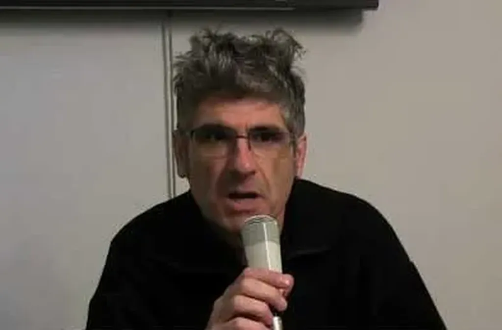

# Blablas sur la déconnexion 

J’ai évoqué mon expérience à Genève tout d’abord lors du [350ème first de Rezonance](http://blog.rezonance.ch/wordpress/2012/02/17/jai-debranche-comment-revivre-sans-internet-apres-une-overdose/), puis à Rennes à [l’invitation de La Cantine](http://www.lacantine-rennes.net/2012/02/thierry-crouzet-on-redecouvre-lennui/). Dans les deux cas, des interventions librement improvisées.

#conf #jai_debranche #netculture #podcasts #y2012 #2012-2-17-14h28
