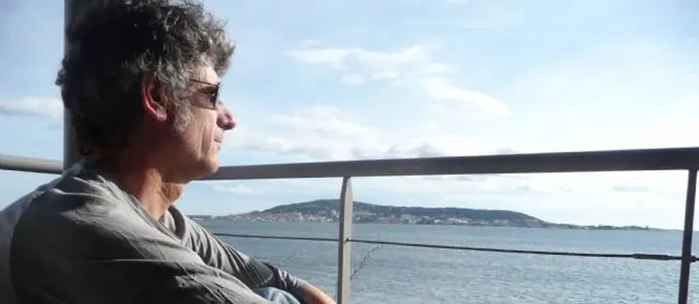

# Les bonheurs retrouvés d'un déconnecté 

[*Le Point*](http://www.lepoint.fr/la-liste/un-sevre-du-net-retrouve-le-bleu-du-ciel-04-02-2012-1427360_312.php) m’a demandé de lister les bonheurs que j’avais redécouverts en me déconnectant. Voici le résultat, avec pour conclusion le bonheur de vivre à l’époque numérique.

### Les rêves

En ligne, j’avais toujours quelque chose à lire, à écrire, à débattre, à voir, à écouter… Quel choc de me retrouver face à moi-même, sans la moindre sollicitation extérieure ! Au début, j’ai eu peur de cette vacuité, puis je me suis surpris à rêvasser en terrasse de café, au bord de l’eau ou allongé au sommet d’une montagne. Ne rien faire était magnifique. Ne penser à rien. Respirer, c’était tout. Alors mon esprit se mettait à frémir de mille étincelles. J’ai imaginé des histoires, des plans de romans, j’ai vécu intérieurement, avec intensité. Même la nuit mes rêves se sont transformés. Ils sont devenus plus lumineux, plus riches, plus hallucinatoires.

### Le vide

Dans [le jeu de taquin](http://fr.wikipedia.org/wiki/Taquin), il existe une case vide qui autorise le mouvement des pièces. La déconnexion a créé dans ma vie un vide, elle m’a placé au bord du précipice de l’ennui. C’était effrayant, mais j’ai pu me remettre en marche et j’ai compris que le Net, en saturant nos champs cognitifs, nous paralysait souvent. Nous avons besoin de béances, de vacances, pour avancer vers l’inconnu, vers des expériences pour nous inédites, c’est à cette seule condition que nous pouvons nous surprendre, donc nous sentir réellement vivre.

### La continuité

Plus de mails, de tweets, d’invitations sur facebook, d’appels skype, d’alertes google, plus la possibilité de lire un blog tout en regardant d’un œil une vidéo, la déconnexion m’a éloigné du multitâche. J’étais tout à ce que je faisais, plus rien ne m’en détournait. Quand j’écrivais et n’avais pas d’idée, je n’avais d’autre choix que de plonger en moi-même, je ne pouvais plus trouver une échappatoire sur le Net. En étant plus concentré, j’ai eu la sensation que le temps s’allongeait, qu’il reprenait de l’épaisseur. Chaque journée devenait unique, je n’avais plus le soir en me couchant l’impression d’avoir participé à un brouhaha incohérent. J’avais échappé à la dictature du temps réel.

### Le corps

Sur le Net, nous dialoguons le plus souvent par textes, en tout cas c’est mon cas. Les lettres sont notre moyen d’existence. À travers elles, nous nous projetons sur le réseau. Notre présence en ligne se prolonge au-delà de notre présence derrière le clavier. Nous finissons par être toujours présents. Et quand nous le sommes moins, nous comblons nos absences par des messages anodins sur les réseaux sociaux. Cette vie dans le temps réel du Net, c’est une vie perpétuelle, dans une certaine mesure hors du temps biologique. J’agissais comme si j’étais immortel.

Pourtant nous ne sommes pas encore des cyborgs. Notre corps nous est indispensable. La déconnexion me l’a rappelé presque avec brutalité. J’ai éprouvé des sensations physiques sublimes. Respirer devenait par moment un bonheur. Cligner des yeux au bord de la mer éblouissante. Apprécier les caresses d’un rayon de soleil. Toutes ces petites expériences provoquèrent en moi des explosions de joie. Mon corps s’était remis à vivre avec intensité parce que j’étais en train de comprendre que j’étais mortel. Il était à nouveau temps de vivre.

### La présence

Une fois mon corps et la continuité du temps retrouvé, je me suis senti plus présent avec moi-même, mais aussi avec ma famille et mes amis. Quand entre nous une conversation s’alanguissait, je ne fuyais plus sur le Net pour en dénicher de plus palpitantes. J’affrontais nos silences, je les appréciais, je les interrogeais. Quand quelqu’un m’ennuyait, j’osais le lui dire. Nous n’avions pas d’autre choix qu’échanger jusqu’à ce que quelque chose de beau surgisse entre nous. Ne plus fuir aura été une façon de revivre.

### Les livres

J’ai toujours été un grand lecteur. J’ai une immense bibliothèque avec des milliers de BD, de livres d’art, de romans, d’essais. Tous les genres se mêlent. Mes disques durs débordent d’ebooks. À quoi bon ? Il aura fallu que je me déconnecte pour prendre conscience que ne je ne lisais plus. Je n’avais pas arrêté d’acheter des livres ou de les télécharger, j’avais arrêté de les lire du début à la fin. Je me contentais le plus souvent des premières pages et je sautais aux dernières.

C’est en retrouvant le silence, le temps long, en frôlant l’ennui, que je me suis remis à vraiment lire des livres. J’y plongeais sans que rien ne m’en arrache. J’ai retrouvé un plaisir oublié, notamment avec l’extraordinaire [*Rêves de Gloire*](http://www.amazon.fr/Rêves-Gloire-Roland-C-Wagner/dp/2841725405) de Roland Wagner.

Malheureusement, depuis mon retour en ligne, j’ai à nouveau réduit mon temps passé avec les livres. Ce n’est pas que je lis moins, mais je lis autre chose, les blogs notamment. Je sais qu’à l’avenir je serai obligé de me ménager des pauses loin du numérique. La déconnexion est une nécessité.

### La cyberculture

C’est un paradoxe. En me coupant du Net, j’ai pris conscience avec une acuité redoublée des valeurs et principes qu’il m’avait inculqués : partage, entraide, coopération, auto-organisation, liberté, équité… J’ai découvert que je devais me battre pour elles, que sans elles le monde n’échapperait pas aux multiples crises qui l’agitent. J’ai compris que la vie en ligne m’était tout aussi indispensable que la vie hors ligne, que c’est en passant de l’une à l’autre que je vivrais heureux notre époque. J’ai alors vécu la déconnexion comme un périple initiatique. Je me suis vu changer, grandir…

Cette sensation m’a motivé dans l’écriture de mon livre. J’avais la chance de vivre une déconnexion extrême, je devais la partager avec ceux qui, par exemple pour des raisons professionnelles, ne peuvent pas tenter l’expérience. J’ai essayé de leur offrir une vie par procuration, exactement comme si j’étais un alpiniste qui racontait son ascension de l’Everest en solo, conscient que la plupart de ses lecteurs ne pourraient pas l’imiter.

#jai_debranche #netculture #dialogue #y2012 #2012-2-4-14h51
