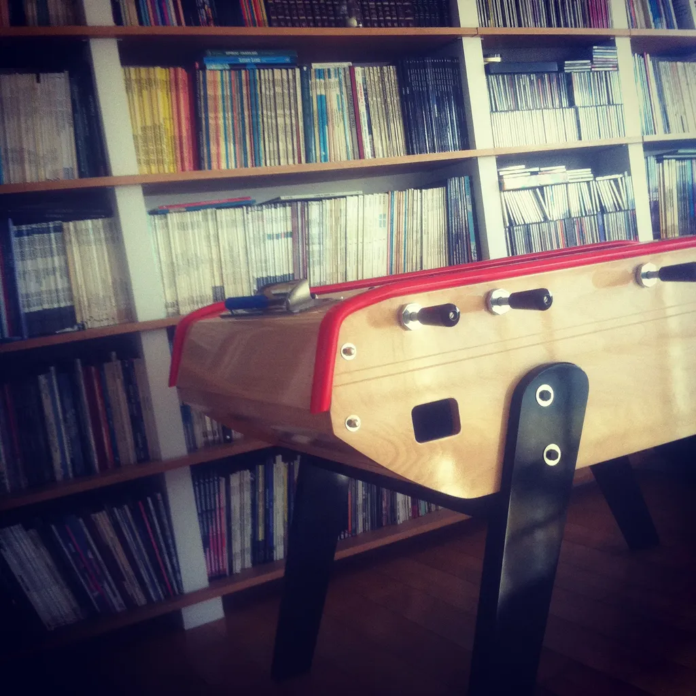

# Et si c’était à cause de la beauté

À l’occasion de la publication de mon *single* philosophique *[Baby-foot](../../books/baby-foot.md)*, Bernard Strainchamps m’a posé quelques questions pour [feedbooks](http://fr.feedbooks.com/interview/56/peut-%C3%AAtre-%C3%A0-cause-de-cette-histoire-de-beaut%C3%A9). L’occasion de revenir sur mes raisons de diffuser mes textes sur [publie.net](http://www.publie.net/fr/ebook/9782814506213/baby-foot).

*— D’où vient cette nouvelle ?*

— Autour d’un baby, j’ai rencontré nombre de mes amis, j’ai entendu parler pour la première fois de politique, de littérature, de philosophie, d’amour… J’ai fini par considérer le jeu comme un art et j’ai pris conscience qu’il avait été crucial dans mon éducation, et dans ma façon de voir la vie. J’ai très tôt eu envie d’écrire à ce sujet. Le temps a passé.

En lisant [*L’autobiographie des objets*](http://www.tierslivre.net/spip/spip.php?rubrique69) de François Bon, je me suis dit que je devais esquisser une autobiographie du baby-foot, d’autant que mes fils découvrent le jeu en ce moment. Au début je voulais écrire deux ou trois pages, le récit m’a emporté un peu plus loin, sans que j’ai encore épuisé tout ce que j’ai à dire.

*— A partir de quel moment, passes-tu à l’écriture ?*

— J’écris ou je réécris tout le temps. Des projets de longue haleine, comme mon Ératosthène que je traîne depuis douze ans, cohabitent avec d’autres qui s’étendent sur quelques mois ou juste quelques jours, c’est le cas pour mon baby-foot. J’ai besoin de ces respirations. En général, je commence l’écriture la nuit dans la ma tête. Quand je me lève, je récite et je tire le fil. Je ne me force jamais à écrire. Quand on écrit beaucoup, des choses surgissent toujours.

*— Pourrais-tu nous parler des différents stades d’écriture par lesquels tu es passé pour écrire Baby-foot ?*

— Au début, je veux écrire ma relation avec le jeu, de mon enfance à aujourd’hui. Puis l’idée d’art de vivre s’est glissée dans le récit et sans m’en rendre compte je me suis vu mettre le doigt sur quelque chose qui me paraît fondamental. Quand je regarde ma vie, j’ai noué mes amitiés autour de la beauté. Si je la néglige, ma vie ne peut qu’être au rabais. Mon histoire de baby est devenue une nouvelle philosophique.

*— En pleine promo de J’ai débranché, tu publies ce texte autour du Baby-foot. Es-tu nostalgique d’une dimension physique de l’apprentissage de la vie qui n’existerait plus dans les réseaux virtuels ?*

— En écrivant sur le baby, j’ai compris le trouble assez vif que j’éprouve depuis ma reconnexion. Sur le Net, surtout les réseaux sociaux, je ne vois plus de beauté. Si je ne suis pas capable de la trouver, je n’ai plus rien à faire en ligne. Les entreprises, et tous ces gens qui font leur promo, squattent les réseaux sociaux (et moi-même j’ai tendance à les imiter parce qu’il me paraît difficile de faire autre chose en ce moment). C’est incompatible avec la beauté. Je crois que ça défigure tout. Il faut que je découvre vite de nouveaux terrains de jeu.

*— À présent, tu publies de plus en régulièrement chez Publie.net. Pourquoi ?*

— Peut-être à cause de cette histoire de beauté, c’est ce qui nous réuni autour de plubie.net, personne ne cherche le bestseller, nous explorons tous, quitte à nous ramasser, cette faiblesse est essentielle pour l’écrivain comme pour le joueur de baby. Il me semble qu’elle devrait l’être aussi pour les lecteurs.

 Je suis peut-être aussi arrivé au bout du blog. Pendant des années, je l’ai pratiqué comme un journal. Les billets se suivaient, se répondaient. Je ne cherchais jamais à les rendre autonomes, c’était une seule histoire, plutôt immense.

Aujourd’hui j’ai envie de me faire plus discret, d’être présent par moment, peut-être avec des textes plus indépendants les uns les autres, et jouer avec les formes. Le livre électronique me permet d’explorer cette voie. J’ai autopublié quelques textes, je le referai peut-être, mais je pense qu’il est plus judicieux de participer à l’élan collectif enclenché par François Bon, tant par rapport son projet littéraire que pour toutes les questions de politique éditoriale que ça pose. On l’a vu avec [l’affaire du *vieil homme et la mer*](http://www.tierslivre.net/spip/spip.php?article2788).

Nos livres électroniques ont toutes les propriétés des livres papier avec en prime une plus grande fluidité. Nous pouvons les modifier et les compléter à tout moment, et en même temps, ils ne dépendent pas d’un serveur. Ils existent partout, j’ai envie de dire librement, indépendamment de nous.

Ça me paraît important en un temps de crise politique, où la tentation de censure est grande de tout côté. Une fois qu’un ebook a été lâché, on ne peut plus le rattraper (c’est le cas de la traduction du *vieil homme et la mer* de François). Les sites Web n’ont pas cette mobilité, ils sont moins adaptés au flux, donc beaucoup plus vulnérable. Je crois que le livre est l’avenir du Web, même si nous vivons bel et bien après le livre.

*PS : Un signle, comme en musique, est une courte pièce par rapport à un album. Une nouvelle est un single romanesque. Baby-foot est donc un single philosophique.*

#netlitterature #breves #y2012 #2012-3-3-8h54
