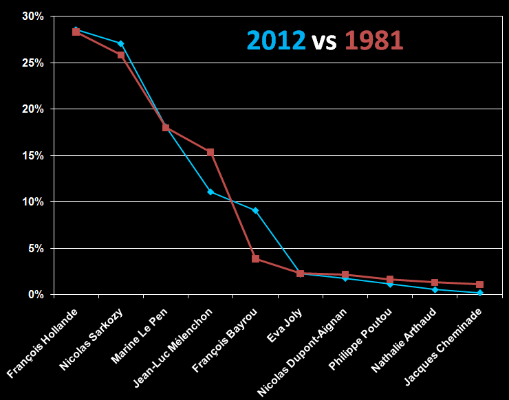
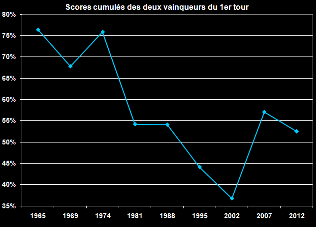
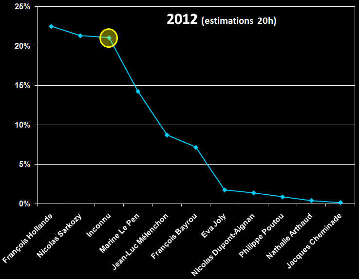

# Analyse de la présidentielle 2012

[Je désapprouve le combat de coqs](je-brule-ma-carte-electeur-100-raisons-pour-ne-pas-voter.md) auquel nous entraîne le système représentatif, donc pas de nom, mais il me semble instructif d’analyser les tendances.

Cette courbe montre l’évolution de la légitimité des deux sortants (leurs parts de marché cumulées). Nous sommes loin du consensus des années initiales de la cinquième république, mais loin aussi du foisonnement connu au tournant du millénaire. La politique s’était alors ouverte aux alternatives, au moins au premier tour.

La répartition des scores est pratiquement identique à 1981. Résultats final identique ? C’est à dire victoire du PS ou victoire finale du second au premier tour ?

Si on ramène les scores à l’ensemble du corps électoral en introduisant le candidat fantôme des abstentionnistes dont je fais partie (en jaune sur le graphique), on aboutit à un tir groupé qui montre qu’une réelle majorité ne se dégage pas. Les abstentionnistes troisième force politique du pays, quasiment à égalité avec la seconde !

*PS : Pour les nuls en math. Quand ont dit que Hollande fait 28,56%, c’est par rapport aux suffrages exprimés. Quand on dit 80,3% de participation, c’est par rapport aux inscrits. Il faut donc ramener tous les chiffres au nombre d’inscrits et ajouter 1,6% de blancs et de nuls aux abstentions. Ainsi Hollande tombe, à 22,54%, Sarkozy à 21,36% et on obtient pour l’inconnu 21,10%.*

#long_tail #politique #coup_de_gueule #y2012 #2012-4-22-20h0
